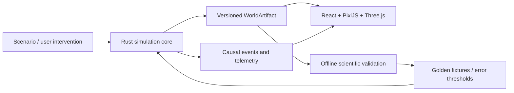

*English · [Tiếng Việt](README.md)*

# Anima Engine

A living world simulated in real time — terrain, water, climate, soil, plants, animals, and the
knock-on effects between those systems — inside a **Tauri v2** desktop app. The simulation core is
**Rust (Bevy ECS + Burn)**; the presentation layer is **React + TypeScript**.

The current focus is one verifiable vertical slice: **watershed → grassland → rabbit → wolf**, with
versioned world state, reproducible results, and evidence attached to each change.

## Where to start

| If you want to | Read |
|---|---|
| Understand the product and current architecture | [PROJECT.md](PROJECT.md) |
| Understand the world vision | [WORLD_DESIGN.md](WORLD_DESIGN.md) |
| See the long-range simulation roadmap | [WORLD_SIMULATION_PLAN.md](WORLD_SIMULATION_PLAN.md) |
| See the rules that must not be broken | [SIMULATION_RULES.md](SIMULATION_RULES.md) |
| Implement environment-adapted creatures | [Creature Development Contract](docs/reference/CREATURE_DEVELOPMENT_CONTRACT.md) |
| Touch agent brains, brain genomes, or the action space | [ADR-0003](docs/decisions/ADR-0003-evolved-per-agent-brains.md) |
| Run an evolution experiment under different world laws | [Evolution Experiment Contract](docs/reference/EVOLUTION_EXPERIMENT_CONTRACT.md) |
| Contribute code | [CONTRIBUTING.md](CONTRIBUTING.md) |
| Browse all documentation | [Documentation hub](docs/README.md) |

Most documentation is written in Vietnamese. This file is the English entry point; the tables below
name the code symbols and file paths, which are the parts that matter for reading the source.

## What is in the code

The table below lists **what exists in the code**, not what has been measured or proven. Measured
status lives in [`docs/planning/STATE_OF_THE_PROJECT.md`](docs/planning/STATE_OF_THE_PROJECT.md).

| Layer | Contents |
|---|---|
| **World** | Multi-octave noise terrain + hydrology (rivers, spillways, delta, endorheic lakes); biome classification; dynamic climate/water/soil fields with conserved water and nutrient budgets |
| **Exchange boundary** | `WorldArtifact`: versioned container with an FNV-1a checksum, generated **byte-identical** by Rust and TypeScript; 256² simulated world |
| **Creatures** | `MorphologyGenotype` → multi-segment phenotype, joint constraints, CPG oscillators driving gait; metabolism follows MTE (Kleiber + Arrhenius) instead of a linear mass term |
| **Brains** | A shared actor-critic (Burn — `burn-wgpu` on GPU or `burn-ndarray` on CPU) is the default; **per-agent evolved brains** (`BrainGenotype`) and lifetime learning are opt-in behind flags ([ADR-0003](docs/decisions/ADR-0003-evolved-per-agent-brains.md)) |
| **Social behaviour** | Raycasting through a spatial hash, a 1D pheromone grid with diffusion/decay, predator–prey dynamics, combat |
| **Ecology** | A **closed** energy ledger (EU): plants → herbivory → detritus → plants; Holling II/III functional responses; ~30% Lindeman transfer; logistic NPP regrowth per biome; seasonal cycle |
| **Evolution** | MAP-Elites over an **ecological niche** grid (body mass × foraging range); generational replacement; lineage persisted to Neo4j with an in-memory fallback |
| **Experiments** | Experiment manifest + headless runner, checkpoint forking, intervention queue + causal ledger, generic exotic energy ("mana") **off by default** |
| **Interface** | 2D PixiJS 8 viewport; 3D landscape on three + R3F (`landscape.html`) with a day–night cycle, weather, instanced vegetation, first-person explore mode; ecosystem / evolution / lineage / chronicle panels |
| **Infrastructure** | A 60 FPS background tick loop, **zero heap allocation on the hot path**, seeded RNG split per stream, versioned snapshots usable as checkpoints (draw position restored), deterministic mode for replay |

## Architecture



- Rust is the source of truth for simulation state.
- TypeScript/Three.js renders and interacts; it does not invent ecological state.
- `WorldArtifact` is the versioned exchange boundary between the layers.
- Open-source Python models are used offline for calibration and validation only; they never become
  runtime dependencies of the desktop app.

## Repository layout

```
src/                      React + TypeScript (Vite, 2 entries: index.html, landscape.html)
  components/             control panels, lineage graph, ecosystem panels
  components/Landscape/   3D landscape, frontend worldgen, world cache, explore mode
  PixiViewport.tsx        2D WebGL/WebGPU viewport (falls back to Canvas 2D under Vitest)
src-tauri/                Rust crate `anima-engine` (lib `anima_engine_lib`)
  src/core/               ECS + tick loop, terrain, ecology, energy ledger, dynamic fields,
                          world artifact, snapshots, multi-rate clock, interventions, causality,
                          experiments, exotic energy, networking systems
  src/ai/                 Burn model, CPG, HRRL, pheromones
  src/evolution/          MAP-Elites, genotype/mutation/crossover, brain genome, lineage, meta-AI
  src/physics/            dynamics, spatial hash
  src/commands/           Tauri IPC command surface
  crates/anima-domain/    world laws, independent of any engine adapter
tests/                    separate npm package: Vitest (frontend/) + Playwright (e2e/)
docs/                     Diátaxis documentation (tutorial / how-to / reference / explanation)
scripts/                  benchmarks, docs link check, manifest and fixture generation
```

## Running it

Requirements: Node.js + npm, a Rust toolchain (edition 2021), and the Tauri v2 build prerequisites
for Windows (WebView2, MSVC build tools).

```bash
npm install
npm run dev
```

`npm run dev` starts Vite on fixed port **5173** — enough to work on the UI, the 3D landscape and
frontend worldgen.

To run the full desktop app with the backend:

```bash
npm run tauri:dev
```

Use `npm run tauri:dev` / `npm run tauri:build`, **not** bare `tauri dev` / `tauri build`. The npm
scripts pass `--features desktop`, and `tauri.conf.json` has no field for Cargo features, so the
bare commands ship a `default = []` binary: no Neo4j lineage, no cross-shard migration, and the CPU
learner. All three have working fallbacks, so nothing fails loudly.

> ⚠️ Building and running the full Bevy/Tauri backend is heavy and **has crashed the current
> development machine**. To look at 3D models or the landscape only, use `npm run dev`, or serve
> `rabbit-standalone/` statically with `py -m http.server 8000`.

## Verification

Frontend:

```bash
npm run test
npm run test:frontend
npm run test:e2e
npm run lint
npm run build
```

Backend:

```bash
cargo test --manifest-path src-tauri/Cargo.toml --features desktop -j 2
cargo clippy --manifest-path src-tauri/Cargo.toml --all-targets --features desktop
cargo deny --manifest-path src-tauri/Cargo.toml check
```

`cargo audit` (advisories) must be run **from inside `src-tauri/`**, not from the root: it looks for
`.cargo/audit.toml` relative to the current directory, so running it from the root skips the two
verified ignores recorded there and reports a false failure. `cargo deny` finds `deny.toml` next to
the manifest, so it works from anywhere.

Playwright E2E starts the Vite dev server itself (`webServer` in
`tests/e2e/playwright.config.ts`); no release binary is required.

Three constraints below are not stylistic preferences:

- `--features desktop`: seven test files carry a crate-level `#![cfg(feature = "networking")]` or
  `"ml-wgpu"`. Without the flag they compile to empty binaries, report `running 0 tests` and
  **exit 0** — silently skipping 1,877 lines of migration / cross-shard / GPU-fallback coverage. To
  check: capture the output and run `node scripts/check_test_targets.mjs <file>`.
- `-j 2`: a fully parallel build exhausts the paging file on the current development machine and
  cargo fails mid-way with `LNK1104` / `os error 1455`.
- Run **one `cargo test` process at a time**: several suites swap the global allocator to count
  allocations, or read and write environment variables. They lock themselves per file with a mutex,
  but two concurrent processes still contend over the `.exe` (`os error 32`).

Performance baseline:

```bash
node scripts/bench_baseline.mjs
```

## Runtime flags

The backend loads environment variables through `dotenvy` from `.env` (gitignored). The default is
the legacy path: with no flag set, the simulation behaves exactly as it did before the features
below existed.

| Variable | Default | Effect |
|---|---|---|
| `ANIMA_SIM_SEED` | world seed | Overrides the run's random seed (for headless sweeps) |
| `ANIMA_EVOLVED_BRAINS` | off | Each agent gets its own evolved brain instead of one shared network |
| `ANIMA_LIFETIME_LEARNING` | off | Within-lifetime learning; only effective when the flag above is on |
| `ANIMA_DETERMINISTIC` | off | Deterministic mode for replay/checkpoints |
| `ANIMA_USE_GPU` | on | `burn-wgpu`; set `0` to fall back to the `ndarray` CPU backend |
| `ANIMA_WORLD_ARTIFACT` | temp dir | Path to the shared World Artifact |
| `ANIMA_CACHE_DIR` | temp dir | Where the backend caches generated worlds |
| `GEMINI_API_KEY` | empty | Gemini REST for the meta-AI; absent → mock |
| `GEMINI_WEBSESSION_ENDPOINT` | empty | Web-session endpoint for `GeminiWebSessionClient` |
| Neo4j credentials | empty | Lineage; absent → in-memory offline mode |

## IPC contract

The frontend talks to the Rust core with Tauri commands and events — for example
`get_simulation_status`, `toggle_simulation`, `get_map_elites_grid`, `get_pheromone_grid`,
`get_lineage_graph`, `get_ecosystem_state`, `save_simulation_state` / `load_simulation_state`; and
the events `simulation-tick`, `map-elites-update`, `pheromone-update`, `chronicle-event`,
`migration-event`.

The full list with payloads is in [PROJECT.md § Interface Contracts](PROJECT.md) — read it before
changing the IPC surface, and update it in the same change.

## Rules for changes

1. A change to simulation law updates `SIMULATION_RULES.md` and its tests.
2. A change to an exchange format is versioned, with a migration and a Rust/TypeScript fixture.
3. The tick hot path (physics, CPG, collision) **allocates nothing on the heap** — tests assert
   `allocs == 0`.
4. EU is a closed system; a new energy charge goes through `total_cost`, never a separate deduction.
5. An architectural or large dependency decision gets an ADR.
6. A new open-source dependency passes the license check, a benchmark and a documented rollback path.
7. Do not claim map quality without passing the mandatory validation gates in `AGENTS.md`.

Full text in the [documentation policy](docs/governance/DOCUMENTATION_POLICY.md) and the
[open-source policy](docs/governance/OPEN_SOURCE_POLICY.md).

## Status

- **Phases 0–7** (foundation → morphology → neural control + MAP-Elites → social → distribution and
  meta-AI → GPU + PixiJS → landscape → ecosystem dynamics): done; detailed table in
  [PROJECT.md](PROJECT.md).
- **Simulation foundation M0–M3** (unit/conservation contracts, checksummed World Artifact,
  multi-rate clock + interventions + causal ledger, dynamic climate/water/soil fields): done in the
  headless core.
- **Evolution lab AE1–AE3** (manifest/runner, exotic energy, energy pathway + selection): done and
  **off by default**; [ADR-0002](docs/decisions/ADR-0002-world-laws-and-exotic-energy.md) is still
  `proposed`.
- **ADR-0003** (per-agent brains + action space): accepted and implemented behind flags.
- Open work and its dependency order: [TODO.md](TODO.md) and
  [docs/planning](docs/planning/README.md).

## Contributing

See [CONTRIBUTING.md](CONTRIBUTING.md): the license terms your contribution arrives under, the
required reading per area of the code, and the gates to run before opening a pull request. There is
no CLA.

## License

`Copyright (c) 2026 Duong Nguyen Anh`

Anima Engine is **open source, dual licensed** — take whichever you prefer.

| Scope | License |
|---|---|
| **Source code** (`src/`, `src-tauri/`, `scripts/`, `tests/`) | [MIT](LICENSE-MIT) **OR** [Apache-2.0](LICENSE-APACHE) — `MIT OR Apache-2.0` |
| **Documentation and assets** (`docs/`, `public/`, `src-tauri/icons/`, preview images at the root) | same dual license |
| **The `.anmw` format** (World Artifact) | **open format** — see below |

This is the Rust ecosystem's de-facto default. Why dual rather than Apache-2.0 alone: Apache-2.0 is
**incompatible with GPLv2**, so a downstream GPLv2 project could not use this engine; the MIT branch
removes that barrier, while the Apache-2.0 branch keeps its explicit patent grant (§3) and its
[`NOTICE`](NOTICE) propagation requirement (§4d) available to anyone who wants them.

`NOTICE` carries attribution for the third-party components shipped in binary builds.

### `.anmw` is an open format

`WorldArtifact` — the versioned, FNV-1a-checksummed binary container that Rust and TypeScript
produce **byte-identically** — is an **open format**. Anyone may read it, write it, and reimplement
it in their own software, under any license, without asking. The specification is the reference
implementation in
[`src-tauri/src/core/world_artifact.rs`](src-tauri/src/core/world_artifact.rs), together with the
cross-language fixtures in `src-tauri/tests/fixtures/`.

### Neo4j is optional and separately licensed

Lineage works **without** Neo4j: drop the `neo4j` feature — or simply have no server reachable — and
the in-memory tracker takes over. When enabled, the engine talks to a separately installed Neo4j
process over the Bolt protocol. That is a **process boundary, not linking**, so the GPLv3 of Neo4j
Community Edition does not reach this project's code. Neo4j is not bundled, and licensing it is the
operator's responsibility.

This is not legal advice.
