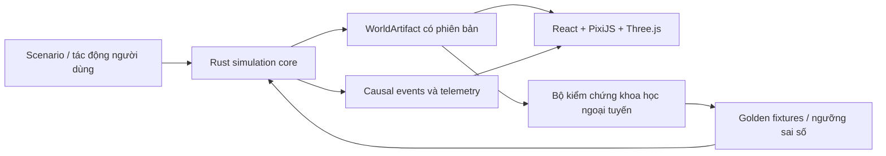

# Anima Engine

Mô phỏng một thế giới sống — địa hình, nước, khí hậu, đất, thực vật, động vật và tác động
dây chuyền giữa các hệ thống — chạy thời gian thực trong một ứng dụng desktop **Tauri v2**.
Lõi mô phỏng là **Rust (Bevy ECS + Burn)**; lớp hiển thị là **React + TypeScript**.

Trọng tâm hiện tại là một lát cắt dọc có thể kiểm chứng: **lưu vực → đồng cỏ → thỏ → sói**,
với trạng thái thế giới có phiên bản, kết quả tái lập được và bằng chứng cho từng thay đổi.

## Bắt đầu từ đâu

| Nhu cầu | Tài liệu |
|---|---|
| Hiểu sản phẩm và kiến trúc hiện tại | [PROJECT.md](PROJECT.md) |
| Hiểu tầm nhìn thế giới | [WORLD_DESIGN.md](WORLD_DESIGN.md) |
| Xem lộ trình mô phỏng dài hạn | [WORLD_SIMULATION_PLAN.md](WORLD_SIMULATION_PLAN.md) |
| Xem các quy tắc không được phá vỡ | [SIMULATION_RULES.md](SIMULATION_RULES.md) |
| Triển khai sinh vật thích nghi môi trường | [Creature Development Contract](docs/reference/CREATURE_DEVELOPMENT_CONTRACT.md) |
| Sửa bộ não agent, gen não hoặc không gian hành động | [ADR-0003](docs/decisions/ADR-0003-evolved-per-agent-brains.md) |
| Chạy thí nghiệm tiến hoá khác luật | [Evolution Experiment Contract](docs/reference/EVOLUTION_EXPERIMENT_CONTRACT.md) |
| Xem đề xuất nâng cấp map và mô hình ML | [Khảo sát map & ML](docs/research/MAP_AND_ML_UPGRADE_RESEARCH.md) |
| Chọn công nghệ nguồn mở để tích hợp | [Kế hoạch áp dụng nguồn mở](docs/planning/OPEN_SOURCE_ADOPTION_PLAN.md) |
| Tra cứu toàn bộ tài liệu | [Trung tâm tài liệu](docs/README.md) |

## Đang có gì trong mã

| Lớp | Nội dung |
|---|---|
| **Thế giới** | Sinh địa hình noise nhiều lớp + thuỷ văn (sông, spillway, delta, hồ nội lưu); phân loại biome; trường khí hậu/nước/đất động với ngân sách nước và dinh dưỡng được bảo toàn |
| **Biên trao đổi** | `WorldArtifact` có phiên bản + checksum FNV-1a, sinh **byte-identical** giữa Rust và TypeScript; world mô phỏng 256² |
| **Sinh vật** | `MorphologyGenotype` → phenotype nhiều đốt, ràng buộc khớp, dao động CPG điều khiển dáng đi; chuyển hoá theo MTE (Kleiber + Arrhenius) thay cho số hạng khối lượng tuyến tính |
| **Bộ não** | Actor-critic dùng chung (Burn — `burn-wgpu` GPU hoặc `burn-ndarray` CPU) là mặc định; **não di truyền theo từng cá thể** (`BrainGenotype`) và học-trong-đời là tuỳ chọn sau cờ ([ADR-0003](docs/decisions/ADR-0003-evolved-per-agent-brains.md)) |
| **Hành vi xã hội** | Raycast qua spatial hash, lưới pheromone 1D có khuếch tán/phân rã, động lực thú săn – con mồi, chiến đấu |
| **Sinh thái** | Sổ cái năng lượng **đóng** (EU): thực vật → ăn cỏ → xác mục → thực vật; phản ứng chức năng Holling II/III; chuyển hoá Lindeman ~30%; trường NPP tái sinh logistic theo biome; chu kỳ mùa |
| **Tiến hoá** | MAP-Elites trên trục **niche sinh thái** (khối lượng cơ thể × tầm kiếm ăn); thay thế theo thế hệ; phả hệ lưu Neo4j với fallback in-memory |
| **Thí nghiệm** | Manifest thí nghiệm + runner headless, fork từ checkpoint, hàng đợi can thiệp + sổ nhân quả, năng lượng ngoại lai (“mana”) **mặc định tắt** |
| **Giao diện** | Viewport 2D PixiJS 8; cảnh quan 3D three + R3F (`landscape.html`) với chu kỳ ngày–đêm, thời tiết, thảm thực vật instanced, chế độ khám phá góc nhìn thứ nhất; bảng hệ sinh thái / tiến hoá / phả hệ / chronicle |
| **Hạ tầng** | Vòng tick 60 FPS chạy nền, **không cấp phát heap trên hot path**, RNG có seed tách theo stream, snapshot có phiên bản dùng làm checkpoint (khôi phục cả vị trí draw), chế độ tất định để replay |

## Kiến trúc ở mức cao



- Rust là nguồn sự thật của trạng thái mô phỏng.
- TypeScript/Three.js hiển thị và tương tác, không tự phát minh trạng thái sinh thái.
- `WorldArtifact` là biên trao đổi có phiên bản giữa các lớp.
- Các mô hình Python nguồn mở chỉ dùng ngoại tuyến để hiệu chuẩn và kiểm chứng; chúng
  không trở thành phụ thuộc runtime của ứng dụng desktop.

## Bố cục kho mã

```
src/                      React + TypeScript (Vite, 2 entry: index.html, landscape.html)
  components/             bảng điều khiển, đồ thị phả hệ, panel hệ sinh thái
  components/Landscape/   cảnh quan 3D, worldgen frontend, cache world, explore mode
  PixiViewport.tsx        viewport 2D WebGL/WebGPU (rơi về Canvas 2D dưới Vitest)
src-tauri/                crate Rust `anima-engine` (lib `anima_engine_lib`)
  src/core/               ECS + tick loop, terrain, ecology, sổ năng lượng, trường động,
                          world artifact, snapshot, đồng hồ đa nhịp, can thiệp, nhân quả,
                          thí nghiệm, năng lượng ngoại lai, networking systems
  src/ai/                 mô hình Burn, CPG, HRRL, pheromone
  src/evolution/          MAP-Elites, genotype/mutation/crossover, gen não, phả hệ, meta-AI
  src/physics/            động lực học, spatial hash
  src/commands/           bề mặt lệnh Tauri IPC
tests/                    npm package riêng: Vitest (frontend/) + Playwright (e2e/)
docs/                     tài liệu theo Diátaxis (tutorial / how-to / reference / explanation)
scripts/                  benchmark, kiểm tra link tài liệu, sinh manifest và fixture
```

## Chạy dự án

Yêu cầu: Node.js + npm, Rust toolchain (edition 2021) và các điều kiện build Tauri v2 trên
Windows (WebView2, MSVC build tools).

```powershell
npm install
npm run dev
```

`npm run dev` mở Vite ở cổng cố định **5173** — đủ để làm việc với giao diện, cảnh quan 3D và
worldgen phía frontend.

Chạy trọn ứng dụng desktop kèm backend:

```powershell
npm run tauri dev
```

> ⚠️ Build và chạy toàn bộ backend Bevy/Tauri rất nặng và **đã từng làm treo máy phát triển
> hiện tại**. Khi chỉ cần xem mô hình 3D hoặc cảnh quan, dùng `npm run dev`, hoặc serve tĩnh
> `rabbit-standalone/` bằng `py -m http.server 8000`.

## Kiểm chứng

Frontend:

```powershell
npm run test
npm run test:frontend
npm run test:e2e
npm run lint
npm run build
```

Backend:

```powershell
cargo test --manifest-path src-tauri/Cargo.toml --features desktop -j 2
cargo clippy --manifest-path src-tauri/Cargo.toml --all-targets --features desktop
```

E2E Playwright tự khởi động Vite dev server (`webServer` trong `tests/e2e/playwright.config.ts`),
không cần binary release.

Hai ràng buộc dưới đây không phải tuỳ chọn thẩm mỹ:

- `--features desktop`: bảy file test mang `#![cfg(feature = "networking")]` hoặc `"ml-wgpu"` ở cấp
  crate. Thiếu cờ này chúng biên dịch thành binary rỗng, báo `running 0 tests` và **exit 0** — 1.877
  dòng test migration / cross-shard / GPU-fallback bị bỏ qua trong im lặng. Muốn kiểm tra: hứng
  output rồi chạy `node scripts/check_test_targets.mjs <file>`.
- `-j 2`: build song song đầy đủ làm cạn paging file trên máy phát triển hiện tại và cargo báo
  `LNK1104` / `os error 1455` giữa chừng.
- Chạy **một tiến trình `cargo test` tại một thời điểm**: vài suite thay global allocator để đếm
  cấp phát, hoặc đọc/ghi biến môi trường. Chúng đã tự khoá bằng mutex trong từng file, nhưng hai
  tiến trình song song vẫn tranh chấp file `.exe` (`os error 32`).

Đo baseline hiệu năng:

```powershell
node scripts/bench_baseline.mjs
```

## Cờ chạy

Backend nạp biến môi trường qua `dotenvy` từ `.env` (gitignored). Mặc định là đường legacy:
không bật cờ nào thì mô phỏng chạy đúng như trước khi các tính năng dưới đây tồn tại.

| Biến | Mặc định | Tác dụng |
|---|---|---|
| `ANIMA_SIM_SEED` | seed của world | Ghi đè seed ngẫu nhiên của run (dùng cho sweep headless) |
| `ANIMA_EVOLVED_BRAINS` | tắt | Mỗi agent có bộ não di truyền riêng thay vì dùng chung một mạng |
| `ANIMA_LIFETIME_LEARNING` | tắt | Học trong đời cá thể; chỉ có hiệu lực khi đã bật cờ trên |
| `ANIMA_DETERMINISTIC` | tắt | Chế độ tất định cho replay/checkpoint |
| `ANIMA_USE_GPU` | bật | `burn-wgpu`; đặt `0` để rơi về CPU `ndarray` |
| `ANIMA_WORLD_ARTIFACT` | temp dir | Đường dẫn World Artifact dùng chung |
| `ANIMA_CACHE_DIR` | temp dir | Nơi cache world sinh ở backend |
| `GEMINI_API_KEY` | trống | Gemini REST cho meta-AI; vắng thì dùng mock |
| `GEMINI_WEBSESSION_ENDPOINT` | trống | Endpoint web-session cho `GeminiWebSessionClient` |
| Thông tin Neo4j | trống | Phả hệ; vắng thì chạy offline in-memory |

Chi tiết xem [hướng dẫn phát triển](docs/how-to/README.md) và
[baseline hiệu năng](BENCHMARK_BASELINE.md).

## Hợp đồng IPC

Frontend nói chuyện với lõi Rust bằng lệnh và sự kiện Tauri — ví dụ `get_simulation_status`,
`toggle_simulation`, `get_map_elites_grid`, `get_pheromone_grid`, `get_lineage_graph`,
`get_ecosystem_state`, `save_simulation_state` / `load_simulation_state`; sự kiện
`simulation-tick`, `map-elites-update`, `pheromone-update`, `chronicle-event`,
`migration-event`.

> **Đổi hành vi 2026-07-27 — save/load.** Tham số `file_path` giữ nguyên tên (tương thích IPC) nhưng
> nay là **tên save**, không phải đường dẫn: nó được phân giải trong thư mục app-data
> (`<app_data_dir>/saves/<tên>.json`). Trước đây chuỗi từ frontend đi thẳng vào `write_atomic` /
> `read`, nên bất cứ thứ gì gọi được `invoke` đều ghi/đọc được **file bất kỳ** mà tiến trình có
> quyền. Tên chỉ được chứa `[A-Za-z0-9._-]` (allow-list, không phải block-list — xem
> [`commands/save_paths.rs`](src-tauri/src/commands/save_paths.rs) giải thích vì sao block-list thua
> trước `..%2f`, UNC, ADS `save.json:evil`, và tên thiết bị `CON`/`NUL`).
>
> **Save cũ nằm ngoài thư mục đó sẽ không đọc được nữa.** Cách chuyển: copy file `.json` vào
> `<app_data_dir>/saves/` rồi load bằng tên. Không có bước migrate tự động, vì tự động đọc một đường
> dẫn tuỳ ý chính là lỗ hổng vừa đóng.

Danh sách đầy đủ kèm payload nằm ở [PROJECT.md § Interface Contracts](PROJECT.md) — đọc trước
khi đổi bề mặt IPC, và cập nhật nó trong cùng thay đổi.

## Quy tắc thay đổi

1. Thay đổi luật mô phỏng phải cập nhật `SIMULATION_RULES.md` và test tương ứng.
2. Thay đổi định dạng trao đổi phải có phiên bản, migration và fixture Rust/TypeScript.
3. Hot path của tick (physics, CPG, va chạm) **không được cấp phát heap** — test khẳng định
   `allocs == 0`.
4. Năng lượng EU là hệ đóng; mọi khoản chi mới phải đi qua `total_cost`, không trừ riêng lẻ.
5. Quyết định kiến trúc hoặc phụ thuộc lớn phải có ADR.
6. Phụ thuộc nguồn mở phải qua kiểm tra giấy phép, benchmark và phương án hoàn tác.
7. Không tuyên bố bản đồ đạt chất lượng nếu chưa qua các cổng kiểm chứng bắt buộc trong
   `AGENTS.md`.

Xem đầy đủ tại [chính sách tài liệu](docs/governance/DOCUMENTATION_POLICY.md) và
[chính sách nguồn mở](docs/governance/OPEN_SOURCE_POLICY.md).

## Trạng thái

- **Phase 0–7** (nền tảng → hình thái → điều khiển neural + MAP-Elites → xã hội → phân tán và
  meta-AI → GPU + PixiJS → cảnh quan → động lực hệ sinh thái): xong; bảng chi tiết ở
  [PROJECT.md](PROJECT.md).
- **Nền mô phỏng M0–M3** (hợp đồng đơn vị/bảo toàn, World Artifact có checksum, đồng hồ đa nhịp
  + can thiệp + sổ nhân quả, trường khí hậu/nước/đất động): xong ở lõi headless.
- **Phòng thí nghiệm tiến hoá AE1–AE3** (manifest/runner, năng lượng ngoại lai, đường dẫn năng
  lượng + chọn lọc): xong và **mặc định tắt**; [ADR-0002](docs/decisions/ADR-0002-world-laws-and-exotic-energy.md)
  vẫn ở trạng thái `proposed`.
- **ADR-0003** (não theo từng cá thể + không gian hành động): accepted và đã triển khai sau cờ.
- Việc đang mở và thứ tự phụ thuộc: [TODO.md](TODO.md) và [docs/planning](docs/planning/README.md).

## Giấy phép

Phần mềm độc quyền — `Copyright (c) 2026 Duong Nguyen Anh. All rights reserved.`
Xem [LICENSE](LICENSE) trước khi sao chép, phân phối hoặc tạo tác phẩm phái sinh.
