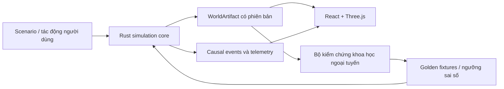

# Anima Engine

Anima Engine là dự án mô phỏng một thế giới sống: địa hình, nước, khí hậu, đất,
thực vật, động vật và tác động dây chuyền giữa các hệ thống. Trọng tâm hiện tại là
một lát cắt dọc có thể kiểm chứng: **lưu vực → đồng cỏ → thỏ → sói**, với trạng thái
thế giới có phiên bản, kết quả tái lập được và bằng chứng cho từng thay đổi.

## Bắt đầu từ đâu

| Nhu cầu | Tài liệu |
|---|---|
| Hiểu sản phẩm và kiến trúc hiện tại | [PROJECT.md](PROJECT.md) |
| Hiểu tầm nhìn thế giới | [WORLD_DESIGN.md](WORLD_DESIGN.md) |
| Xem lộ trình mô phỏng dài hạn | [WORLD_SIMULATION_PLAN.md](WORLD_SIMULATION_PLAN.md) |
| Xem các quy tắc không được phá vỡ | [SIMULATION_RULES.md](SIMULATION_RULES.md) |
| Triển khai sinh vật thích nghi môi trường | [Creature Development Contract](docs/reference/CREATURE_DEVELOPMENT_CONTRACT.md) |
| Chọn công nghệ nguồn mở để tích hợp | [Kế hoạch áp dụng nguồn mở](docs/planning/OPEN_SOURCE_ADOPTION_PLAN.md) |
| Tra cứu toàn bộ tài liệu | [Trung tâm tài liệu](docs/README.md) |

## Kiến trúc ở mức cao



- Rust là nguồn sự thật của trạng thái mô phỏng.
- TypeScript/Three.js hiển thị và tương tác, không tự phát minh trạng thái sinh thái.
- `WorldArtifact` là biên trao đổi có phiên bản giữa các lớp.
- Các mô hình Python nguồn mở chỉ dùng ngoại tuyến để hiệu chuẩn và kiểm chứng; chúng
  không trở thành phụ thuộc runtime của ứng dụng desktop.

## Chạy dự án

Yêu cầu: Node.js/npm, Rust toolchain và các điều kiện của Tauri trên Windows.

```powershell
npm install
npm run dev
```

Các kiểm tra hiện có:

```powershell
npm run test:frontend
npm run lint
cargo test --manifest-path src-tauri/Cargo.toml
```

Đo baseline:

```powershell
node scripts/bench_baseline.mjs
```

Chi tiết xem [hướng dẫn phát triển](docs/how-to/README.md) và
[baseline hiệu năng](BENCHMARK_BASELINE.md).

## Quy tắc thay đổi

1. Thay đổi luật mô phỏng phải cập nhật `SIMULATION_RULES.md` và test tương ứng.
2. Thay đổi định dạng trao đổi phải có phiên bản, migration và fixture Rust/TypeScript.
3. Quyết định kiến trúc hoặc phụ thuộc lớn phải có ADR.
4. Phụ thuộc nguồn mở phải qua kiểm tra giấy phép, benchmark và phương án hoàn tác.
5. Không tuyên bố bản đồ đạt chất lượng nếu chưa qua các cổng kiểm chứng bắt buộc trong
   `AGENTS.md`.

Xem đầy đủ tại [chính sách tài liệu](docs/governance/DOCUMENTATION_POLICY.md) và
[chính sách nguồn mở](docs/governance/OPEN_SOURCE_POLICY.md).
