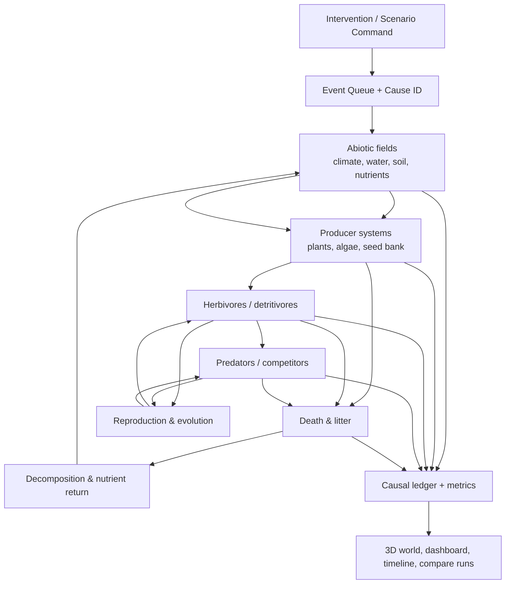

# Kế hoạch tổng thể — Mô phỏng thế giới sống có quan hệ nhân–quả

> Dự án: **Anima Engine**
> Trạng thái: **Bản kế hoạch đề xuất**
> Ngày lập: **2026-07-24**
> Phạm vi: thế giới, khí hậu, nước, đất, thực vật, sinh vật, quần thể, tiến hóa,
> biến cố và tác động dây chuyền khi người dùng can thiệp.

---

## 0. Kết quả cuối cùng cần đạt

Anima Engine phải trở thành một **thế giới sống có thể giải thích**, không chỉ là một
bản đồ đẹp có sinh vật chuyển động.

Người dùng có thể tác động vào bất kỳ lớp nào, ví dụ:

- tăng nhiệt độ trung bình;
- giảm lượng mưa;
- chặt một khu rừng;
- xây đập trên sông;
- loại bỏ loài săn mồi;
- thả một loài mới;
- làm ô nhiễm hồ;
- tăng độ màu mỡ của đất;
- tạo cháy rừng hoặc lũ;
- thay đổi tốc độ tiến hóa.
- thay một luật ngay từ genesis, ví dụ bật/tắt một nguồn năng lượng đặc biệt “mana”.

Hệ thống phải:

1. áp dụng tác động vào đúng vị trí và đúng thời điểm;
2. truyền ảnh hưởng qua các lớp liên quan;
3. tạo hiệu ứng tức thời, hiệu ứng trễ, ngưỡng sụp đổ và vòng phản hồi;
4. giữ các định luật bảo toàn đã chọn;
5. ghi lại chuỗi nguyên nhân;
6. cho người dùng xem **cái gì đổi, đổi bao nhiêu và vì sao**;
7. có thể chạy lại cùng `seed + cấu hình + chuỗi can thiệp` để thu được cùng kết quả.
8. có thể fork từ genesis/checkpoint, khóa các factor còn lại và so sánh lịch sử tiến hóa qua
   nhiều seed.

Ví dụ mục tiêu:

```text
Chặt 40% rừng đầu nguồn
  → tán cây và rễ giảm
  → giữ nước / thấm nước giảm
  → dòng chảy mặt và xói mòn tăng
  → độ đục sông tăng, đất màu bị cuốn đi
  → năng suất cây vùng hạ lưu thay đổi
  → thức ăn của thú ăn cỏ giảm sau một khoảng trễ
  → số lượng thú ăn cỏ giảm
  → loài săn mồi giảm trễ hơn
  → xác chết và mùn tăng tạm thời
  → hệ sinh thái có thể phục hồi hoặc chuyển sang trạng thái nghèo ổn định mới
```

---

## 1. Điểm xuất phát của Anima Engine

### 1.1. Những nền tảng đã có

| Nền tảng | Hiện trạng có thể tái sử dụng |
|---|---|
| ECS và vòng lặp | Rust + Bevy ECS, vòng mô phỏng 60 Hz |
| Hình thái | Genotype dạng đồ thị, sinh phenotype nhiều đoạn, CPG và physics |
| Nhận thức | Actor–Critic, HRRL, cảm biến raycast và pheromone |
| Tiến hóa | Mutation, crossover, lineage, MAP-Elites |
| Quan hệ sinh thái | Predator, prey, săn mồi, ăn cỏ |
| Dòng năng lượng | NPP, `ResourceField`, plants → animals → detritus → plants |
| Điều hòa sinh thái | Holling Type II/III, Lindeman efficiency, MTE |
| Mùa vụ | `SeasonClock` điều khiển độ màu mỡ theo chu kỳ |
| Quan sát | Dashboard sinh khối, quần thể, Shannon, Simpson, niche divergence |
| World 3D | World generator 22 biome, thủy văn, hồ, sông, bờ biển, thực vật và wildlife trang trí |
| World backend | Terrain 128×128, 11 biome; phần cache ra đĩa đang được bổ sung |
| Kiểm thử | Rust unit/integration tests, Vitest và Playwright |

### 1.2. Khoảng trống cần giải quyết

| Khoảng trống | Hệ quả |
|---|---|
| Frontend world và backend world vẫn là hai thế giới khác nhau | Sinh vật không thật sự sống trên cảnh 3D đang thấy |
| `Predator` và `Prey` mới là hai guild, chưa phải mô hình loài hoàn chỉnh | Không có vòng đời, tuổi, giới tính, sinh sản, trưởng thành hoặc specialist diet |
| Thực vật chủ yếu là resource grid và `Tree` đơn giản | Chưa có hạt, nảy mầm, cạnh tranh ánh sáng/nước, chết và kế tục rừng |
| Biến cố đang chỉnh trực tiếp food cap hoặc nhiệt độ mục tiêu của agent | Hiệu ứng “nhảy cóc”, không đi qua khí hậu → đất/nước → cây → thú |
| Chưa có đất, dinh dưỡng, carbon, oxy nước và decomposer rõ ràng | Nhiều tác động sinh thái chưa có đường truyền vật lý |
| Save state chưa bao phủ đầy đủ world, resource field, mùa và sổ sinh khối | Load có thể tạo ra lịch sử sinh thái khác |
| Chưa có causal ledger | Dashboard cho biết “đã đổi” nhưng chưa trả lời “vì sao đổi” |
| Chưa có Simulation LOD hoàn chỉnh | Không thể tiến gần quy mô rất lớn bằng cách chạy brain đầy đủ cho mọi cá thể |
| Chưa có map manifest chuẩn cho cổng kiểm định | Chưa thể tự động chứng minh render, collision, navigation và sim coordinate đồng nhất |

### 1.3. Quyết định kiến trúc bắt buộc

Chọn một **World Artifact quyền lực duy nhất**. Lộ trình phù hợp nhất với hiện trạng là:

1. ngắn hạn: xuất world giàu dữ liệu hiện tại thành artifact dùng chung;
2. backend đọc artifact thay vì tự sinh một world khác;
3. frontend chỉ render artifact;
4. dài hạn: port world generator quyền lực sang Rust nhưng giữ nguyên schema artifact.

Như vậy có thể đổi nơi sinh world mà không đổi các hệ thống tiêu thụ world.

---

## 2. Nguyên tắc thiết kế

### 2.1. Một nguồn sự thật

- Terrain, biome, nước, khí hậu, collision, navigation, minimap và ecology dùng cùng tọa độ.
- Không tạo “cây trang trí” không liên quan đến sinh khối thật nếu cây đó được xem là tài nguyên.
- Ambient wildlife phải được gắn nhãn rõ là trang trí hoặc được lấy từ entity thật.

### 2.2. Không có hiệu ứng phép thuật

Một tác động không được chỉnh thẳng chỉ số cuối nếu có thể truyền qua cơ chế trung gian.

Tên hiển thị “mana” không phải ngoại lệ của nguyên tắc này. Mana có thể là luật hư cấu của thế giới,
nhưng implementation vẫn phải có field, source/sink, đơn vị, uptake, cost và causal path. Nó không
được cộng thẳng fitness, population hoặc sửa genotype.

Ví dụ:

- hạn hán không trực tiếp giảm số con mồi;
- hạn hán giảm mưa và độ ẩm đất;
- cây sinh trưởng chậm, nước uống giảm;
- agent mất năng lượng/hydration;
- sinh sản giảm và tử vong tăng;
- quần thể mới giảm.

### 2.3. Bảo toàn có chủ đích

MVP cần theo dõi ít nhất:

- năng lượng/sinh khối: plants + animals + detritus;
- nước: khí quyển đơn giản + nước mặt + nước đất;
- dinh dưỡng: soil nutrient + plant biomass + detritus;
- số cá thể: sinh, chết, di cư;
- khối lượng chất ô nhiễm nếu scenario có ô nhiễm.

Năng lượng hô hấp có thể:

- tiếp tục được tái chế thành “detritus” theo mô hình closed-energy hiện tại; hoặc
- được tách thành nhiệt thất thoát và vật chất hữu cơ.

Quyết định này phải được ghi rõ trong `SimulationRules`, tránh vừa gọi là năng lượng vật lý
vừa dùng như vật chất tuần hoàn.

### 2.4. Tác động có không gian và thời gian

Mọi can thiệp có:

- vùng tác động: điểm, bán kính, polygon, lưu vực, biome, chunk hoặc toàn cầu;
- thời điểm bắt đầu;
- thời lượng;
- cường độ;
- đường cong tăng/giảm;
- khả năng đảo ngược;
- `cause_id` để truy vết.

### 2.5. Hiệu ứng nhiều thang thời gian

- 60 Hz: vận động, collision, uống, ăn, chiến đấu.
- 10–20 Hz: cảm biến, quyết định hành vi, local physiology.
- 1 Hz: resource exchange, nhiệt, hydration, soil moisture cục bộ.
- 0.1–0.2 Hz: tăng trưởng cây, phân hủy, dịch bệnh, quần thể.
- theo ngày/mùa/năm mô phỏng: khí hậu nền, sinh sản, kế tục sinh thái và tiến hóa.

### 2.6. Data-oriented và có trần tài nguyên

- Các field lớn dùng SoA, buffer cấp phát trước và update in-place.
- Không tạo một object OOP riêng cho mỗi loài.
- Loài là tập dữ liệu `SpeciesProfile`; cá thể là entity + component.
- Hệ thống xa người quan sát dùng Simulation LOD, không chạy neural inference đầy đủ.

---

## 3. Kiến trúc mục tiêu



### 3.1. Ba lớp dữ liệu chính

#### A. World Artifact — dữ liệu nền, ít thay đổi

```text
WorldArtifact
  header
    schema_version
    generator_version
    seed
    width, height, world_scale
    coordinate_system
    checksum
  static_fields
    elevation
    base_biome
    slope
    soil_type
    bedrock
    river_network
    lake_basins
    ocean_mask
  sparse_features
    outlets
    waterfalls
    caves
    spawn_regions
    navigation_regions
```

#### B. Dynamic Fields — dữ liệu thay đổi theo thời gian

```text
DynamicWorldFields
  air_temperature
  precipitation
  wind_x, wind_z
  surface_water
  groundwater
  soil_moisture
  soil_nitrogen
  soil_carbon
  plant_biomass
  detritus
  dissolved_oxygen
  turbidity
  toxin
  fire_fuel
  fire_intensity
  exotic_energy_density  # optional, chỉ khi WorldLawSet bật nguồn tương ứng
```

Không nhất thiết mọi field có cùng độ phân giải. Có thể dùng:

- terrain: 1024²–2048²;
- ecology: 256²–512²;
- climate: 64²–128²;
- active local physics: theo chunk hoặc spatial hash.

#### C. ECS Entities — các cá thể và đối tượng rời rạc

```text
Organism
  Identity { species_id, lineage_id }
  LifeStage { age, stage, maturity }
  Homeostasis { energy, hydration, temperature, health }
  Reproduction { cooldown, fertility, pregnancy/egg state }
  Diet { guild, edible_resources }
  HabitatPreference
  DiseaseState
  Genotype / Phenotype
  Position / Velocity / Collider
  Brain / CPG / Sensors

PlantIndividual (chỉ dùng cho cây/cây lớn cần entity)
  SpeciesId
  Age
  Size
  RootDepth
  CanopyRadius
  WaterReserve
  CarbonReserve
  SeedProduction
  Health

DisturbanceEntity
  FireFront / PollutionSource / Dam / Barrier / Carcass
```

Thảm cỏ, tảo, vi sinh và cây nhỏ nên dùng field hoặc cohort, không dùng hàng triệu entity.

### 3.2. World laws và experiment manifest

`WorldArtifact` trả lời **thế giới có địa hình gì**. `WorldLawSet` trả lời **những luật và nguồn nào
tồn tại trong run**. `ExperimentManifest` khóa cả hai cùng initial state, intervention, seed set và
sampling:

```text
ExperimentManifest
  world_artifact_ref + checksum
  world_laws
    baseline energy law
    optional ExoticEnergyLaw ("Mana")
    mutation/development/speciation policy versions
  initial_conditions
  interventions
  seeds[]
  duration + sampling + observable ids
```

World law được chốt trước genesis. Thay law trong UI tạo genesis/checkpoint branch hoặc một
intervention có `cause_id`; không âm thầm sửa cùng run. Contract chi tiết:
[`docs/reference/EVOLUTION_EXPERIMENT_CONTRACT.md`](docs/reference/EVOLUTION_EXPERIMENT_CONTRACT.md).

---

## 4. Cơ chế quan hệ nhân–quả

### 4.1. Command đầu vào

Đề xuất contract:

```rust
InterventionCommand {
    intervention_id,
    kind,
    target_region,
    start_tick,
    duration_ticks,
    intensity,
    ramp,
    parameters,
}
```

Các `kind` MVP:

- `SetClimateAnomaly`
- `ChangeRainfall`
- `RemoveVegetation`
- `AddVegetation`
- `RemovePopulation`
- `IntroduceSpecies`
- `AddNutrients`
- `AddToxin`
- `IgniteFire`
- `BuildDam`
- `RemoveDam`
- `ChangeEvolutionPressure`

### 4.2. Causal ledger

Mỗi hệ thống tạo `EffectRecord` khi thay đổi vượt ngưỡng quan sát:

```rust
EffectRecord {
    effect_id,
    root_cause_id,
    parent_effect_id,
    tick,
    region_id,
    metric,
    before,
    after,
    delta,
    mechanism,
    confidence,
}
```

Ví dụ:

```text
cause-42: RemoveVegetation, watershed-3, -40% canopy
  effect-1: canopy_cover -0.40
  effect-2: infiltration_rate -0.18      parent=effect-1
  effect-3: runoff +0.24                 parent=effect-2
  effect-4: soil_erosion +0.31           parent=effect-3
  effect-5: river_turbidity +0.17        parent=effect-4
  effect-6: aquatic_plant_npp -0.09      parent=effect-5
```

Ledger chỉ ghi delta có ý nghĩa, không ghi mọi cell mỗi tick. Dùng:

- threshold;
- aggregation theo region/chunk;
- top-K cause contribution;
- ring buffer trong RAM;
- downsample khi persist.

### 4.3. Bốn loại ảnh hưởng

1. **Trực tiếp:** chặt cây làm canopy giảm ngay.
2. **Trễ:** thiếu thức ăn hôm nay làm sinh sản giảm sau khi cơ thể suy yếu.
3. **Ngưỡng:** dưới một mức oxy, cá chết hàng loạt.
4. **Phản hồi:** ít cây → xói mòn → đất nghèo → cây càng khó phục hồi.

Mỗi model cần khai báo loại ảnh hưởng và hằng thời gian đặc trưng.

### 4.4. Thứ tự update chuẩn

```text
1. Apply scheduled interventions
2. Climate forcing
3. Hydrology and soil exchange
4. Plant photosynthesis / growth / mortality
5. Decomposition and nutrient return
6. Sensors and behavior decisions
7. Movement and physics
8. Feeding, drinking, predation, disease contact
9. Metabolism and homeostasis
10. Birth, aging, death, migration
11. Evolution / MAP-Elites update
12. Conservation audit
13. Metrics, causal ledger and UI snapshot
```

Hệ thống cần khai báo dependency bằng `.after()`/`.before()` rõ ràng; tránh nhiều system
cùng ghi một resource mà không có thứ tự khoa học.

---

## 5. Các hệ mô phỏng cần xây

### 5.1. Khí hậu và thời tiết

MVP:

- nhiệt độ nền theo vĩ độ và cao độ;
- ngày/đêm;
- mùa;
- mưa theo moisture, địa hình và anomaly;
- bốc hơi theo nhiệt độ, gió và độ ẩm;
- tuyết tích lũy/tan;
- hạn hán và đợt nóng dưới dạng forcing, không phải sửa agent trực tiếp.

Sau MVP:

- vector gió động;
- rain shadow hai chiều;
- storm cell;
- dòng hải lưu đơn giản;
- climate trend nhiều năm.

### 5.2. Thủy văn

MVP:

- nước mưa → canopy interception → infiltration → runoff;
- soil water;
- surface water;
- hồ, sông và cửa thoát;
- evaporation;
- uống nước làm giảm reservoir cục bộ;
- đập thay đổi mực nước và discharge.

Ràng buộc:

- nước không tự chảy lên cao;
- hồ có outlet hoặc được đánh dấu endorheic;
- sông phải tới hồ, biển, biên map hoặc bồn kín hợp lệ;
- render water, collision và simulation water phải trùng nhau.

### 5.3. Đất và dinh dưỡng

MVP:

- soil type;
- moisture;
- nitrogen/fertility;
- organic matter;
- erosion risk;
- litter/detritus;
- mineralization.

Quan hệ:

```text
rain + slope + low root cover → erosion
detritus + decomposer activity + suitable moisture/temp → nutrients
nutrients + water + light → plant NPP
plant roots → infiltration and erosion resistance
```

### 5.4. Thực vật

Hai mức mô phỏng:

- field/cohort cho cỏ, tảo, cây bụi và cây con số lượng lớn;
- entity cho cây lớn hoặc cây có tương tác vật lý.

Vòng đời:

```text
seed bank → germination → juvenile → mature → reproduction → senescence → death
```

Giới hạn sinh trưởng:

- ánh sáng;
- nước;
- nhiệt độ;
- nutrient;
- competition;
- herbivory;
- fire/toxin;
- trait của loài.

Trait tối thiểu:

- temperature range;
- moisture range;
- shade tolerance;
- growth rate;
- maximum biomass;
- seed mass/dispersal;
- root depth;
- fire tolerance;
- palatability.

### 5.5. Sinh vật

Vòng đời tối thiểu:

```text
birth/hatch → juvenile → mature → reproduction → aging → death
```

Sinh lý:

- energy;
- hydration;
- body temperature;
- health;
- injury;
- hunger;
- stress;
- reproductive reserve.

Nhu cầu biến thành hành vi:

```text
dehydrated → seek water
hungry herbivore → seek suitable plants
hungry predator → seek viable prey
too hot → seek shade/water/rest
threatened → flee/hide/group
ready to reproduce → seek mate/nest
```

Không tạo class `Rabbit`, `Wolf`, `Deer`. Dùng `SpeciesProfile` và component:

```text
Rabbit = SpeciesId + Prey + Herbivore + BurrowUser + trait data
Wolf   = SpeciesId + Predator + PackSocial + Carnivore + trait data
Deer   = SpeciesId + Prey + Herbivore + HerdSocial + trait data
```

### 5.6. Food web và phân hủy

Nâng từ hai guild predator/prey thành graph:

- producer;
- herbivore;
- omnivore;
- carnivore;
- scavenger;
- detritivore;
- decomposer.

`FoodWeb` là dữ liệu:

```text
edge {
  consumer_species,
  resource_species_or_pool,
  preference,
  handling_time,
  assimilation_efficiency
}
```

Cần đo:

- connectance;
- trophic level;
- chain length;
- biomass pyramid;
- diet overlap;
- extinction cascade.

### 5.7. Sinh sản, di truyền và tiến hóa

MVP:

- maturity age;
- reproduction cost;
- mate selection đơn giản;
- offspring count;
- inheritance;
- mutation;
- death selection;
- lineage.

MAP-Elites không chỉ dùng body mass và foraging range. Sau khi ổn định có thể thêm:

- thermal niche;
- diet breadth;
- locomotion medium;
- sociality;
- reproductive strategy.

Không tăng số chiều archive quá sớm; dùng nhiều archive 2D hoặc projection thay vì một grid
cao chiều rất thưa.

### 5.8. Bệnh, ký sinh và độc tố

Đưa vào sau khi vòng đời và quần thể ổn định:

- susceptibility;
- exposure;
- incubation;
- infectious;
- recovery/death;
- immunity;
- transmission theo contact/water;
- toxin dose và bioaccumulation.

Đây là milestone mở rộng, không thuộc vertical slice đầu tiên.

### 5.9. Nguồn năng lượng thay thế và tiến hóa theo chế độ thế giới

Core gọi nguồn tổng quát là `ExoticEnergy`; “Mana” chỉ là tên scenario/UI. Nguồn có field spatial,
đơn vị MU và budget riêng:

```text
initial + sourced
  = field + organism_storage + dissipated + exported ± tolerance
```

MU không phải closed EU và không tạo biomass miễn phí. Sinh vật chỉ khai thác nguồn qua pathway có
thể di truyền với sensing, uptake, storage, efficiency, tolerance và maintenance/morphology cost.
Chuỗi bắt buộc:

```text
world law → field → pathway transaction → performance
→ survival/reproduction → trait frequency → lineage/niche divergence
```

So sánh chính gồm:

- genesis fork: cùng artifact/seed, Mana absent vs present từ `t=0`;
- checkpoint fork: cùng snapshot, continue vs add/remove nguồn;
- ensemble nhiều seed;
- species diagnostic có evidence, không suy từ ngoại hình.

Thiết kế và task nằm trong
[`docs/ai/planning/2026-07-24-feature-alternate-evolution-world-lab.md`](docs/ai/planning/2026-07-24-feature-alternate-evolution-world-lab.md).

---

## 6. Ma trận “tác động một thứ sẽ thay đổi thế nào”

| Can thiệp | Tức thời | Ngắn hạn | Trung hạn | Dài hạn | Chỉ số cần xem |
|---|---|---|---|---|---|
| Nhiệt độ +2°C | evaporation và metabolic rate tăng | soil moisture giảm, nhu cầu nước tăng | cây ưa lạnh giảm; heat stress tăng | biome/niche dịch chuyển, chọn lọc trait chịu nóng | temp, evap, soil water, NPP, mortality, niche |
| Mưa −30% | input nước giảm | hồ/sông/đất giảm nước | cây giảm tăng trưởng, sinh vật tranh nước | quần thể giảm hoặc di cư; sa mạc hóa | precipitation, discharge, hydration, plant biomass |
| Chặt 40% rừng đầu nguồn | canopy/root biomass giảm | runoff, erosion tăng | đất nghèo, sông đục, aquatic NPP đổi | phục hồi rừng chậm hoặc state shift | canopy, infiltration, erosion, turbidity, NPP |
| Loại bỏ predator | predator count giảm | prey survival tăng | prey overshoot, grazing tăng | plant collapse → prey crash; predator khó trở lại | populations, grazing, plants, starvation |
| Thêm predator | predation tăng | prey giảm và đổi hành vi | grazing giảm, cây phục hồi | chọn lọc speed/armor/sociality | capture, prey movement, plant biomass, traits |
| Xây đập | flow bị chặn, upstream water tăng | downstream water/sediment giảm | fish migration đứt, floodplain khô | food web thủy sinh tái cấu trúc | water level, discharge, sediment, fish connectivity |
| Bón nutrient | soil fertility tăng | NPP tăng | herbivore tăng, oxygen hồ có thể giảm | eutrophication hoặc paradox of enrichment | nutrient, NPP, algae, oxygen, population cycles |
| Thả loài xâm lấn | competition/herbivory mới | native resource giảm | native population giảm | food web đổi hoặc tuyệt chủng cục bộ | abundance, diet overlap, connectance, extinction |
| Cháy rừng | plant biomass chết, nhiệt tăng | smoke/toxin, animal displacement | nutrient pulse, pioneer plants | succession; có thể đổi biome nếu cháy lặp | burned area, mortality, nutrient, recovery |
| Ô nhiễm hồ | toxin tăng | health/oxygen giảm | cá và aquatic plants chết | toxin tích lũy lên trophic level cao | toxin mass, oxygen, deaths, bioaccumulation |
| Mana có từ genesis | exotic field xuất hiện | pathway có cost bắt đầu phân hóa performance | trait frequency/niche thay đổi | ecotype/candidate species và food web mới có thể xuất hiện | MU budget, uptake, cost, reproduction, trait/lineage |
| Rút Mana sau nhiều thế hệ | source flux về 0 | specialist thiếu resource/work | population/fitness giảm, generalist có lợi | tuyệt chủng, tái thích nghi hoặc dependency state | storage, mortality, trait decay, recovery, extinction |
| Mana patchy thay vì uniform | hotspot hình thành | migration/competition quanh hotspot | local adaptation/niche partition | lineage phân vùng nếu gene flow đủ thấp | field heterogeneity, movement, gene flow, niche/species evidence |

### 6.1. Quy tắc hiển thị tác động

Với mỗi can thiệp, UI phải có:

- baseline trước can thiệp;
- đường thời gian thực tế;
- vùng tin cậy hoặc độ biến thiên qua nhiều seed;
- top nguyên nhân đóng góp;
- thời điểm bắt đầu phản ứng;
- thời điểm đạt đỉnh;
- thời gian hồi phục;
- trạng thái có/không hồi phục;
- so sánh control run không can thiệp.

---

## 7. Roadmap triển khai

Ước lượng dưới đây là **person-week tương đối**, không phải cam kết lịch. Một người làm toàn thời
gian cần khoảng **30–40 tuần** cho bản 1.0 có chiều sâu. Nhóm 3 người có thể đạt vertical slice
trong khoảng **12–16 tuần** và bản 1.0 trong **18–26 tuần**, tùy mức độ khoa học và đồ họa.

### Milestone M0 — Chốt baseline và hợp đồng khoa học

Thời lượng: 1–2 tuần.

| ID | Công việc | Phụ thuộc | Bằng chứng hoàn tất | Test |
|---|---|---|---|---|
| M0.1 | Chốt MVP, các pool bảo toàn và đơn vị đo | Không | `SIMULATION_RULES.md` được duyệt | S01 |
| M0.2 | Chốt taxonomy 22 biome và mapping legacy 11→22 | M0.1 | Bảng mapping không mơ hồ | S02 |
| M0.3 | Chốt coordinate system, world scale và time scale | M0.1 | Contract dùng chung frontend/backend | S03 |
| M0.4 | Ghi benchmark baseline CPU/RAM/GPU/tick | Không | Báo cáo benchmark tái chạy được | S04 |
| M0.5 | Tạo map manifest schema và canonical camera/view list | M0.2–M0.3 | Manifest validate được | S05 |

**Gate:** không triển khai causal systems khi đơn vị, pool bảo toàn và time scale còn mơ hồ.

### Milestone M1 — Một World Artifact quyền lực

Thời lượng: 2–4 tuần.

| ID | Công việc | Phụ thuộc | Bằng chứng hoàn tất | Test |
|---|---|---|---|---|
| M1.1 | Định nghĩa binary schema versioned | M0.2–M0.3 | Encode/decode Rust + TS | S06 |
| M1.2 | Xuất world giàu hiện tại ra artifact | M1.1 | Checksum và metadata đầy đủ | S06 |
| M1.3 | Backend load artifact thay world riêng | M1.2 | Agent đọc đúng biome/elevation đang render | S07 |
| M1.4 | Frontend render artifact, bỏ đường sinh thứ hai | M1.2 | Minimap/terrain/render cùng checksum | S07 |
| M1.5 | Persist artifact reference trong save state | M1.1 | Load save không regenerate world ẩn | S08 |
| M1.6 | Migration/cache invalidation an toàn | M1.1 | Cache cũ bị từ chối có lý do | S09 |

**Gate:** cùng một tọa độ phải trả về cùng elevation, biome, water và navigability ở backend,
frontend, minimap và collision.

### Milestone M2 — Simulation clock, scenario runner và causal ledger

Thời lượng: 2–3 tuần.

| ID | Công việc | Phụ thuộc | Bằng chứng hoàn tất | Test |
|---|---|---|---|---|
| M2.1 | Tách physics tick và ecology clock | M0.3 | Scheduler đa tần số deterministic | S10 |
| M2.2 | `InterventionCommand` + event queue | M2.1 | Can thiệp theo vùng/thời gian | S11 |
| M2.3 | `CauseId` + `EffectRecord` | M2.2 | Truy được root cause và parent effect | S12 |
| M2.4 | Scenario file + replay | M2.2 | Hai lần chạy cùng input có cùng checksum | S13 |
| M2.5 | Control-run / treatment-run harness | M2.4 | Báo cáo delta tự động | S14 |

**Gate:** một scenario cố định phải replay deterministic trong tolerance đã công bố.

### Milestone M2E — Nền World Lab và alternate-regime experiment

Đây là milestone chéo cần làm **sau M2 và trước khi M3–M7 tạo quá nhiều state mới**. Task chi tiết và
gate AE-S01…AE-S15 nằm trong
[`docs/ai/planning/2026-07-24-feature-alternate-evolution-world-lab.md`](docs/ai/planning/2026-07-24-feature-alternate-evolution-world-lab.md).

| ID | Công việc | Phụ thuộc | Bằng chứng hoàn tất | Test |
|---|---|---|---|---|
| M2E.1 | `WorldLawSet` + `ExperimentManifest` + fingerprint | M1–M2 | Input tự mô tả, diff factor rõ | AE-S02/03/08 |
| M2E.2 | Genesis/checkpoint fork + seed-set ensemble | M2E.1 | Control/treatment khóa initial state | AE-S08/09/14 |
| M2E.3 | `ObservableRegistry` + result artifact | M2E.1 | Backend/UI/export dùng stable id/unit | AE-S13 |
| M2E.4 | Exotic field Disabled/Renewable/Patchy + MU budget | M2E.1 | Baseline parity và budget audit | AE-S01/04/05 |
| M2E.5 | Reference pathway/selection vertical slice | M2E.2–M2E.4 | Mechanism→reproduction→trait frequency | AE-S06/07/10/12 |

**Gate:** headless experiment không được tuyên bố là live-world evolution; live Bevy adapter,
persistence và species evidence vẫn thuộc các phase AE4/AE5.

### Milestone M3 — Khí hậu, nước và đất động

Thời lượng: 4–6 tuần.

| ID | Công việc | Phụ thuộc | Bằng chứng hoàn tất | Test |
|---|---|---|---|---|
| M3.1 | Dynamic climate fields và anomaly forcing | M1–M2 | Temp/mưa thay đổi theo vùng và mùa | S15 |
| M3.2 | Water budget: mưa, thấm, runoff, evaporation | M3.1 | Sai số budget dưới ngưỡng | S16 |
| M3.3 | Soil moisture, nutrient, organic matter | M3.2 | Field update bounded, zero-alloc | S17 |
| M3.4 | Erosion/turbidity response đơn giản | M3.2–M3.3 | Dốc + mưa + ít rễ làm erosion tăng | S18 |
| M3.5 | Dam/barrier và connectivity graph | M3.2 | Upstream/downstream phản ứng đúng chiều | S19 |
| M3.6 | Persist dynamic fields | M3.1–M3.5 | Save/load giữ đúng budgets | S20 |

**Gate:** water/nutrient budget không tự sinh hoặc mất ngoài các source/sink đã khai báo.

### Milestone M4 — Vòng đời thực vật

Thời lượng: 3–5 tuần.

| ID | Công việc | Phụ thuộc | Bằng chứng hoàn tất | Test |
|---|---|---|---|---|
| M4.1 | `PlantSpeciesProfile` data-driven | M0.2, M3 | Ít nhất 5 chiến lược cây khác nhau | S21 |
| M4.2 | Growth theo light/water/temp/nutrient | M3 | Limiting factor có thể giải thích | S22 |
| M4.3 | Seed bank, germination, dispersal | M4.1–M4.2 | Quần thể cây tái tạo sau disturbance | S23 |
| M4.4 | Competition và canopy/root effects | M4.2 | Cây ảnh hưởng lại water/soil | S24 |
| M4.5 | Mortality, litter và succession | M4.3–M4.4 | Forest recovery curve hợp lý | S25 |
| M4.6 | Đồng bộ plant biomass ↔ render instances | M1, M4.1–M4.5 | Mật độ render phản ánh field thật | S26 |

**Gate:** tăng/giảm thực vật phải thay đổi sinh khối, water/soil feedback và hình ảnh cùng lúc.

### Milestone M5 — Vòng đời và sinh lý động vật

Thời lượng: 4–6 tuần.

Companion triển khai cho genotype → phenotype → spawn/save/migration:
[`docs/planning/CREATURE_MORPHOGENESIS_PLAN.md`](docs/planning/CREATURE_MORPHOGENESIS_PLAN.md).
Contract bắt buộc:
[`docs/reference/CREATURE_DEVELOPMENT_CONTRACT.md`](docs/reference/CREATURE_DEVELOPMENT_CONTRACT.md).

| ID | Công việc | Phụ thuộc | Bằng chứng hoàn tất | Test |
|---|---|---|---|---|
| M5.1 | `SpeciesProfile`, diet và habitat | M0.2 | Loài hợp biome/medium | S27 |
| M5.2 | Age, life stage, health và mortality | M5.1 | Birth/death census khép kín | S28 |
| M5.3 | Reproduction cost, maturity và offspring | M5.2 | Tăng trưởng quần thể bị resource giới hạn | S29 |
| M5.4 | Thermoregulation và shelter seeking | M3, M5.1 | Heat wave đổi hành vi trước tử vong | S30 |
| M5.5 | Drinking/foraging dùng field quyền lực | M3–M4 | Không ăn/uống tài nguyên trang trí | S31 |
| M5.6 | Carcass entity/cohort và decomposition input | M5.2 | Cái chết trả biomass đúng pool | S32 |

**Gate:** quần thể có thể tự duy trì nhiều thế hệ mà không cần spawn thức ăn “từ không khí”.

### Milestone M6 — Food web nhiều bậc và decomposer

Thời lượng: 3–4 tuần.

| ID | Công việc | Phụ thuộc | Bằng chứng hoàn tất | Test |
|---|---|---|---|---|
| M6.1 | Data-driven food-web edges | M4–M5 | Diet query không hard-code hai guild | S33 |
| M6.2 | Omnivore, scavenger và detritivore | M6.1 | Ba đường năng lượng mới hoạt động | S34 |
| M6.3 | Decomposition theo temp/moisture | M3, M5.6 | Nutrient return có độ trễ | S35 |
| M6.4 | Connectance, trophic level, chain length | M6.1–M6.3 | Dashboard và export metric | S36 |
| M6.5 | Extinction cascade harness | M6.1–M6.4 | Remove-species scenario có causal trace | S37 |

**Gate:** mọi trophic transfer đều có nguồn, sink và hiệu suất rõ ràng.

### Milestone M7 — Hành vi, sinh sản và tiến hóa gắn với môi trường

Thời lượng: 4–6 tuần.

Local adaptation của morphogenesis dùng gate CM-S11; S43 bên dưới vẫn dành riêng cho
Red-Queen predator–prey. Xem
[`docs/explanation/CREATURE_MORPHOGENESIS.md`](docs/explanation/CREATURE_MORPHOGENESIS.md).

| ID | Công việc | Phụ thuộc | Bằng chứng hoàn tất | Test |
|---|---|---|---|---|
| M7.1 | Sensor thêm terrain, biome, water, shade | M1, M3 | Agent nhận đúng local fields | S38 |
| M7.2 | Utility/HRRL goal selection theo nhu cầu | M5 | Đói/khát/nóng tạo hành vi khác nhau | S39 |
| M7.3 | Mate/nest/offspring behavior | M5.3 | Sinh sản diễn ra trong habitat phù hợp | S40 |
| M7.4 | Trait inheritance và mutation mở rộng | M5, M7.3 | Trait con có lineage và bounds | S41 |
| M7.5 | MAP-Elites ecological projections | M7.4 | Archive phản ánh nhiều chiến lược | S42 |
| M7.6 | Red-Queen scenario nhiều thế hệ | M6–M7.5 | Trait predator/prey coevolve | S43 |

**Gate:** trait chỉ được coi là thích nghi khi cải thiện survival/reproduction qua nhiều seed,
không chỉ tăng một fitness proxy.

### Milestone M8 — Disturbance và công cụ can thiệp

Thời lượng: 3–5 tuần.

| ID | Công việc | Phụ thuộc | Bằng chứng hoàn tất | Test |
|---|---|---|---|---|
| M8.1 | Drought và heat wave | M3–M7 | Hiệu ứng đi qua field trung gian | S44 |
| M8.2 | Fire spread và post-fire succession | M3–M4 | Fire budget/boundary ổn định | S45 |
| M8.3 | Flood/dam removal | M3.5 | Hydrograph và habitat phản ứng | S46 |
| M8.4 | Nutrient/toxin/pollution | M3, M6 | Mass budget và trophic effect | S47 |
| M8.5 | Introduce/remove species | M6–M7 | Invasion/extinction trace đầy đủ | S48 |
| M8.6 | Brush/polygon controls trong UI | M2, M8.1–M8.5 | Người dùng chọn vùng và preview scope | S49 |

**Gate:** không có disturbance nào sửa trực tiếp population count trừ command remove/add cá thể.

### Milestone M9 — Causal Explorer và quan sát thế giới

Thời lượng: 3–4 tuần.

| ID | Công việc | Phụ thuộc | Bằng chứng hoàn tất | Test |
|---|---|---|---|---|
| M9.1 | Layer inspector cho climate/water/soil/biomass | M3–M4 | Cùng tọa độ, cùng dữ liệu | S50 |
| M9.2 | Timeline intervention/effect | M2.3 | Click effect thấy parent/root cause | S51 |
| M9.3 | “Why did this change?” top contributors | M2.3, M3–M8 | Giải thích có delta và mechanism | S52 |
| M9.4 | Baseline vs treatment charts | M2.5 | Đồng bộ trục thời gian | S53 |
| M9.5 | Conservation and anomaly alerts | M3–M8 | Phát hiện drift trong một tick window | S54 |
| M9.6 | Export report JSON/CSV | M9.1–M9.5 | Scenario có artifact kết quả | S55 |

**Gate:** mọi thay đổi quan trọng trong KPI phải truy được ít nhất một cơ chế và root cause.

### Milestone M10 — Chunk, Simulation LOD và hiệu năng

Thời lượng: 4–6 tuần.

| ID | Công việc | Phụ thuộc | Bằng chứng hoàn tất | Test |
|---|---|---|---|---|
| M10.1 | Chunk registry và spatial ownership | M1 | Entity/field thuộc chunk rõ ràng | S56 |
| M10.2 | Full-agent, reduced-agent, cohort LOD | M5–M7 | Chuyển LOD bảo toàn count/biomass | S57 |
| M10.3 | Batched inference theo active set | M10.2 | GPU/CPU batch có trần | S58 |
| M10.4 | Multi-rate field scheduling | M3–M6 | Không update field chậm ở 60 Hz | S59 |
| M10.5 | Streaming/persistence theo chunk | M10.1–M10.4 | Unload/reload không đổi state | S60 |
| M10.6 | Stress tiers 1k/10k/100k/cohort-million | M10.1–M10.5 | Báo cáo frame/tick/RAM | S61 |

**Gate:** “một triệu” chỉ được công bố theo số cá thể tương đương cohort; số agent chạy brain
đầy đủ phải được báo riêng.

### Milestone M11 — Hiệu chỉnh khoa học và phát hành 1.0

Thời lượng: 3–5 tuần.

| ID | Công việc | Phụ thuộc | Bằng chứng hoàn tất | Test |
|---|---|---|---|---|
| M11.1 | Parameter registry + nguồn/tham chiếu | M3–M8 | Mỗi hằng có đơn vị và lý do | S62 |
| M11.2 | Sensitivity analysis | M11.1 | Xác định parameter chi phối | S63 |
| M11.3 | Multi-seed ensemble tests | M2.5, M11.2 | Kết luận không phụ thuộc một seed | S64 |
| M11.4 | Long-run stability | M3–M10 | Không NaN, drift hoặc leak | S65 |
| M11.5 | Map visual/manifest/navigation/ecology gates | M1–M10 | Không critical/high finding | S66 |
| M11.6 | Documentation và example scenarios | M8–M11.5 | Người mới chạy được 5 thí nghiệm | S67 |

**Gate phát hành:** validation pass, không còn critical/high finding, navigation reachable,
canonical before/after views đã kiểm tra và không còn mâu thuẫn sinh thái đã biết.

---

## 8. Danh mục scenario kiểm thử

### 8.1. Foundation và determinism

- **S01:** pool bảo toàn và đơn vị được machine-check.
- **S02:** mọi biome legacy map được sang taxonomy mới.
- **S03:** round-trip world↔grid↔render coordinate.
- **S04:** benchmark baseline có seed/cấu hình/phần cứng.
- **S05:** map manifest thiếu field bắt buộc phải fail.
- **S06:** World Artifact round-trip byte/tolerance.
- **S07:** elevation/biome/water parity tại tập điểm chuẩn.
- **S08:** save/load giữ world checksum.
- **S09:** schema/version/cache cũ bị từ chối an toàn.
- **S10:** multi-rate scheduler chạy đúng số lần.
- **S11:** intervention áp đúng region/tick/duration.
- **S12:** causal chain không mất root cause.
- **S13:** replay tạo cùng state checksum.
- **S14:** treatment-control delta được tính đúng.

### 8.2. Abiotic

- **S15:** heat anomaly tăng temp nhưng không thay field ngoài vùng.
- **S16:** water input − output = storage delta trong tolerance.
- **S17:** soil field bounded và không allocation trong hot loop.
- **S18:** erosion tăng theo rainfall/slope và giảm theo root cover.
- **S19:** dam tăng upstream storage, giảm downstream discharge.
- **S20:** save/load giữ water/nutrient budget.

### 8.3. Plants

- **S21:** species profile invalid bị từ chối.
- **S22:** Liebig limiting factor: thiếu nước không được bù bằng dư nutrient.
- **S23:** seed dispersal bị giới hạn theo trait.
- **S24:** canopy giảm light; root cover tăng infiltration.
- **S25:** disturbance tạo succession hợp thứ tự.
- **S26:** render plant density khớp biomass/cohort.

### 8.4. Animals và food web

- **S27:** terrestrial species không spawn giữa hồ; aquatic species không spawn trên núi.
- **S28:** age transition và mortality census.
- **S29:** reproduction không tạo biomass miễn phí.
- **S30:** heat stress làm đổi hành vi trước health.
- **S31:** ăn/uống chỉ lấy từ resource thật.
- **S32:** carcass trả đúng biomass.
- **S33:** food-web edge data-driven.
- **S34:** omnivore/scavenger/detritivore transfer.
- **S35:** decomposition nhanh hơn trong khoảng ấm/ẩm hợp lệ.
- **S36:** connectance và trophic level trên graph chuẩn.
- **S37:** loại một loài tạo extinction cascade có thể giải thích.

### 8.5. Behavior và evolution

- **S38:** sensor trả đúng field tại position.
- **S39:** homeostatic priority chuyển đúng theo đói/khát/nóng.
- **S40:** mate/nest phải thỏa habitat.
- **S41:** inheritance/mutation có bounds.
- **S42:** MAP-Elites coverage và projection ổn định.
- **S43:** Red-Queen signal trên ensemble, không kết luận từ một run.

### 8.6. Disturbance, UI và performance

- **S44:** drought propagation test.
- **S45:** fire spread/stop/recovery test.
- **S46:** flood và dam removal hydrograph.
- **S47:** nutrient/toxin mass conservation.
- **S48:** invasive species multi-seed.
- **S49:** UI preview region đúng với backend region.
- **S50:** overlay parity.
- **S51:** timeline parent/root navigation.
- **S52:** why-changed top contribution tổng hợp đúng.
- **S53:** control/treatment chart alignment.
- **S54:** conservation drift alert.
- **S55:** report export schema.
- **S56:** chunk ownership invariant.
- **S57:** LOD transition conservation.
- **S58:** inference batch bounds.
- **S59:** scheduler frequency budget.
- **S60:** chunk unload/reload.
- **S61:** stress tiers.
- **S62:** parameter units registry.
- **S63:** sensitivity analysis reproducibility.
- **S64:** multi-seed confidence summary.
- **S65:** soak test.
- **S66:** map review gates.
- **S67:** example scenario smoke tests.

### 8.7. Alternate evolutionary regimes

Feature này dùng namespace riêng để không đổi nghĩa S01…S67:

- **AE-S01:** exotic disabled giữ baseline.
- **AE-S02/03:** replay và manifest fingerprint.
- **AE-S04/05:** MU/EU budget.
- **AE-S06/07/10:** pathway cost, performance và selection qua reproduction.
- **AE-S08/09:** genesis/checkpoint fork parity.
- **AE-S11:** không gọi morphology-only cluster là species.
- **AE-S12:** causal trace tới trait frequency.
- **AE-S13/14:** observable parity và multi-seed uncertainty.
- **AE-S15:** save/load/migration.

Nguồn đầy đủ:
[`EVOLUTION_EXPERIMENT_CONTRACT.md`](docs/reference/EVOLUTION_EXPERIMENT_CONTRACT.md).

---

## 9. Vertical slice nên làm trước

Không nên triển khai tất cả loài và biến cố cùng lúc. Vertical slice đầu tiên nên là:

### Hệ sinh thái “lưu vực – đồng cỏ – thỏ – sói”

World:

- một lưu vực có sông, hồ, đồng cỏ, rừng thưa;
- field khí hậu, nước đất, nutrient và grass biomass;
- cây lớn có canopy/root effect.

Sinh vật:

- thỏ: herbivore, prey, sinh sản nhanh;
- sói: predator, sinh sản chậm;
- decomposer cohort;
- carcass.

Can thiệp:

1. hạn hán 30 ngày mô phỏng;
2. loại bỏ 80% sói;
3. chặt 40% rừng đầu nguồn;
4. bón nutrient quanh hồ.

Kết quả phải quan sát được:

- chu kỳ predator–prey;
- trophic cascade;
- water/soil/plant feedback;
- eutrophication đơn giản;
- causal timeline;
- control vs treatment;
- save/replay deterministic.

Nhánh thí nghiệm alternate-regime mở rộng vertical slice nhưng không thay baseline:

```text
control: cùng lưu vực, exotic_energy=None
treatment A: Renewable Patchy Mana từ genesis
treatment B: fork từ generation 100 rồi rút Mana
```

Giai đoạn đầu chỉ được claim mechanism/performance/selection khi gate tương ứng pass. “Loài mới”
chỉ được claim sau lineage/species evidence AE-S11/14.

Vertical slice này chạm đủ mọi tầng nhưng vẫn có thể hiệu chỉnh và kiểm thử.

---

## 10. KPI và ngân sách kỹ thuật

### 10.1. KPI đúng đắn

- conservation error/tick và theo 1.000 tick;
- deterministic replay divergence;
- số effect record/giây;
- time-to-first-observable-effect;
- recovery time;
- extinction count;
- Shannon/Simpson;
- food-web connectance;
- plant/animal/detritus/nutrient/water budgets;
- active full-brain agents;
- reduced agents;
- cohort-equivalent individuals.

### 10.2. Ngân sách ban đầu

| Hạng mục | Mục tiêu khởi đầu |
|---|---|
| Physics tick | 60 Hz cho active radius |
| Brain/sensor | 10–20 Hz, batched |
| Ecology local | 1 Hz |
| Plant/decomposition | 0.1–0.2 Hz |
| UI telemetry | 1–5 Hz |
| Hot-loop allocation | 0 |
| Full-brain agents MVP | 1.000 trên máy đích, sau đó đo tăng dần |
| Cohort scale | 100.000–1.000.000 cá thể tương đương |
| Causal records | aggregate theo region, không log từng cell |
| Soak test | 6–24 giờ tùy tier |

Không khóa các con số hiệu năng trước khi chạy M0.4 trên phần cứng mục tiêu.

---

## 11. Rủi ro và cách khống chế

| Rủi ro | Mức | Cách khống chế |
|---|---:|---|
| Hai world tiếp tục tồn tại | Critical | M1 là dependency cứng cho mọi milestone |
| Model quá chi tiết, không chạy được | High | Multi-rate + field/cohort + Simulation LOD |
| “Khoa học giả” do hằng số tùy ý | High | Parameter registry, unit, sensitivity, multi-seed |
| Feedback gây nổ/sụp toàn hệ | High | Bounds, conservation audit, refuge, delayed response |
| Determinism hỏng do RNG/threading | High | RNG stream theo system/chunk/entity; replay checksum |
| Save state thiếu field | High | Versioned snapshot + completeness test |
| Causal log quá nặng | Medium | Threshold, aggregation, top-K, downsample |
| Render đẹp nhưng sai sim | High | Checksum/coordinate parity + map review gate |
| Loài hard-code lan khắp code | Medium | `SpeciesProfile` và data-driven food web |
| Kết luận từ một seed | High | Ensemble scenario và confidence summary |
| Test network/port flake | Medium | Tách pure simulation tests khỏi external-port tests |

---

## 12. Bốn việc nên làm ngay

### Việc 1 — Hoàn thành M0

Tạo và duyệt:

- `SIMULATION_RULES.md`;
- bảng đơn vị;
- pool bảo toàn;
- taxonomy biome;
- coordinate/time contract;
- vertical-slice scope.

### Việc 2 — Biến hai world thành một artifact

Ưu tiên:

- schema versioned;
- checksum;
- TS export;
- Rust load;
- parity tests;
- save artifact identity.

Không mở rộng thêm loài trước khi agent sống đúng trên world đang render.

### Việc 3 — Xây scenario runner + causal ledger tối thiểu

Scenario đầu tiên:

```text
baseline: 10 phút mô phỏng
intervention: rainfall -30% trong một lưu vực
expected chain:
  rainfall ↓
  → soil moisture ↓
  → plant growth ↓
  → herbivore energy/reproduction ↓
  → herbivore abundance ↓
  → predator abundance ↓ trễ hơn
```

Đây là bài kiểm tra đầu tiên chứng minh dự án đã chuyển từ “mô phỏng nhiều subsystem”
sang “một thế giới nhân–quả”.

### Việc 4 — Đóng khung World Lab trước khi state tăng mạnh

Không đợi tới M9 mới tạo experiment contract. Làm M2E headless trước:

1. `WorldLawSet` + `ExperimentManifest`;
2. genesis/checkpoint fork;
3. observable registry;
4. seed-set ensemble;
5. ExoticEnergy Disabled/Renewable + MU budget;
6. reference selection slice.

Thứ tự task chính xác nằm trong
[`docs/ai/planning/2026-07-24-feature-alternate-evolution-world-lab.md`](docs/ai/planning/2026-07-24-feature-alternate-evolution-world-lab.md).
Việc này cho phép mọi subsystem M3–M7 đăng ký biến và tham gia thí nghiệm ngay khi xuất hiện, thay vì
phải retrofit observability sau cùng.

---

## 13. Cổng kiểm định bản đồ bắt buộc

Mọi milestone chạm terrain, biome, ecosystem placement, navigation, collision, water hoặc
lighting phải chạy đúng thứ tự:

1. `discover_map_artifacts`;
2. `validate_map_manifest`;
3. `prepare_team_review`;
4. `inspect_map_views`.

Các view cần kiểm tra nếu tồn tại:

- overview;
- navigation;
- collision;
- lighting;
- spawn;
- water;
- biome transition;
- ecosystem.

Mỗi finding phải có:

- severity;
- image path;
- region;
- observed evidence;
- hypothesis tách riêng;
- gameplay/ecology impact;
- proposed fix;
- before/after reproduction check.

Không tuyên bố map hoàn tất khi:

- manifest chưa pass;
- còn critical/high finding;
- canonical before/after view chưa được xem;
- navigation chưa reachable;
- render/collider/navmesh/simulation/minimap chưa đồng nhất;
- còn mâu thuẫn sinh thái.

Tại thời điểm lập tài liệu này, `animal-map-vision` MCP không có trong phiên làm việc,
vì vậy đây là **kế hoạch kiến trúc dựa trên mã nguồn**, chưa phải báo cáo kiểm định trực quan map.
