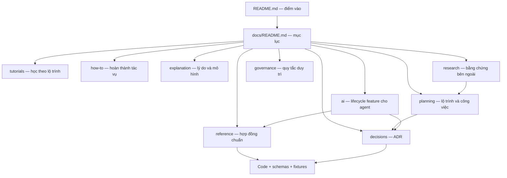

# Trung tâm tài liệu Anima Engine

Tài liệu được tổ chức theo Diátaxis: **tutorial** để học theo lộ trình, **how-to** để
hoàn thành một việc, **reference** để tra cứu hợp đồng, và **explanation** để hiểu lý
do thiết kế. Kế hoạch, nghiên cứu, quyết định và quản trị được tách riêng để không
trộn “điều đang đúng” với “điều dự kiến làm”.

## Bản đồ tài liệu

## Lối vào theo nhu cầu

| Tôi muốn… | Đi tới |
|---|---|
| Chạy và hiểu dự án lần đầu | [Tutorials](tutorials/README.md) |
| Build, test, benchmark hoặc tạo artifact | [How-to](how-to/README.md) |
| Tra cứu luật mô phỏng, biome, tọa độ, manifest | [Reference](reference/README.md) |
| Sửa genotype, phenotype, spawn, save hoặc migration sinh vật | [Creature Development Contract](reference/CREATURE_DEVELOPMENT_CONTRACT.md) |
| Tạo thế giới khác luật, nguồn “mana”, fork và so sánh tiến hóa | [Evolution Experiment Contract](reference/EVOLUTION_EXPERIMENT_CONTRACT.md) |
| Sửa bộ não agent, gen não, hoặc không gian hành động | [ADR-0003](decisions/ADR-0003-evolved-per-agent-brains.md) *(proposed)* |
| Xem requirements/design/testing/task của feature đang phát triển | [AI lifecycle docs](ai/requirements/2026-07-24-feature-alternate-evolution-world-lab.md) |
| Hiểu kiến trúc và nguyên nhân của quyết định | [Explanation](explanation/README.md) |
| Xem việc cần làm và thứ tự phụ thuộc | [Planning](planning/README.md) |
| Xem đánh giá dự án nguồn mở | [Open-source landscape](research/OPEN_SOURCE_LANDSCAPE.md) |
| Xem đề xuất nâng cấp map và mô hình machine | [Map & ML upgrade research](research/MAP_AND_ML_UPGRADE_RESEARCH.md) *(proposed)* |
| Ghi hoặc tra cứu quyết định kiến trúc | [ADR index](decisions/README.md) |
| Duy trì và tái cấu trúc tài liệu | [Documentation policy](governance/DOCUMENTATION_POLICY.md) |
| Thêm dependency hoặc sao chép mã/asset | [Open-source policy](governance/OPEN_SOURCE_POLICY.md) |

## Nguồn sự thật

| Chủ đề | Nguồn chuẩn hiện tại |
|---|---|
| Phạm vi sản phẩm và kiến trúc | [`PROJECT.md`](../PROJECT.md) |
| Tầm nhìn thế giới | [`WORLD_DESIGN.md`](../WORLD_DESIGN.md) |
| Luật, đơn vị, bảo toàn và thứ tự tick | [`SIMULATION_RULES.md`](../SIMULATION_RULES.md) |
| Phân loại biome | [`BIOME_TAXONOMY.md`](../BIOME_TAXONOMY.md) |
| Hệ tọa độ và phép biến đổi | [`COORDINATE_CONTRACT.md`](../COORDINATE_CONTRACT.md) |
| Artifact ảnh và góc nhìn chuẩn | [`MAP_MANIFEST.md`](../MAP_MANIFEST.md) |
| Baseline hiệu năng | [`BENCHMARK_BASELINE.md`](../BENCHMARK_BASELINE.md) |
| Lộ trình mô phỏng | [`WORLD_SIMULATION_PLAN.md`](../WORLD_SIMULATION_PLAN.md) |
| Công việc có thể thực thi | [`TODO.md`](../TODO.md) |
| Vòng đời genotype → phenotype → spawn | [`CREATURE_DEVELOPMENT_CONTRACT.md`](reference/CREATURE_DEVELOPMENT_CONTRACT.md) |
| World laws, exotic energy và thí nghiệm tiến hóa | [`EVOLUTION_EXPERIMENT_CONTRACT.md`](reference/EVOLUTION_EXPERIMENT_CONTRACT.md) *(proposed)* |

Các tài liệu chuẩn đang ở thư mục gốc được giữ nguyên để không phá liên kết và thay
đổi đang thực hiện. Việc di chuyển chỉ diễn ra theo từng đợt có redirect stub, được
mô tả trong [chính sách tài liệu](governance/DOCUMENTATION_POLICY.md).
