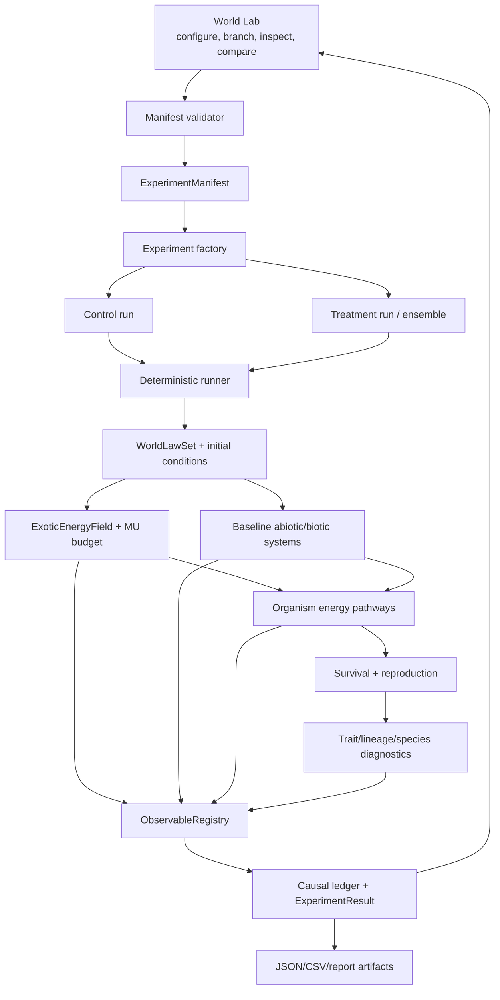

# Design — Alternate Evolution & World Lab

## Architecture overview



### Architectural boundary

| Layer | Owns | Must not own |
|---|---|---|
| World law | Các luật/nguồn hợp lệ của run | Runtime density hoặc organism trait |
| World state | Dynamic fields và budgets | Genotype rewrite |
| Organism genotype | Khả năng di truyền | Current field value |
| Developed phenotype | Cơ quan/capacity đã phát triển | Mức storage thay đổi mỗi tick |
| Runtime state | Storage, uptake, health, behavior | World-law definition |
| Experiment | Initial state, factors, seeds, sampling | Cơ chế sinh học nội bộ |
| Observability | Metadata, sample, result, causal links | Tự suy logic từ renderer |

## Current-to-target mapping

| Hiện tại | Target | Thay đổi chính |
|---|---|---|
| `Scenario` | `ExperimentManifest` | laws, initial conditions, seed set, metrics, versions |
| `SimModel: Default` | `ExperimentModelFactory` | khởi tạo từ manifest/snapshot |
| `InterventionKind` enum nhỏ | Versioned parameterized commands | exotic source add/remove/pulse |
| `ReferenceEcosystem` | `ReferenceEvolutionWorld` | field + generations + pathway frequency |
| `CausalLedger` | Causal/evolution ledger | world-law root, reproduction/trait events |
| `STATE_VARIABLES` | `ObservableRegistry` + conservation metadata | dynamic registration nhưng stable ids |
| `control_treatment` | fork/ensemble runner | genesis/checkpoint/factorial |
| `EcosystemPanel` | World Lab | branch tree, layers, inspector, comparison |

## Data model

### World laws

```rust
#[derive(Clone, Debug, Serialize, Deserialize)]
pub struct WorldLawSet {
    pub schema_version: u16,
    pub baseline_energy: BaselineEnergyLaw,
    pub exotic_energy: Option<ExoticEnergyLaw>,
    pub mutation: MutationLaw,
    pub development: DevelopmentLawRef,
    pub speciation: SpeciationPolicy,
}

#[derive(Clone, Debug, Serialize, Deserialize)]
pub struct ExoticEnergyLaw {
    pub id: EnergySourceId,
    pub display_name: String,
    pub unit: UnitId, // MVP "MU"
    pub source_model: ExoticSourceModel,
    pub topology: SourceTopology,
    pub source_rate: f32,
    pub diffusion_rate: f32,
    pub decay_rate: f32,
    pub max_density: f32,
}

pub enum ExoticSourceModel {
    Renewable,
}

pub enum SourceTopology {
    Uniform,
    Patchy { hotspot_count: u16, radius_cells: f32 },
}
```

`WorldLawSet::fingerprint()` là một phần của run/save identity. Unknown schema/source model phải trả
lỗi có lý do, không fallback thành Mana mặc định.

`WorldLawSet.exotic_energy=None` là disabled/baseline path duy nhất. Một
`Some(ExoticEnergyLaw)` luôn là nguồn sống; `Finite`, `Pulsed` source model và `FieldArtifact`
topology là future extensions, không phải variant đã ship trong headless AE2. Runtime `Pulse` là
intervention trên field state, không phải source-model variant hay world-law mutation.

### Experiment manifest

```rust
pub struct ExperimentManifest {
    pub schema_version: u16,
    pub experiment_id: ExperimentId,
    pub name: String,
    pub world_artifact: WorldArtifactRef,
    pub laws: WorldLawSet,
    pub initial_conditions: InitialConditionSet,
    pub interventions: Vec<InterventionCommand>,
    pub seeds: Vec<u64>,
    pub duration_ticks: u64,
    pub sample_plan: SamplingPlan,
    pub observable_ids: Vec<ObservableId>,
    pub expected_factor_diff: FactorDiff,
}

pub struct RunProvenance {
    pub run_id: RunId,
    pub parent_run_id: Option<RunId>,
    pub fork_tick: Option<u64>,
    pub manifest_fingerprint: u64,
    pub model_version: String,
    pub build_id: String,
}
```

`FactorDiff` liệt kê JSON paths được phép khác giữa control/treatment. Validator fail nếu có khác
biệt ngoài allowlist.

### Dynamic exotic field and budget

```rust
pub struct ExoticEnergyField {
    pub source_id: EnergySourceId,
    pub width: usize,
    pub height: usize,
    pub density: Vec<f32>,
    pub next: Vec<f32>,
}

pub struct ExoticEnergyBudget {
    pub initial: f64,
    pub sourced: f64,
    pub field: f64,
    pub organism_storage: f64,
    pub dissipated: f64,
    pub exported: f64,
}
```

Audit:

```text
initial + sourced
  = field + organism_storage + dissipated + exported ± tolerance
```

MU → biological work phải debit storage/field. EU transfer vẫn debit/credit giữa
plants/animals/detritus theo contract hiện tại.

### Organism pathway

```rust
pub struct EnergyPathwayGenotype {
    pub source_id: EnergySourceId,
    pub sensing_affinity: f32,
    pub uptake_rate: f32,
    pub storage_capacity: f32,
    pub utilization_efficiency: f32,
    pub tolerance: f32,
    pub maintenance_cost_eu_per_tick: f32,
    pub morphology_allocation: f32,
}

pub struct DevelopedEnergyPathway {
    pub source_id: EnergySourceId,
    pub sensor_range: f32,
    pub uptake_surface: f32,
    pub storage_capacity: f32,
    pub utilization_efficiency: f32,
    pub tolerance: f32,
    pub maintenance_cost_eu_per_tick: f32,
}

pub struct ExoticEnergyState {
    pub stored_mu: f32,
    pub last_uptake_mu: f32,
    pub last_spent_mu: f32,
    pub toxicity_load: f32,
}
```

Genotype defaults disabled/zero để giữ legacy. `DevelopedEnergyPathway` được materialize tại birth
theo Creature Development Contract; `ExoticEnergyState` là runtime.

### Species diagnostics

```rust
pub struct SpeciesClusterRecord {
    pub policy_version: u16,
    pub cluster_id: SpeciesClusterId,
    pub status: ClusterStatus, // Morph, Ecotype, CandidateSpecies, Species
    pub founding_lineages: Vec<LineageId>,
    pub first_generation: u64,
    pub last_generation: u64,
    pub genotype_distance: f32,
    pub niche_distance: f32,
    pub gene_flow_score: Option<f32>,
    pub member_count: u64,
    pub evidence: Vec<EvidenceRef>,
}
```

Cluster ID là diagnostic. Nó không đổi class/behavior của organism và không trở thành selection
target.

### Observable registry

```rust
pub struct ObservableSpec {
    pub id: ObservableId,
    pub display_name: String,
    pub unit: UnitId,
    pub scope: ObservableScope,
    pub cadence: RateBand,
    pub aggregation: Aggregation,
    pub valid_range: RangeInclusive<f64>,
    pub conservation: ConservationRole,
    pub source: SourceSymbol,
}
```

Stable observable groups:

- `world.*`: climate, water, nutrient, biomass;
- `exotic.*`: density, source, uptake, storage, dissipation, budget error;
- `organism.*`: EU, MU, pathway phenotype, reproductive success;
- `evolution.*`: trait mean/variance/frequency, lineage count, niche occupancy;
- `species.*`: richness, cluster status, divergence, extinction;
- `experiment.*`: checksum, run status, effect size, interval, performance.

## Runner design

### Factory instead of `Default`

```rust
pub trait ExperimentModel: Sized {
    type Snapshot;

    fn from_genesis(ctx: &RunContext) -> Result<Self, ExperimentError>;
    fn from_snapshot(ctx: &RunContext, snapshot: &Self::Snapshot)
        -> Result<Self, ExperimentError>;
    fn step(&mut self, step: StepContext<'_>) -> Result<(), ExperimentError>;
    fn snapshot(&self) -> Self::Snapshot;
    fn checksum(&self) -> u64;
}
```

Reference adapter và Bevy adapter dùng cùng interface. `RunContext` chứa immutable laws/seed streams,
không cho system tự đọc global mutable config.

### Fork modes

```rust
pub enum ForkOrigin {
    Genesis { initial_conditions: InitialConditionSet },
    Checkpoint { snapshot_ref: SnapshotRef, fork_tick: u64 },
}
```

- Genesis fork so sánh lịch sử từ `t=0`.
- Checkpoint fork so sánh resilience/dependency.
- Factorial runner tạo manifests từ factor matrix nhưng vẫn xuất từng manifest độc lập.

### Ensemble

Mỗi seed là một run độc lập. Summary không drop NaN/failure:

```rust
pub struct EnsembleSummary {
    pub requested_runs: usize,
    pub completed_runs: usize,
    pub failed_runs: Vec<RunFailure>,
    pub metrics: Vec<MetricSummary>,
}
```

Metric summary có median/mean, effect size, interval, quantiles và sample count.

## Causal design

`WorldLawSet` được ghi như một root cause tại tick 0:

```text
WorldLawCause(exotic=arcane_flux)
  → field density/flux
  → uptake/storage transaction
  → performance delta
  → survival/reproduction event
  → trait frequency delta
  → lineage/species-cluster event
```

MVP giữ một dominant parent cho đường vertical slice và lưu `contributing_effects` riêng. Full
weighted multi-parent DAG là phase sau; không gán “100% do Mana” khi model có nhiều cause.

## Update order

Phần exotic được chèn vào tick order hiện tại:

```text
1. Apply scheduled interventions / branch inputs
2. Climate forcing
3. Hydrology and soil exchange
4. Exotic source, diffusion and decay
5. Producer growth / catalytic MU use
6. Decomposition and nutrient return
7. Sensors (including exotic sensing) and behavior
8. Movement and physics
9. Feeding, drinking, predation and exotic uptake
10. Metabolism, MU expenditure and homeostasis
11. Birth, aging, death, migration
12. Evolution / lineage / species diagnostics
13. EU + MU conservation audit
14. Observable sampling, causal ledger and snapshots
```

Mỗi system phải khai `.before()`/`.after()` và rate band; field diffusion không chạy 60 Hz nếu không
có lý do/benchmark.

## Frontend World Lab

### Components

| Component | Trách nhiệm |
|---|---|
| `ExperimentBuilder` | artifact, laws, initial state, factors, seeds, duration |
| `ManifestDiff` | chỉ ra biến control/treatment được phép khác |
| `RunTree` | genesis/checkpoint branches và trạng thái run |
| `LayerInspector` | field overlays với legend/unit/cadence |
| `EntityInspector` | genotype/phenotype/runtime/transactions/lineage |
| `EvolutionTimeline` | trait frequency, population, species events |
| `CausalExplorer` | trace selected metric/effect tới root |
| `CompareRuns` | aligned series, effect size, interval, failures |
| `BudgetPanel` | EU/MU balance và drift alerts |
| `ExperimentExport` | manifest/result JSON, summary CSV |

UI nhận metadata từ observable registry payload. Không hard-code unit/range khác backend.

### Interaction rules

- Control thay world law hiển thị “creates new branch/restart required”.
- Intervention preview hiển thị region/time/intensity/cause.
- Layer sampling cadence luôn hiện để người dùng không nhầm interpolation là dữ liệu thật.
- Candidate species có badge evidence state; không tự nâng thành Species.

## Persistence and compatibility

Save/snapshot thêm:

- world-law fingerprint + serialized laws;
- experiment/run provenance;
- exotic field/budget;
- organism exotic runtime state;
- species diagnostic policy version/state;
- observable registry version.

Legacy save:

- `exotic_energy=None`;
- pathway/storage mặc định zero;
- không re-develop organism;
- giữ `WorldIdentity` check;
- lần save sau ghi schema mới.

Migration giữa shard giữ same law fingerprint. Cross-law migration bị từ chối hoặc đi qua explicit
world-transfer intervention; không đổi phenotype/storage im lặng.

## API/IPC proposal

```rust
validate_experiment(manifest) -> ValidationReport
run_experiment(manifest) -> RunHandle
fork_experiment(parent_run, fork_spec) -> RunHandle
cancel_run(run_id) -> RunStatus
get_run_status(run_id) -> RunStatus
get_observable_catalog(run_id) -> Vec<ObservableSpec>
get_series(run_id, query) -> SeriesPage
get_causal_trace(run_id, effect_id) -> CausalTrace
get_entity_history(run_id, entity_or_lineage_id) -> EntityHistory
export_experiment(run_id, format) -> ArtifactRef
```

Long run phải stream progress/samples bằng Tauri events hoặc chunked artifact, không trả toàn bộ
time series trong một IPC response.

## Error handling

Fail-fast trước run cho:

- invalid unit/range/schema;
- unknown source/pathway id;
- factor diff ngoài allowlist;
- artifact/law/snapshot fingerprint mismatch;
- duplicate seed/run id;
- requested observable không tồn tại;
- impossible budget/tolerance.

Run-time error tạo `RunFailure` có tick/system/cause/state checksum và giữ trong ensemble.

## Alternatives and decisions

| Quyết định | Chọn | Lý do |
|---|---|---|
| Hard-code Mana vs generic source | Generic `ExoticEnergy` | Tái sử dụng, test baseline, không nhân đôi engine |
| Trộn MU vào EU vs ledger riêng | Ledger riêng | Giữ unit/conservation contract |
| Live Bevy trước vs reference slice trước | Reference trước | Rẻ, deterministic, kiểm contract nhanh |
| Species class authored vs detector | Detector diagnostic | Cho phép emergence, tránh hard-code outcome |
| Slider thay law in-place vs branch | Branch | Giữ lịch sử và causal validity |
| Một seed vs ensemble | Ensemble | Không kết luận từ noise |
| UI tự định nghĩa metric vs registry | Registry backend | Một nguồn sự thật |

## Non-functional requirements

### Determinism

- Same manifest/build → same run checksum.
- RNG stream keyed, treatment không đổi unrelated draw count.
- Parallel ensemble không đổi result của từng seed.

### Performance

- Exotic field SoA + double buffer cấp phát trước.
- Ecology update target 1 Hz hoặc thấp hơn.
- Telemetry aggregate theo cell/chunk/species; không log mỗi entity mỗi tick mặc định.
- Time series chunk/downsample; query có paging.
- Benchmark report tách reference runner, live Bevy và UI.

### Reliability

- Checkpoint atomic/versioned.
- Partial ensemble giữ completed/failure metadata.
- Cancel không làm hỏng artifact.
- Unknown schema fail có thông báo, không fallback ngầm.

### Security/privacy

Feature chạy local; không cần external service hoặc secret.
Imported manifests giới hạn kích thước, duration, seed count và observable count để tránh resource
exhaustion.

## Design coverage

| Requirement | Design section |
|---|---|
| G1/FR-01/02 | World laws |
| G2/FR-05/06/11 | Dynamic field, pathway, species diagnostics |
| G3 | Budget + compatibility |
| G4/FR-03/04 | Manifest, runner, forks, ensemble |
| G5/FR-08/09/10/12 | Observable registry, causal design, World Lab |
| G6 | Current-to-target mapping, rollout in plan |
| FR-07 | Persistence and compatibility |
| FR-13 | `None` fallback |
| FR-14 | Map gate + authoritative registry |

Không còn gap kiến trúc material trong phạm vi MVP. Parameter defaults và full multi-cause DAG được
defer có tên trong requirements, không bị giả định ngầm.
