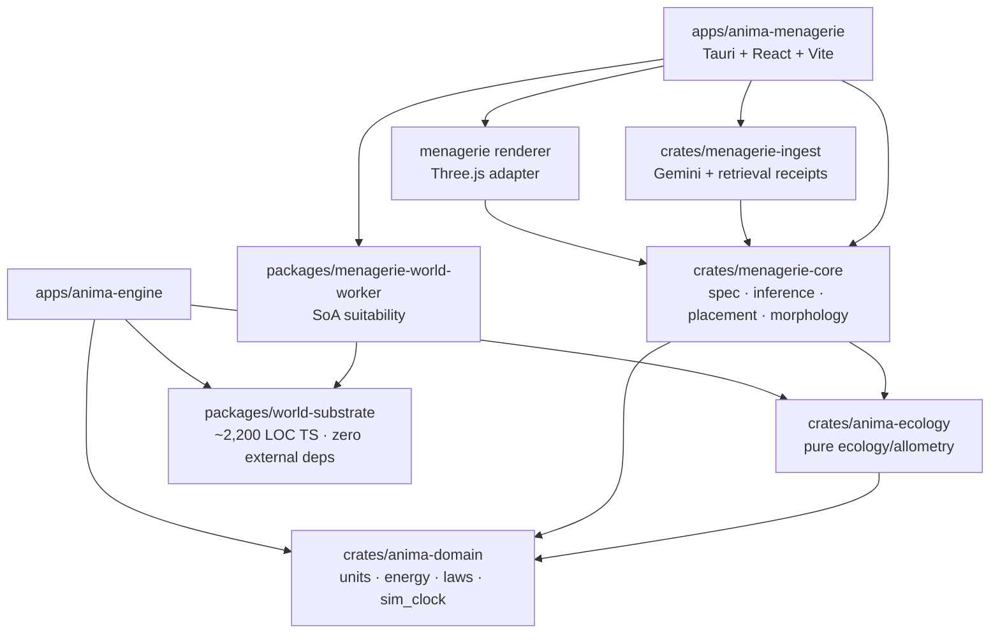

# Design — Anima Menagerie

## 1. Câu hỏi làm rõ

Không có câu hỏi chặn thiết kế. Bản thiết kế dùng các giả định có tên sau; đổi bất kỳ giả định nào cũng
cần review lại phần tương ứng:

1. Menagerie là một Tauri v2 desktop app phát hành độc lập, nhưng giai đoạn đầu nằm cùng monorepo để
   dùng workspace package/crate; nó không import app Anima-Engine.
2. Internet chỉ cần ở biên nhập liệu. Khi đã có `CreatureSpec`, toàn bộ suy diễn, suitability,
   placement, morphology, animation và render chạy offline, tất định.
3. V1 ưu tiên động vật có xương sống và các body plan nêu trong schema. Động vật không xương sống vẫn
   nhận được ở nhánh B nhưng phải dùng `custom` authoring graph và mang confidence thấp; không giả vờ
   một template quadruped bao phủ chúng.
4. World hiện chỉ có các field chuẩn hóa. Để so với ngưỡng sinh thái theo đơn vị thật, Menagerie cần
   thêm `WorldFieldCalibrationV1` versioned bên ngoài `CreatureSpec`; interface này chưa có trong repo.
5. `EU` hiện là đơn vị biomass-equivalent nội bộ, chưa có phép đổi được công bố sang kJ. Menagerie tính
   bioenergetics/placement bằng kJ, kg, m, ngày và chỉ đi qua một adapter hiệu chỉnh riêng khi chạy
   runtime. Không được ngầm coi `1 EU = 1 kJ`.

## 2. Kiến trúc tầng

### 2.1 Quan hệ phụ thuộc



Đây là chữ V thật: hai app cùng phụ thuộc substrate, không phụ thuộc lẫn nhau.

### 2.2 Package boundary

| Package/crate | Sở hữu | Không được sở hữu |
|---|---|---|
| `anima-domain` | unit vocabulary, conservation ledger, laws, sim clock | UI, Gemini, evolution policy |
| `anima-ecology` | phần pure hiện ở `core/ecology.rs`: NPP, trophic transfer, metabolic helpers | Bevy systems, MAP-Elites |
| `world-substrate` | `worldGen`, `worldSample`, `worldArtifact`, `coordinate`, cache contract, world identity | React, Three.js, Tauri |
| `menagerie-ingest` | identification, HTTP retrieval, evidence receipt, model JSON validation, quota scheduler | suitability, placement, morphology runtime |
| `menagerie-core` | `CreatureSpec`, deterministic inference, placement result, authoring compiler, export gate | selection, mutation, A2C, lineage |
| `menagerie-world-worker` | full-grid SoA compute, preview pyramid, caches | network, AI, renderer |
| renderer adapter | mesh/skin/material/animation presentation | ecological truth or placement decision |

Theo số đo repo, substrate TS là khoảng 2.200 dòng và không có dependency ngoài. Công việc tách cụ thể:

- kéo duy nhất `ImprovedNoise2D` khỏi `terrainGenerator.ts` 905 dòng sang `noise.ts`;
- giữ `chunkLod`, `caveGeometry`, `skyParams` ở renderer vì chúng import Three.js;
- chuyển `sharedWorld.ts` vào package và giữ API nhỏ hiện có;
- publish source package trong workspace trước, chưa cần registry riêng.

### 2.3 Dùng chung và tuyệt đối không dùng chung

Dùng chung bắt buộc:

- đơn vị, ledger bảo toàn, nhiệt động học, trọng lực/vận động và clock từ `anima-domain`;
- NPP, trophic transfer, resource capacity và công thức sinh thái pure;
- canonical 22-biome artifact, mapping 22→11, coordinate contract và world identity;
- morphology vocabulary `MorphologyNode`, `MorphologyEdge`, `MorphologyGenotype` tại cổng export.

Không link vào Menagerie:

- generation replacement, mutation/crossover, MAP-Elites;
- `BrainGenotype`, per-agent neural model, A2C/lifetime learning;
- lineage/speciation diagnostics, experiment manifest và các gate phục vụ quyền kết luận nghiên cứu.

Menagerie vẫn có luật nghiêm: behavior là FSM + steering + CPG heuristic; seeded RNG chỉ dùng để tạo
biến thiên có thể tái tạo.

### 2.4 Hai contract còn thiếu — ghi rõ là đề xuất mới

Repo chưa có hai interface sau; đây không phải API hiện hữu:

```ts
interface WorldFieldCalibrationV1 {
  schema_version: "1.0.0";
  world_identity: { seed: string; size: number; shape: string };
  world_gen_version: number; // 20 hiện tại; không phải thành phần thứ tư của identity
  horizontal_extent_m: { x: number; z: number };
  elevation_m: MonotoneCalibration;       // raw elevation [0,1] -> m ASL
  temperature_c: MonotoneCalibration;     // raw temperature [0,1] -> °C
  soil_moisture_vwc: MonotoneCalibration; // raw moisture [0,1] -> m³/m³
  npp_model_version: string;
}

interface RuntimeEnergyCalibrationV1 {
  schema_version: "1.0.0";
  ecology_model_version: string;
  kJ_per_EU: number; // phải được hiệu chỉnh và gate; không có default ngầm
}
```

`MonotoneCalibration` là affine hoặc LUT đơn điệu kèm inverse. Suitability đổi ngưỡng vật lý sang raw
threshold đúng một lần, không đổi 4,2 triệu cell sang object vật lý.

Mọi cache key dùng `(world_identity, world_gen_version, calibration_version)`. Điều này giữ đúng
identity duy nhất `(seed,size,shape)` đã công bố, đồng thời vẫn invalidate kết quả khi generator tăng
version.

### 2.5 Van một chiều

```text
CreatureSpec + seed
  -> AuthoredMorphology (có rest pose)
  -> validated Menagerie phenotype
  -> ExportGateV1
  -> ExternalGenotypeEnvelope (chỉ genotype + provenance tối thiểu)
  -> Anima-Engine run manifest: origin = exogenous
```

`ExportGateV1` phải kiểm finite/range, graph, mass, unit vector, version và content hash. Nó loại mesh,
skin, animation, placement, phenotype và model response. Engine cần một interface import mới (chưa có):

```rust
validate_external_genotype(envelope) -> Result<MorphologyGenotype, ImportError>
```

Manifest run cần marker `population_origin = exogenous { source, spec_hash, compiler_version }`; run đó
không được nhập vào baseline. Một hàm `toJSON()` không đủ vì không chứng minh invariants hay nguồn gốc.

## 3. `CreatureSpec` v1

### 3.1 Quy ước chung

Mọi leaf có dạng `Field<T>`; không có field quan trọng nào chỉ là một scalar trần:

```ts
type Field<T> = {
  value: T;
  provenance: Provenance[];
};

type Provenance =
  | { kind: "user"; input_id: string; content_sha256: string }
  | { kind: "retrieved"; evidence_id: string; span_start: number; span_end: number }
  | { kind: "inferred"; rule_id: string; rule_version: string; inputs: string[];
      confidence: number };

type Range4 = {
  survival_min: number;
  core_min: number;
  core_max: number;
  survival_max: number;
};
```

Invariant `survival_min <= core_min <= core_max <= survival_max`, mọi số finite, đơn vị nằm trong enum
được định nghĩa. Provenance `retrieved` chỉ hợp lệ khi receipt bên ngoài model xác minh được span.

### 3.2 Contract chuẩn

```ts
interface CreatureSpecV1 {
  schema_version: "1.0.0";
  spec_id: string; // sha256 của canonical spec, không gồm created_at

  identity: {
    display_name: Field<string>;
    scientific_name: Field<string | null>;
    accepted_taxon_id: Field<string | null>;
    reality: Field<"real" | "uncertain" | "imagined">;
    recognition_branch: Field<"A" | "B">;
  };

  physiology: {
    adult_body_mass: Field<{ min: number; typical: number; max: number; unit: "kg" }>;
    thermoregulation: Field<"endotherm" | "ectotherm" | "mesotherm" | "unknown">;
    ambient_temperature: Field<Range4 & { unit: "degC" }>;
    substrate_moisture: Field<(Range4 & { unit: "m3_water_per_m3_substrate" }) | null>;
    tissue_density: Field<{ min: number; typical: number; max: number; unit: "kg_per_m3" }>;
  };

  habitat: {
    elevation: Field<Range4 & { unit: "m_asl" }>;
    slope: Field<Range4 & { unit: "degree" }>;
    media: Field<Array<"land" | "freshwater" | "saltwater" | "air" | "subterranean" | "arboreal">>;
    water_relation: Field<{
      immersion: "avoid" | "optional" | "required";
      salinity: "fresh" | "brackish" | "marine" | "any";
      depth: Range4 & { unit: "m" };
      max_distance_from_water: { value: number; unit: "m" } | null;
    }>;
  };

  ecology: {
    diet_guild: Field<"herbivore" | "omnivore" | "carnivore" | "detritivore" | "filter_feeder">;
    trophic_level: Field<{ min: number; typical: number; max: number; unit: "dimensionless" }>;
    social_group_size: Field<{ min: number; typical: number; max: number; unit: "individual" }>;
    observed_home_range: Field<{ min: number; typical: number; max: number;
                                 unit: "km2_per_group" } | null>;
    observed_population_density: Field<{ min: number; typical: number; max: number;
                                         unit: "individual_per_km2" } | null>;
  };

  locomotion: {
    modes: Field<Array<"walk" | "run" | "hop" | "slither" | "swim" | "fly" | "climb" | "burrow">>;
    primary_mode: Field<string>;
    locomotor_appendage_count: Field<number>;
    ground_contact_labels: Field<string[]>;
    characteristic_limb_length: Field<{ value: number; unit: "m" } | null>;
    observed_max_speed: Field<{ min: number; typical: number; max: number; unit: "m_per_s" } | null>;
  };

  morphology: {
    body_plan: Field<"quadruped" | "biped" | "serpentine" | "piscine" | "avian" |
                     "pinniped" | "testudine" | "crocodilian" | "custom">;
    symmetry: Field<"bilateral" | "radial" | "asymmetric">;
    authoring_frame: Field<"animal_fixed_x_forward_y_up_z_right">;
    nodes: Array<{
      id: number;
      label: Field<string>;
      length: Field<{ value: number; unit: "m" }>;
      radius: Field<{ value: number; unit: "m" }>;
      mass_fraction: Field<number>;
      contact_role: Field<"none" | "foot" | "fin" | "wing_tip">;
    }>;
    edges: Array<{
      source_node: number;
      target_node: number;
      anchor: Field<{ value: [number, number, number]; unit: "m" }>;
      joint_axis: Field<[number, number, number]>;
      rest_dir: Field<[number, number, number]>;
      joint_limits: Field<{ min: number; max: number; unit: "radian" }>;
    }>;
  };
}
```

### 3.3 Vì sao các field tồn tại

- `spec_id` làm key cache/share; canonicalization bỏ timestamp để cùng dữ liệu cho cùng hash.
- `accepted_taxon_id` làm bằng chứng resolution máy-kiểm-được; tên hiển thị không đủ vì synonym.
- bốn ngưỡng trong `Range4` cấp đúng hình thang suitability: vùng sống sót và vùng tối ưu khác nhau.
- `media`, water depth/distance/salinity ngăn cá lên cạn, thú đất dưới hồ và loài biển vào freshwater.
- `trophic_level`, group size, home range/density là input bắt buộc cho carrying capacity và territory.
- `ground_contact_labels` làm phép đo đồng phẳng đúng body plan; không coi cánh/vây là chân.
- `body_plan` là tham số dữ liệu, không phải câu cố định trong prompt.
- `authoring_frame`, `anchor`, `rest_dir` đóng ambiguity đã gây 13/16 khớp hở.
- `mass_fraction` giữ tổng khối lượng compiler đúng bằng body mass, kể cả sai số float.

### 3.4 Những field cố ý không có

- Không `x/y`, `cell`, `spawn`, `biome_id`, `world_gen_version`: placement là output theo từng world;
  spec phải sống qua worldgen mới.
- Không `root_node`: root được suy từ node có indegree 0; field model khai báo đã chứng minh là không tin được.
- Không `sources: string[]`: URL model kể lại không phải retrieval receipt.
- Không `confidence` toàn cục: confidence theo leaf; một tên chắc chắn không làm khối lượng chưa tra cứu trở
  nên chắc chắn.
- Không mesh, texture, rig runtime hay tọa độ bone: đó là phenotype/cache, không phải creature truth.
- Không `biome_preferences`: biome là nhãn worldgen; các ngưỡng vật lý mới là contract bền vững.
- Không neural weights, fitness, generation, lineage hoặc experiment manifest.
- Không `created_at` trong nội dung hash; metadata lưu trong document envelope bên ngoài spec.

## 4. Suy diễn sinh học, suitability và placement

### 4.1 Thứ tự và quy tắc mâu thuẫn

Mỗi đại lượng có ba slot: `observed`, `derived`, `effective`. Không ghi đè lẫn nhau.

1. User override được giữ nguyên và hiển thị cảnh báo nếu mâu thuẫn; không âm thầm sửa ý người dùng.
2. Đo trực tiếp theo đúng loài, có retrieval receipt, là `effective` mặc định.
3. Công thức chỉ điền thiếu và luôn chạy song song làm cross-check.
4. Nếu interval tra cứu không giao interval dự đoán sau tolerance log-space 0,5 dex, tạo
   `Conflict`; placement dùng dữ liệu tra cứu nhưng UI không được giấu cảnh báo.
5. Với species benchmark, sai quá ngưỡng không được “tune riêng con đó”; phải sửa coefficient theo guild
   và chạy lại toàn bộ corpus.

### 4.2 Năng lượng

Khối lượng `M` tính bằng kg.

- BMR endotherm fallback theo Kleiber:
  `BMR_kJ_day = 293.1 * M^0.75` (293,1 kJ = 70 kcal).
- FMR generic cho terrestrial vertebrate, dùng mass theo gram như regression gốc:
  `FMR_kJ_day = 2.25 * M_g^0.808`.
- Nếu chỉ có BMR: `FMR = activity_factor * BMR`, với v1 `activity_factor = 2.5` và interval
  `[1.6, 4.0]`; đây là prior cần hiệu chỉnh, không phải ground truth.
- Ectotherm không dùng coefficient endotherm. Khi thiếu đo trực tiếp, áp ratio lớp từ corpus Nagy và
  bắt buộc provenance `inferred`; không dùng một coefficient chung cho chim, thú, bò sát.

`anima-ecology::metabolic_rate` hiện có `METABOLIC_NORM=0.06`, exponent `0.75`, reference 293,15 K và
activation energy 0,65 eV. Menagerie dùng cùng luật khi chuyển vào runtime EU, nhưng không gọi giá trị
EU đó là kJ cho tới khi `RuntimeEnergyCalibrationV1` tồn tại.

### 4.3 Density, territory và capacity

Damuth baseline chỉ cho mammalian primary consumers:

```text
D_herbivore = 10^4.23 * M_g^-0.75              [individual/km²]
C_trophic   = 10^(-2 * max(0, trophic_level-2))
D_fallback  = D_herbivore * C_trophic
A_density   = group_size / D_fallback           [km²/group]
```

Hệ số `10^-2` cho mỗi bậc trên herbivore biến “hai bậc độ lớn” thành rule có version. Ví dụ một predator
gần trophic level 3,5 nhận correction khoảng `10^-3`, thay vì cho hổ density của động vật ăn cỏ. Đây là
prior; home range/density tra cứu có nguồn thắng nó.

Nhu cầu diện tích theo năng lượng không lấy NPP trung bình toàn map. Với một vùng connected `R`:

```text
producer_kJ_day(R)
  = Σcell [NPP_g_m2_year(cell) * area_m2(cell) * 18 kJ/g / 365]
consumer_supply(R)
  = producer_kJ_day(R) * harvest_fraction * 0.30^(trophic_level - 1)
required_kJ_day
  = FMR_kJ_day * group_size * safety_factor
```

V1: dry-matter energy `18 kJ/g`, `harvest_fraction=0.10`, `safety_factor=1.5` và trophic efficiency
`0.30` để khớp constant hiện tại của `core/ecology.rs`. Ba constant đầu là calibration parameters có
version; `0.30` là luật runtime đang có. Vùng tối thiểu là connected expansion nhỏ nhất thỏa năng lượng:

```text
A_energy  = area(first connected region whose consumer_supply >= required)
A_min     = max(A_density, A_energy)
```

Nếu observed home range có nguồn, dùng nó làm target interval nhưng vẫn chạy capacity gate. World thiếu
năng lượng là `Uninhabitable`, không phải lý do đặt population vượt budget.

Population count cuối:

```text
N_density = floor(suitable_area_km2 * D_effective)
N_energy  = floor(total_consumer_supply_kJ_day / FMR_kJ_day)
N         = min(N_density, N_energy)
```

Nếu `N < minimum_viable_group_size`, kết quả hợp lệ là không đặt.

### 4.4 Nhiệt và hình thái

Không suy nhiệt độ chịu đựng của một loài chỉ từ mass. Bergmann và Allen là prior kiểm tra hình thái:

- với geometric similarity, `surface/volume ∝ M^-1/3`;
- compiler tính capsule surface và volume thật, xuất `surface_area_m2 / volume_m3`;
- limb/ear/tail exposure là appendage-area fraction.

Nếu loài endotherm ở lạnh nhưng spec vừa rất nhỏ vừa có appendage fraction cao, tạo warning. Không sửa
temperature range hay limb length nếu không có evidence. Điều này tôn trọng việc Bergmann có xu hướng
thống kê nhưng không phải định luật nhân quả phổ quát.

### 4.5 Gait và tốc độ

Với leg length `L` m và `g=9.80665 m/s²`:

```text
Froude = v²/(gL)
v_preferred_walk = sqrt(0.25*g*L)
v_walk_run_transition = sqrt(0.50*g*L)
stride_frequency = v / (stride_ratio * L)
stride_ratio = 1.8 walk; 2.4 run
```

Maximum running fallback dùng Hirt, mass kg và output km/h:

```text
v_max = a*M^b*(1-exp(-h*M^i))
a=25.5, b=0.26, h=22, i=-0.60       // running v1 coefficient set
```

Observed speed có source thắng fallback. Swimming/flying dùng coefficient table versioned từ cùng model
sau khi đưa supplementary values vào regression fixture; v1 không được bịa `h` còn thiếu. Nếu table
chưa được ship và không có observed speed, UI ghi `max_speed = unknown`, animation vẫn dùng tốc độ
dimensionless an toàn từ CPG.

### 4.6 Suitability

Cho một dimension vật lý `x` và `Range4(a,b,c,d)`:

```text
μ(x)=0                    x<=a hoặc x>=d
μ(x)=(x-a)/(b-a)          a<x<b
μ(x)=1                    b<=x<=c
μ(x)=(d-x)/(d-c)          c<x<d
```

Chọn trapezoid vì dữ liệu sinh thái thường là range và core range, không chứng minh được mean/variance
Gaussian; ngoài survival range phải bằng 0 thật. Với field không áp dụng (`soil_moisture` cho pelagic),
loại khỏi denominator, không gán 1 giả.

Tổ hợp:

```text
hard_fail = bất kỳ μ bắt buộc nào bằng 0
S = 0 nếu hard_fail
S = exp(Σ w_i*ln(max(μ_i, 1e-6)) / Σw_i) nếu không
```

Đây là weighted geometric mean có veto. Nó không cho nhiệt độ chết được bù bằng độ ẩm đẹp, đồng thời
không làm score nhỏ đi chỉ vì spec có nhiều dimension. V1 weights: temperature 2, medium/water 3,
elevation 1, moisture 1, slope 1. Evidence quality `Q` được hiển thị riêng, không nhân vào `S` và không
biến thiếu nguồn thành sinh thái kém.

Water membership dùng depth/salinity/land mask; land species có thêm distance-to-water khi field đó có
giá trị. Distance transform, water depth, cell area, connected components và NPP là derived SoA cache
theo world identity, không đưa vào `CreatureSpec`.

### 4.7 Hiệu năng 4,2 triệu cell

- Preview 256² khi pointer đang kéo; exact 2048² sau `pointerup` hoặc debounce 150 ms.
- Worker riêng, transferable buffers/SharedArrayBuffer khi khả dụng; UI không quét field.
- Mỗi membership plane quantize `Uint8` (4 MiB ở 2048²), output thêm 4 MiB; cache tối đa sáu plane +
  derived masks dưới budget 64 MiB/creature.
- Slider đổi temperature chỉ tính lại plane temperature rồi combine; key cache gồm world identity,
  calibration version và threshold tuple quantize.
- Stale generation id bị hủy; không để kết quả slider cũ ghi đè mới.
- Complexity full pass `O(ND)`, placement connected expansion `O(N log N)` worst-case nhưng chỉ trên
  candidate component; có bucket queue 256 suitability levels để gần `O(N)`.

Target trước benchmark, không phải claim đã đo: preview p95 < 50 ms, full recombine p95 < 250 ms trên
máy baseline repo, peak additional memory < 96 MiB. Phải ghi số đo vào benchmark report trước ship.

### 4.8 Placement

1. Candidate phải `S >= 0.60`, mọi hard constraint pass và nằm trong component reachable cho
   `NavigationProfile` suy từ body radius, height, slope limit và medium.
2. Sampling weight `p_i ∝ S_i^4 * cell_area`; exponent 4 ưu tiên habitat tốt mà không collapse vào
   đúng một maximum.
3. Seed `H(spec_id, world_identity, world_gen_version, placement_seed)`, scan row-major, PRNG versioned.
4. Chọn group centers bằng weighted sampling không hoàn lại; rải cá thể quanh center bằng deterministic
   Poisson-disc, khoảng cách tối thiểu suy từ territory/social group, không phải slider tùy ý.
5. Grow territory connected tới khi đạt cả `A_min` lẫn capacity. Không cross medium hoặc nav component.
6. Không candidate, không component đủ lớn, hoặc `N` dưới group minimum đều trả
   `Uninhabitable { limiting_dimensions, best_score, energy_shortfall }`.

`PopulationPlacementV1` là artifact world-specific chứa cell/coordinates, world identity, suitability
hash, capacity audit và nav profile. Nó không được nhúng ngược vào `CreatureSpec`.

## 5. Pipeline AI đầu vào

### 5.1 Số lượt gọi

Không có agentic retry loop.

| Input/path | Call 1 | Retrieval ngoài model | Call 2 | Call 3 |
|---|---|---|---|---|
| Tên exact, unique | không cần model để resolve taxon | có | extract facts | không |
| Tên mơ hồ/mô tả | text identification top-k | có | extract facts | chỉ nhánh B |
| Ảnh | vision identification + morphology observation | có | extract facts | chỉ nhánh B |

Branch A thường 1–2 model calls; branch B 2 calls, tối đa 3 nếu cần analog selection. Model chỉ tạo dữ
kiện đầu vào. Từ normalizer/allometry trở đi không gọi API.

### 5.2 JSON schema từng lượt

`IdentifyObservationV1`:

```ts
{
  schema_version: "1.0.0";
  candidates: Array<{ scientific_name: string|null; common_name: string;
    rank: "species"|"genus"|"family"|"unknown"; confidence: number;
    observed_features: string[] }>;
  morphology: { body_plan_candidates: string[]; appendage_count: number|null;
    symmetry: string; visible_landmarks: Array<{label:string; x:number; y:number}>;
    occluded_fraction: number };
}
```

Không có `sources` trong schema này.

`ExtractEvidenceV1`, model chỉ được thấy evidence documents đã tải:

```ts
{
  schema_version: "1.0.0";
  claims: Array<{ field_path: string; value: unknown; unit: string|null;
    evidence_id: string; quote: string; confidence: number }>;
  missing_fields: string[];
}
```

Validator phải tìm đúng normalized `quote` trong snapshot có hash; quote hoặc evidence id sai thì claim
bị downgrade thành `inferred`, không được badge “đã truy xuất”.

`FallbackAnalogV1`:

```ts
{
  schema_version: "1.0.0";
  analogs: Array<{ accepted_taxon_id: string; borrowed_fields: string[]; rationale: string }>;
  inferred_traits: Array<{ field_path: string; value: unknown; unit: string;
    analog_taxon_ids: string[]; confidence: number }>;
}
```

### 5.3 Rẽ nhánh A/B

Không dùng confidence tự khai của model một mình. Branch A chỉ khi:

- taxon resolver trả một accepted species id;
- exact normalized name là unique, **hoặc** vision top-1 `>=0.85` và margin so với top-2 `>=0.15`;
- ít nhất hai đặc trưng quan sát không mâu thuẫn với taxon profile;
- không có hard contradiction về limb count/body plan/medium.

Ngược lại branch B. Ảnh mờ/che >50%, chỉ resolve tới genus, fantasy name, hoặc candidate margin nhỏ đều
phải abstain. UI cho phép user xác nhận một candidate; hành động đó mang provenance `user`, không biến
model memory thành retrieved evidence.

### 5.4 Chứng minh retrieval thật

HTTP retriever, không phải model, tạo:

```ts
interface EvidenceReceiptV1 {
  evidence_id: string;
  provider_id: string;
  canonical_url: string;
  requested_at: string;
  http_status: number;
  content_type: string;
  body_sha256: string;
  snapshot_ref: string;
  license: string | null;
}
```

Chỉ response 2xx có body hash và snapshot mới sinh receipt. Model không được ghi receipt. Cache giữ raw
snapshot để audit; extraction lưu character span. Ba badge UI:

- **Người dùng nhập**: có input hash;
- **Đã truy xuất**: receipt + body hash + span đều verify;
- **Hệ thống suy ra**: rule id/version + input paths, kể cả model “nhớ” đúng.

Một URL trong model text không khớp receipt bị bỏ. Retrieval 429/timeout không bao giờ fallback thành
“retrieved” từ model memory.

### 5.5 429, key/model rotation và cache

- Scheduler quản lý từng `(key_id, model_id)` bằng token bucket + circuit state; key không đi vào log.
- 429 đọc `Retry-After`; thiếu header thì exponential full-jitter 2, 4, 8… tối đa 120 s.
- Pair bị cooldown ngay; chuyển pair khác. Ba 429 liên tiếp mở circuit 15 phút.
- Model fallback là registry cấu hình local, không hard-code vĩnh viễn. Dữ kiện thí nghiệm hiện tại xếp
  `gemini-3.x-flash` trước các model đã hết quota, nhưng health state thắng thứ tự tĩnh.
- Mỗi logical call tối đa 12 transport attempts và deadline 90 s; hết thì trả `AwaitingQuota`, lưu job
  idempotent để resume, không sinh spec giả.
- Cache key là hash(input, image hash, prompt version, JSON schema version, model id). Success được reuse;
  invalid JSON không rotate key như quota mà là validation failure.

### 5.6 Bộ hồi quy loài chuẩn

Corpus ban đầu 36 loài, có ảnh rõ/mờ, synonym và mô tả text; oracle nằm trong test fixture chứ không
trong `CreatureSpec`. Bộ tối thiểu:

| Coverage | Species |
|---|---|
| Ocean/marine | blue whale, bottlenose dolphin, great white shark, green sea turtle |
| Beach/coast | harbor seal, ghost crab |
| Desert/badlands | dromedary camel, fennec fox, sidewinder, bighorn sheep |
| Savanna/grassland | African elephant, cheetah, plains zebra, American bison, ostrich |
| Forest/jungle | Siberian tiger, red fox, wild boar, jaguar, Bornean orangutan |
| Taiga/tundra/snow | moose, caribou, Arctic fox, polar bear, emperor penguin |
| Freshwater/wetland | giant otter, hippopotamus, American alligator, saltwater crocodile, common crane |
| Shrub/chaparral/steppe | mule deer, coyote, saiga antelope |
| Rock/alpine/glacier edge | Alpine ibex, snow leopard, golden eagle |
| OOD/fantasy | 6 synthetic creatures, 6 corrupted/occluded images |

Body plan coverage: quadruped, biped, avian, piscine, serpentine, pinniped, testudine, crocodilian và
custom. Gate đề xuất: provenance precision 100%; top-1 branch-A >=90% trên ảnh rõ; abstain precision
>=95% trên OOD; numeric reference interval coverage >=85%; 0 biome/medium contradiction trong oracle.

## 6. Pipeline mô hình 3D

### 6.1 Canonical representation

`rest_dir` ở `CreatureSpec.morphology.edges`, tức authoring layer trên genotype. Compiler tạo:

```rust
struct AuthoredMorphologyV1 {
    genotype: MorphologyGenotype,
    rest_pose: Vec<RestEdge>,
}

struct RestEdge {
    source_node: u32,
    target_node: u32,
    rest_dir: [f32; 3],
}
```

Không sửa ngay `MorphologyEdge` của engine; export valve vẫn xuất đúng genotype vocabulary hiện hữu.
Nếu sau này engine cần neutral pose native, đó là migration schema riêng, không thay đổi âm thầm.

### 6.2 Compiler tất định

1. Validate authoring graph; suy root là node không có incoming edge. Phải đúng một root, connected,
   acyclic, mọi non-root có đúng một parent.
2. Dùng **một animal-fixed frame**: `+x` mũi, `+y` lên, `+z` bên phải. Không có parent-local rotating frame.
3. Node origin là đầu gần. Segment kéo từ origin theo `rest_dir * length_m`.
4. `edge.anchor` là child origin offset từ **parent origin** trong fixed frame, mét.
5. Normalize `rest_dir`/`joint_axis`; reject norm ngoài `1±1e-4`, không tự sửa vector zero.
6. Scale template theo body measurements và mass. Phân mass theo fractions, node cuối nhận residual để
   tổng bit-exact theo representation đã chọn.
7. Radius được giải từ capsule volume và tissue density; clamp chỉ khi còn trong interval source. Nếu
   không giải được thì fail, không ép ra hình đẹp.
8. Build capsule/superellipsoid geometry theo seed; vertex order, segment count, noise và material
   palette đều versioned.
9. Bone tại mỗi node origin; skin weight từ hai bone gần nhất dọc graph, normalize theo stable node id.
10. CPG phase graph lấy từ body plan/contact labels; FSM chọn idle/walk/run/swim/fly, không có ML.

Capsule volume với total length `L` và radius `r`:

```text
V = πr²*max(L-2r,0) + 4πr³/3
density = mass/V
```

### 6.3 Geometry gates

- Joint gap: khoảng cách child origin tới central segment của parent capsule trừ hai radius;
  `gap <= max(1 mm, 0.02*min(radius_parent,radius_child))`.
- Contact coplanarity: max-min `y` của `ground_contact_labels`; quadruped/biped tolerance
  `<= max(1 mm, 0.005*standing_height)`. Không kiểm cánh/vây.
- Tissue density: mọi node trong `200..3000 kg/m³` và total mass sai `<=1e-6` relative.
- Thêm gate topology, self-intersection thô, joint limit, bone/weight normalization và ground clearance.

Ba phép đo đầu là hard gate trước render/vision. Vòng render→critic chỉ là diagnostic tùy chọn, không
được regenerate nếu geometry pass và không được cứu schema sai.

### 6.4 Mesh, rig và animation

Đường canonical dùng procedural low-poly capsule mesh, deterministic seed, vài chục KB. Skinning tạo
continuous surface bằng rings quanh skeleton + blend ở joint; vertical slice đầu có thể render capsule
rời nhưng joint phải dính và rig phải cử động.

Giả định thư viện/kỹ thuật, ghi rõ:

- app renderer dùng Three.js hiện có (`three` 0.184) với `BufferGeometry`, `Bone`, `Skeleton`,
  `SkinnedMesh`; đây là adapter, core không import Three;
- triangulation/ring stitching tự cài pure deterministic; chưa chọn thư viện remesh bên ngoài;
- animation dùng CPG/FSM heuristic; collision/navigation runtime cần adapter mới theo body bounds.

### 6.5 Vai trò image-to-3D

Không nằm trên đường sống. Nó chỉ được phép:

- gợi ý tỷ lệ/landmark đầu vào và mang provenance inferred;
- bake texture/decal tùy chọn;
- tạo static decorative specimen có badge “không mô phỏng”.

Canonical share string chỉ chứa `spec_id + compiler_version + seed`. AI texture/mesh không tham gia
hash canonical; nếu muốn chia sẻ decoration phải chia asset hash riêng. Thiếu asset luôn fallback về
procedural skin, không đổi skeleton, rig, collider hoặc behavior.

## 7. Kế hoạch triển khai theo lát cắt dọc

### Slice 1 — tên → hổ đứng đúng chỗ

- Tách `world-substrate` + `noise.ts` và thêm calibration fixture cho một world.
- Built-in evidence fixture cho Siberian tiger; sinh `CreatureSpecV1` có provenance.
- Allometry + trapezoid suitability + full-grid worker + `Uninhabitable` result.
- Placement seeded, capacity audit, generic terrestrial nav profile.
- Body-plan compiler quadruped, capsule mesh có rig, idle/walk CPG.
- Acceptance: gõ tên → thấy hổ trong vùng temperature/moisture/elevation hợp lệ; cùng spec/seed cho cùng
  placement và geometry hash; tiger home-range cross-check nằm trong 300–2.000 km² hoặc build fail.

### Slice 2 — retrieval trung thực + ảnh

- HTTP EvidenceReceipt store, span validator, ba badge UI.
- Gemini vision identification, branch A/B, quota scheduler và resume.
- Benchmark tiger/camel/penguin/crocodile; intentionally 429 và fake `sources` fixtures.

### Slice 3 — body plans

- biped/avian, piscine/serpentine, crocodilian/pinniped/testudine templates.
- Ground-contact semantics theo body plan; swim/fly CPG.
- 36-species identification/morphology regression.

### Slice 4 — ecology population

- 22-biome physical NPP calibration, density/territory coefficients versioned.
- Connected territory growth, group distribution, prey/producer capacity.
- Multiple populations và conflict report; không placement khi world không nuôi nổi.

### Slice 5 — one-way export

- `ExportGateV1`, `ExternalGenotypeEnvelope`, engine import validator và exogenous manifest marker.
- Tests chứng minh phenotype/placement không lọt qua và exogenous run không vào baseline.

### Slice 6 — polish không phá canonical path

- continuous skinned surface, deterministic coat patterns, optional AI texture/static decoration.
- LOD/collider/nav profiles theo kích thước; accessibility và evidence inspector.

Mỗi slice kết thúc end-to-end; không có phase “làm hết schema”, “làm hết AI”, rồi mới ghép app.

## 8. Rủi ro và dấu hiệu sớm

| Rủi ro | Dấu hiệu nhận biết sớm | Gate/ứng xử |
|---|---|---|
| So normalized field với °C/m trực tiếp | cùng threshold cho kết quả vô lý ở mọi world | thiếu calibration là hard error |
| Laundering provenance | badge retrieved nhưng không có receipt/hash/span | provenance precision phải 100% |
| Body-plan prompt bị hard-code | penguin có bốn contact feet | body-plan corpus + contact-count invariant |
| Schema đúng type nhưng sai giải phẫu | joint gap pass/fail bất thường, nhiều capsule rời | fixed-frame geometry gates trước render |
| Tin `root_node` model | root âm/2 root/cycle | luôn suy indegree; declared root không tồn tại |
| Allometry herbivore áp predator | tiger territory <100 km² | trophic correction + tiger 300–2.000 km² gate |
| Capacity “đẹp số” nhưng phá năng lượng | population placement có energy shortfall dương | `N=min(N_density,N_energy)`, shortfall fail |
| 22→11 collapse làm mất NPP | swamp/lake/bog có cùng capacity sai | NPP table canonical 22-biome trong shared ecology |
| Worker làm treo UI | input latency tăng khi kéo slider | 256² preview, cancel stale, benchmark p95 |
| 429 vô hạn | cùng pair bị gọi liên tục, không resume được | circuit breaker, deadline, idempotent job |
| AI decoration phá determinism | cùng share string ra skeleton/collider khác | decoration ngoài canonical hash |
| Van một chiều rò phenotype | export chứa mesh/placement/rest runtime | allowlist serialization + engine validator |
| Nav profile quá generic | placement hợp field nhưng animal không rời spawn | per-body bounds/medium reachability gate |
| Worldgen tăng version làm hỏng creature | spec snapshot thay chỉ vì world v21 | spec không chứa biome/world fields; placement cache invalidated |

## 9. Bằng chứng map hiện tại và giới hạn review

Manifest `animal-map.manifest.json` qua deterministic gate 100/100. Đã xem đủ tám canonical views ở
`.worktrees/main/map-views`.

| Mức | Bằng chứng/region | Quan sát | Tác động thiết kế |
|---|---|---|---|
| Info | `navigation.png`, đường bờ từ giữa-trái tới góc trên-phải | Có một route debug liên tục nhìn thấy trong capture | Chỉ chứng minh profile hiện tại; Menagerie vẫn cần profile theo thân/medium |
| Medium | `collision.png`, nửa dưới giữa trong tán rừng dày | Marker collider/spawn bị tán cây che, không nhìn được ground contact | Capture mới phải tách canopy hoặc thêm depth/profile overlay trước claim collider cho thú lớn |
| Medium | `biome_transition.png`, sườn tuyết nửa phải phía dưới | Có mảng tam giác/ô lặp và một tam giác tối trên bề mặt tuyết | Giữ làm visual regression; chưa đủ bằng chứng kết luận hole/collision defect |
| Info | `water.png`, hồ núi giữa ảnh và dải outlet phía dưới-phải | Biên nước–tuyết nhìn thấy nhưng một view không chứng minh depth/nav | Aquatic placement cần water-depth SoA + nav evidence, không suy từ màu render |

Không có thay đổi map trong design này, nên không có “after view” và không tuyên bố map hoàn tất cho mọi
animal profile.

## 10. Nguồn khoa học dùng để neo coefficient

- [Nagy 2005 — field metabolic rate and body size](https://pubmed.ncbi.nlm.nih.gov/15855393/): corpus
  229 terrestrial vertebrates và regression FMR; cũng cho thấy class/thermal physiology quan trọng.
- [Damuth 1981 — population density and body size in mammals](https://www.nature.com/articles/290699a0):
  baseline `M^-0.75` chỉ cho mammalian primary consumers.
- [Carbone & Gittleman 2002 — carnivore density](https://pubmed.ncbi.nlm.nih.gov/11910114/): predator
  density phải gắn prey biomass/productivity, không dùng thẳng herbivore intercept.
- [Hirt et al. 2017 — maximum speed](https://doi.org/10.1038/s41559-017-0241-4): hump-shaped
  time-dependent speed model theo mass và locomotion mode.
- [Alexander & Jayes 1983 — dynamic similarity](https://doi.org/10.1111/j.1469-7998.1983.tb04266.x):
  Froude number cho gait similarity.
- [Ashton et al. 2000 — Bergmann's rule in mammals](https://doi.org/10.1086/303400): xu hướng có hỗ trợ
  rộng nhưng không chứng minh heat conservation là nguyên nhân, nên dùng làm warning/prior.
- [Lindeman 1942 — trophic-dynamic aspect of ecology](https://doi.org/10.2307/1930126): nền tảng energy
  transfer; runtime vẫn phải dùng constant đã công bố trong `anima-ecology` cho tới ADR đổi luật.

## 11. Definition of done cho design

- Mọi ràng buộc prompt có section tương ứng; không có coordinate/biome id trong spec.
- AI dừng ở input boundary; provenance retrieved do transport receipt chứng minh.
- `rest_dir`, fixed frame và inferred root là normative contract.
- Suitability/placement có công thức, unit, constants, complexity và no-habitat result.
- Canonical 3D path procedural + rigged + seeded; image-to-3D chỉ decoration/reference.
- Dependency graph giữ chữ V và one-way genotype export.
- Các interface chưa có trong repo được đánh dấu rõ là đề xuất, không trình bày như API đã tồn tại.
