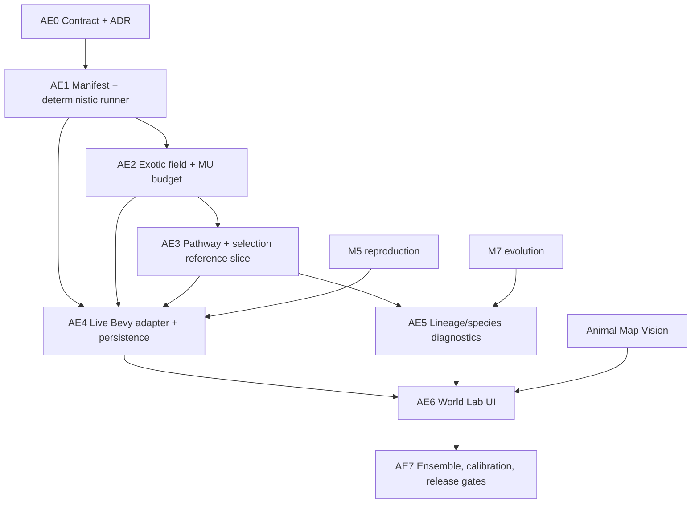

# Plan — Alternate Evolution & World Lab

## Outcome

Từ cùng World Artifact và initial state, người dùng chạy:

- baseline không exotic energy;
- alternate regime có nguồn “Mana”;
- branch thêm/rút nguồn tại checkpoint;
- ensemble nhiều seed;

rồi quan sát field/budget, organism pathway, reproductive success, trait/lineage/species divergence,
causal chain và control–treatment uncertainty.

## Status legend

- `[x]` documentation/design evidence exists.
- `[ ]` not started.
- `[~]` blocked or partial; reason must follow.

Không task production nào được đánh dấu done trong đợt tài liệu này.

## Dependency graph



## AE0 — Contract, feature docs và acceptance

**Mục tiêu:** AI agent có một reading order và không hard-code Mana/bẻ closed EU.

| ID | Task | Dependency | Outcome | Evidence/test |
|---|---|---|---|---|
| AE-001 | [x] Viết requirements/design/testing/planning lifecycle | none | Feature scope traceable | AI DevKit lint |
| AE-002 | [x] Viết proposed contract | AE-001 | ER01…ER12, AE-S01…15 | Contract review |
| AE-003 | [x] Viết ADR-0002 proposed | AE-002 | Chọn generic source + MU ledger | ADR review |
| AE-004 | [x] Viết explanation + vertical slice | AE-002 | Product/science model dễ đọc | Link review |
| AE-005 | [ ] Stakeholder accept/modify ADR-0002 | AE-003 | Quyết định không còn `proposed` | Explicit approval |
| AE-006 | [ ] Chốt MU tolerance và schema version policy | AE-005 | Numeric contract machine-checkable | AE-S03/04 |
| AE-007 | [~] Map evidence baseline | MCP available | Canonical views/manifest reviewed | blocked: MCP unavailable |

**Gate AE0:** AE-005/006 hoàn tất trước production schema. Tài liệu proposed không được mô tả là
runtime current.

## AE1 — Experiment manifest và runner foundation

**Mục tiêu:** tạo “phòng thí nghiệm headless” từ M2 core trước khi thêm Mana.

| ID | Task | Dependency | Code anchor | Outcome | Validation |
|---|---|---|---|---|---|
| AE-101 | Tạo module `core/experiment.rs` | AE0 | `core/mod.rs` | Types/errors/fingerprint | Cargo compile |
| AE-102 | `WorldLawSet`, `InitialConditionSet`, version/canonical encode | AE-101 | new module | Immutable law identity | AE-S03 |
| AE-103 | `ExperimentManifest` + validator + factor allowlist | AE-102 | `Scenario` | Reproducible input | AE-S03/08 |
| AE-104 | Thay `SimModel::Default` bằng factory adapter tương thích | AE-103 | `core/scenario.rs::SimModel` | Model config from context | Existing S13/S14 green |
| AE-105 | `RunProvenance`, run/parent/fork ids | AE-103 | scenario result | Branch identity | AE-S02/09 |
| AE-106 | Genesis fork runner | AE-104/105 | `control_treatment` | Same initial state, declared diff | AE-S08 |
| AE-107 | Snapshot/checkpoint trait + fork runner | AE-104/105 | save/snapshot seams | Same pre-fork state | AE-S09 |
| AE-108 | Seed-set ensemble runner + failure-preserving summary | AE-106 | scenario runner | Multi-run artifact | AE-S14 |
| AE-109 | `ObservableRegistry` core metadata | AE-101 | `STATE_VARIABLES`, `observables()` | Stable ids/units/scope | Registry unit tests |
| AE-110 | Result schema: series, budgets, ledger, versions, failures | AE-108/109 | `ScenarioResult` | Self-describing artifact | serde/fixture |
| AE-111 | Keep legacy `Scenario` adapter | AE-103/104 | `Scenario` | Existing tests/clients survive | S10…S14 regression |

**Gate AE1:**

- Existing M2 tests remain green.
- AE-S02/03/08/09 pass on `ReferenceEcosystem`; **AE-S14 only PARTIAL** (N/CI/failures present, no
  control–treatment effect-size API yet).
- `exotic_energy=None` exists even though field chưa implement.

**Implementation status (2026-07-25):**

- `[x]` **AE-101** — `core/experiment.rs` (`ExperimentError`, `Canon`, `fnv1a_64`). Verified.
- `[x]` **AE-102** — `WorldLawSet`, `InitialConditionSet`, versioned + canonical encoding. AE-S03.
- `[x]` **AE-103** — `ExperimentManifest` + `validate` + `FactorDiff` allowlist + `fingerprint`. AE-S03/08.
- `[x]` **AE-104** — factory seam via `ExperimentModel::from_manifest` (replaces `Default`), impl'd by
  `ReferenceEvolutionWorld`; legacy `SimModel`/S13/S14 untouched. AE-S02.
- `[x]` **AE-105** — `RunProvenance` (experiment/run/parent/fork ids + fingerprints/versions).
- `[x]` **AE-106** — `genesis_fork` control/treatment with declared-factor guard. AE-S08.
- `[x]` **AE-107** — headless checkpoint fork **implemented** (2026-07-25 second pass):
  `ExperimentModel::{Snapshot, snapshot, from_snapshot}` + `experiment_runner::checkpoint_fork`. Runs
  the prefix once, snapshots model state + clones the live RNG at the fork, continues both branches
  from that checkpoint (no re-simulation); a control continuation equals an uninterrupted run
  bit-for-bit. Children carry `parent_run_id`/`fork_tick`. **Provenance contract:** prefix and control
  carry the *base* manifest fingerprint/run id; the treatment carries the fingerprint/run id of the
  validated **effective treatment manifest** (base + appended `treatment_extra`), so each branch is
  independently replayable. `CheckpointForkReport.treatment_extra` records the extras **structurally**
  (`declared_factors` strings are display-only). AE-S09. (Persistence/on-disk snapshot is still AE4,
  out of scope.)
- `[x]` **AE-108** — `run_ensemble` (returns `Result`; validates registry+manifest once) +
  failure-preserving `EnsembleSummary` with N, completed/requested, per-observable mean/std/min/max
  and 95% CI. **AE-S14 is met by the PAIRED runner added in the AE2.5 audit pass**:
  `run_paired_ensemble` / `run_paired_ensemble_with_control` → `PairedEnsembleReport` (same ordered
  seeds by construction, per-seed `SeedPair` preserving one-sided failures, `PairedEffect` with
  `n_requested` / `n_complete_pairs` / means / paired mean delta / SD / SE / 95% CI / Cohen's *d_z*,
  all `Option<f64>` under a documented defined-ness contract).
  ⚠️ `compare_ensembles` (independent-sample Hedges' *g*) was **wrongly** presented as this gate in the
  AE2.5 first pass; it is a descriptive helper only and does not verify same-seed pairing.
  AE-S14's *release* scope (AE-703 seed tiers, AE-610 UI surfacing) is still open, and no evolutionary
  claim may be drawn from an effect size in a slice with no pathway or reproduction.
- `[x]` **AE-109** — `ObservableRegistry`/`ObservableSpec` (stable id/unit/scope/cadence/range/role).
- `[x]` **AE-110** — self-describing `RunResult` (series, budget, ledger, versions, warnings, failures).
- `[x]` **AE-111** — legacy `Scenario`/`ReferenceEcosystem` unchanged; S10–S14 green.

## AE2 — Exotic-energy field và budget

**Mục tiêu:** Mana là nguồn có spatial dynamics và ledger, chưa chạm evolution.

| ID | Task | Dependency | Code anchor | Outcome | Validation |
|---|---|---|---|---|---|
| AE-201 | `EnergySourceId`, unit/type registries | AE1 | `sim_rules.rs` companion | Không trộn MU/EU | Unit registry tests |
| AE-202 | `ExoticEnergyLaw` disabled-or-renewable + Uniform/Patchy (original plan wording; **as implemented** disabled = `exotic_energy = None`, no `Disabled` variant — see the AE2 status list below) | AE-201 | world laws | Config MVP | Validator/property tests |
| AE-203 | `ExoticEnergyField` preallocated SoA/double buffer | AE-202 | `ResourceField` pattern | Density/source/diffusion/decay | AE-S04 + zero alloc |
| AE-204 | `ExoticEnergyBudget` audit | AE-203 | `EcosystemBiomass` pattern | Initial/source/field/storage/sink | AE-S04 |
| AE-205 | Transaction API field↔storage↔dissipated | AE-204 | pure helper | Atomic budgeted movement | AE-S04/05 |
| AE-206 | Add reference-model exotic subsystem | AE-203/205 | `ReferenceEcosystem` successor | Headless field/transactions | AE-S04/07 |
| AE-207 | World-law root cause + exotic effects | AE-206 | `CausalLedger` | Trace field/source changes | AE-S12 partial |
| AE-208 | Disabled (`exotic_energy = None`) fast path and baseline parity | AE-206 | runner/model init | No hidden field/cost | AE-S01 |
| AE-209 | Add/remove/pulse source intervention schema | AE-202/207 | `InterventionKind` | Checkpoint treatments | AE-S09/12 |
| AE-210 | Binary/JSON fixtures and size benchmark | AE-202/203 | artifact tests | Stable schema + budget | fixture/benchmark report |

**Gate AE2:** AE-S01/02/03/04/05 pass. Chưa gọi kết quả là evolution.

**Implementation status (2026-07-25):**

- `[x]` **AE-201** — `EnergySourceId`/`UnitId` newtypes + `EU_UNIT`/`MU_UNIT`; MU≠EU type boundary.
- `[x]` **AE-202** — `ExoticEnergyLaw` with the single `Renewable` source model × `Uniform`/`Patchy`
  topology + `validate` (rejects EU unit, empty id/display_name, negative/unstable params). The
  "disabled" configuration is **`WorldLawSet.exotic_energy = None`** — there is deliberately **no**
  `ExoticSourceModel::Disabled` variant, so `Some(law)` is always a live source.
  `Finite`/`Pulsed`/`FieldArtifact` deferred (absent from the enums).
- `[x]` **AE-203** — `ExoticEnergyField` preallocated SoA double buffer (source/decay/diffusion,
  Closed/Open boundary). AE-S04 + zero-alloc test.
- `[x]` **AE-204** — `ExoticEnergyBudget` (initial/sourced/field/storage/dissipated/exported) +
  `balance_error`. AE-S04.
- `[x]` **AE-205** — atomic `ExoticEnergyField::uptake` + `spend_storage` transaction helpers
  (organism storage represented by a reference-model test double). AE-S04/05.
- `[x]` **AE-206** — `ReferenceEvolutionWorld` integrates field/budget into the headless model. AE-S04/07-mechanism.
- `[x]` **AE-207** — world-law root cause `CAUSE_EXOTIC_WORLD_LAW` + exotic effect chain. AE-S12 partial.
- `[x]` **AE-208** — disabled fast path: no field/cost/RNG draw, baseline checksum unchanged. AE-S01.
- `[x]` **AE-209** — **implemented in AE2.5** (2026-07-25; see
  [the AE2.5 goal](2026-07-25-claude-overnight-goal-ae25.md)).
  `ExoticInterventionKind{AddSource,RemoveSource,Pulse}` + `ExoticIntervention` +
  `ExoticInterventionQueue` in `exotic_energy.rs`; `ExoticEnergyField::apply_forcing` books every MU
  into the ledger; `ExperimentManifest.exotic_interventions` carries them with structured validation
  and a canonical fingerprint contribution; the model applies them on the ecology band under their
  **own `CauseId`**. **Law immutability holds**: a forcing changes the *field*, never
  `laws.exotic_energy` — the world-law fingerprint is provably unchanged (ER01). MU stays closed and
  EU stays byte-identical. AE-S04/S05/S12-partial.
  **Corrected in the AE2.5 audit pass:** `RemoveSource` originally *drained* stored MU (a sink); it now
  **suppresses the base renewable source** (capped at it, never touching stored MU, lowering
  `cum_sourced` with the counterfactual in `cum_source_suppressed`). Also added: ecology-cadence and
  grid-applicability validation, removal of causal double attribution, and the **checkpoint exotic
  channel** `checkpoint_fork_with_exotic` (`treatment_extra_exotic`, structured in the report).
- `[x]` **AE-210** — **implemented in AE2.5**: JSON fixtures under
  `src-tauri/tests/fixtures/experiments/` (baseline / mana-patchy / invalid), generated by the real
  serializer via an `#[ignore]`d regenerator so they cannot drift, with parse/validate/round-trip/
  fingerprint-stability tests and a recorded size note (< 8 KiB each). Binary artifact fixtures and a
  runtime size *benchmark* remain out of scope.

## AE3 — Energy pathway và selection reference slice

**Mục tiêu:** chứng minh source → mechanism → performance → reproduction → trait frequency trong mô
hình headless có generations.

| ID | Task | Dependency | Code anchor | Outcome | Validation |
|---|---|---|---|---|---|
| AE-301 | `EnergyPathwayGenotype` + zero legacy default | AE2 | `evolution/genotype.rs` | Heritable pathway | serde/property tests |
| AE-302 | Mutation/crossover nhận seeded RNG và bound trait | AE-301 | mutation/crossover | Deterministic variation | S41 + AE-S02 |
| AE-303 | `DevelopedEnergyPathway` + cost geometry seam | AE-301 | `ecomorph.rs` target | Birth materialization | CM-S02/05/06 |
| AE-304 | Runtime `ExoticEnergyState` | AE-303 | ECS component/reference agent | Storage/uptake/toxicity | transaction tests |
| AE-305 | Sensing/uptake/utilization policy | AE-304 | behavior/physiology seam | No direct fitness writes | AE-S07 |
| AE-306 | Maintenance/morphology/opportunity cost | AE-303/305 | metabolism/evaluation | No universal benefit | AE-S06 |
| AE-307 | Minimal generational turnover/reproduction loop in reference evolution world | AE-305/306 | headless model | Selection events, births, census; deaths are implicit full-cohort turnover | AE-S10 |
| AE-308 | Trait frequency/reproductive-success observables | AE-307 | registry/result | Selection visible | AE-S10/13 |
| AE-309 | Causal path through reproduction/offspring | AE-307/308 | causal ledger | Full vertical trace | AE-S12 |
| AE-310 | Factorial absent/present × pathway-cost ensemble | AE-307/309 | experiment fixtures | Effect + trade-off | AE-S06/07/10/14 |

**Gate AE3:** không system nào sửa genotype ngoài mutation/reproduction; AE-S06/07/10/12/14 pass
trên headless vertical slice.

**Implementation status (2026-07-25):** AE3 implemented **for the headless reference model only**
(goal: [2026-07-25-claude-overnight-goal-ae3.md](2026-07-25-claude-overnight-goal-ae3.md)). Gate AE3
is met on that slice: AE-S06/07/10/12 và AE-S14 đều có test pass, và không system nào ngoài
`ReferencePopulation::reproduce` được ghi genotype/frequency.

- `[x]` **AE-301** — `EnergyPathwayGenotype` in the new `core/evolution_pathway.rs`; legacy default is
  disabled and zero-cost, every constructor normalizes non-finite/out-of-range input, and JSON
  round-trip preserves source id and every trait. Implemented as
  a **pure reference module**, not by retrofitting `evolution/genotype.rs` (live `MorphologyGenotype`
  is untouched — that is AE4).
- `[x]` **AE-302** — `mutate`/`crossover` take an explicit `&mut StdRng`, are replay-deterministic and
  bounded, and cannot flip strategy identity. Crossover returns `None` for incompatible source ids
  instead of mixing source-specific traits. ⚠️ `crossover` is **not yet used as a reproduction
  mechanism** (the two-strategy cohort model inherits clonally within a strategy), so AE-302's
  variation API is met but recombination-driven inheritance is not exercised.
- `[x]` **AE-303** — `DevelopedEnergyPathway::develop`: pure, one-time, reads no environment; restore
  re-uses the materialized phenotype rather than re-developing.
- `[x]` **AE-304** — `ExoticEnergyState` (stored/last uptake/last spend/toxicity) as reference-model
  runtime state (aggregate cohort, not an ECS component — AE4).
- `[x]` **AE-305** — `PathwayCohort::{uptake, metabolize}` route every MU through the existing
  `ExoticEnergyField::uptake` / `spend_storage` helpers, so the transaction is ledger-exact. No direct
  fitness write exists anywhere. AE-S07.
- `[x]` **AE-306** — maintenance + allocation opportunity cost is paid on every ecology firing whether
  or not MU exists; toxicity penalizes overload. AE-S06.
- `[x]` **AE-307** — opt-in fixed-capacity `ReferencePopulation` with `reproduce` as the only writer of
  composition, on a declared deterministic cadence, using a separate RNG stream. Full parental
  cohort turnover releases stored MU as a declared sink; individual mortality is not modeled. AE-S10.
- `[x]` **AE-308** — 10 AE3 observables in `ObservableRegistry` with full metadata; emitted **only**
  when the population exists, and a manifest requesting one without a population fails preflight with
  `ExperimentError::InvalidPopulation` instead of reporting a fabricated zero.
- `[x]` **AE-309** — the causal chain `world law/forcing → field → uptake → performance → births →
  frequency`, machine-checked in order. A performance effect roots at `CAUSE_EXOTIC_WORLD_LAW`
  **only** by descending from a real uptake; a sole effective AddSource forcing retains its own
  `CauseId`; an absent-source world roots at `CAUSE_BACKGROUND` and invents no Mana cause. Mixed
  source provenance remains conservative because the MVP causal ledger has one parent. AE-S12.
- `[x]` **AE-310** — the 2×2 factorial (absent/present × zero/positive cost) plus a 5-seed same-seed
  paired ensemble reporting finite effect/SD/SE/CI/*d_z* with every pair preserved. AE-S06/07/10/14.
  Five seeds is an ensemble size, **not** a statistical-confidence claim.

Không claim nào về species, live Bevy, persistence, UI hay map được rút ra từ slice này; ADR-0002 vẫn
`proposed` và tolerance MU `1e-4` vẫn chỉ là test tolerance.

## AE4 — Live Bevy integration và persistence

**Dependency cứng:** deterministic live simulation, M5 reproduction, Creature Morphogenesis P1–P4.

| ID | Task | Dependency | Code anchor | Outcome | Validation |
|---|---|---|---|---|---|
| AE-401 | Loại/seed mọi live `thread_rng()` liên quan | AE1 | Bevy systems | Reproducible live path | Replay checksum |
| AE-402 | Bevy `ExperimentModel` adapter | AE-401 | `SimulationEngine` | Same manifest contract | AE-S02 live |
| AE-403 | Insert immutable `WorldLawSet` + field/budget resources | AE2/402 | `core::ecs::init_world` | Runtime resources | startup tests |
| AE-404 | Multi-rate exotic field systems | AE-403 | schedule/order | Correct cadence/dependencies | S10 + perf |
| AE-405 | Add exotic sample to birth environment behind version | AE-303/403 | `EnvSample` | Development cue once | CM-S01/05 |
| AE-406 | Live sensing/uptake/spend/cost | AE-304/404 | agent/world systems | Transactional physiology | AE-S04/05/07 |
| AE-407 | Save/snapshot schema + legacy migration | AE-403/406 | `SavedSimulationState` | Laws/field/budget/storage persisted | AE-S15 |
| AE-408 | Agent save/migration pathway phenotype/runtime | AE-405/407 | `SerializedAgent`, migration | No re-development | CM-S03/04 + AE-S15 |
| AE-409 | World-law mismatch policy | AE-407/408 | `WorldIdentity` checks | Reject implicit cross-law move | migration tests |
| AE-410 | Live control/treatment vertical slice | AE-402…409 | experiment runner | Reference/live semantic parity | AE-S01…10 subset |

**Gate AE4:** AE-S01…10/15 pass on live world; save/load/migration and closed EU remain green.

## AE5 — Lineage, niche và species diagnostics

**Dependency cứng:** M5/M7 reproduction/lineage, AE3 selection signals.

| ID | Task | Dependency | Code anchor | Outcome | Validation |
|---|---|---|---|---|---|
| AE-501 | Chốt `SpeciationPolicy` versioned | AE3, M7 | new evolution module | Threshold/config metadata | policy tests |
| AE-502 | Genotype/pathway distance metric | AE-501 | genotype/lineage | Stable bounded distance | property tests |
| AE-503 | Ecological niche distance incl. exotic pathway | AE-501 | MAP-Elites/ecology | Niche evidence | fixture tests |
| AE-504 | Lineage persistence/member accounting | AE-501 | lineage tracker | No ghost clusters | census tests |
| AE-505 | Optional gene-flow/mating compatibility input | M7.3 | reproduction | Stronger evidence when available | integration |
| AE-506 | `SpeciesClusterRecord` + evidence states | AE-502…505 | diagnostics | Morph→Ecotype→Candidate | AE-S11 |
| AE-507 | Detector is read-only diagnostic | AE-506 | system schedule | No selection feedback | negative test |
| AE-508 | Speciation/merge/extinction event ledger | AE-506 | causal/result | Timeline visible | AE-S12 |
| AE-509 | Patchy source ensemble | AE-506/508 | experiment fixtures | Local divergence evidence | AE-S11/14 |

**Gate AE5:** morphology/color alone never creates Species; only multi-seed evidence can raise claim.

## AE6 — World Lab frontend

| ID | Task | Dependency | Code anchor | Outcome | Validation |
|---|---|---|---|---|---|
| AE-601 | Rust/TS schemas for manifest/result/observable | AE1/AE4 | Tauri IPC/types | Cross-language parity | AE-S13 |
| AE-602 | Experiment Builder + validation errors | AE-601 | new UI route/panel | Configure laws/factors/seeds | Vitest/E2E |
| AE-603 | Manifest Diff + branch-required UX | AE-602 | UI | No in-place law mutation | E2E |
| AE-604 | Run controller/status/cancel | AE-601 | commands/events | Long-run progress | IPC tests |
| AE-605 | Run tree + checkpoint fork UI | AE-603/604 | UI | History visible | E2E |
| AE-606 | Layer inspector + legends/units | AE-601/AE2 | Pixi/landscape seam | Field visualization | AE-S13 + map gate |
| AE-607 | Organism/lineage/species inspector | AE-601/AE5 | UI | Multi-layer state/history | UI tests |
| AE-608 | Evolution timeline + trait distribution | AE-607 | charts | Frequency/lineage events | snapshot tests |
| AE-609 | Causal Explorer | AE-601/AE-309/508 | ledger UI | Why-changed trace | AE-S12 |
| AE-610 | Compare runs/ensemble intervals/failures | AE-108/601 | charts | Honest uncertainty | AE-S14 |
| AE-611 | EU/MU Budget panel and alerts | AE-204/601 | dashboard | Drift visible | AE-S04/05/13 |
| AE-612 | JSON/CSV export/import/replay | AE-110/601 | commands/UI | Portable experiment | E2E |
| AE-613 | Accessibility/downsample/perf pass | AE-602…612 | frontend | Usable on target machine | audit/benchmark |
| AE-614 | Animal Map Vision canonical views | MCP available | manifest/views | Placement/render evidence | blocked until MCP |

**Gate AE6:** backend/UI observable parity, critical flows E2E, no hidden failed runs, map gate pass.

## AE7 — Calibration, open-source evaluation and release evidence

| ID | Task | Dependency | Outcome | Validation |
|---|---|---|---|---|
| AE-701 | Parameter registry with source/meaning/range | AE2–AE5 | No magic constants | review |
| AE-702 | Sensitivity analysis source/cost/diffusion/speciation threshold | AE-701 | Dominant parameters known | reproducible report |
| AE-703 | Ensemble tiers 5/10/30 seeds | AE-702 | Confidence summary | AE-S14 |
| AE-704 | Long-run soak + NaN/budget/leak alerts | AE4/AE6 | Stability evidence | soak artifact |
| AE-705 | Performance tiers field/agents/samples | AE4/AE6 | CPU/RAM/tick/UI budget | benchmark |
| AE-706 | Evaluate reusable libraries after seams stabilize | AE1/AE6 | Adopt/reject record | open-source policy |
| AE-707 | Five example experiments + tutorial | AE6/AE3/AE5 | New user can reproduce | smoke tests |
| AE-708 | Full contract review AE-S01…15 | all | Release evidence table | 0 required failure |

## Test-to-task trace

| Gate | Producer tasks | Consumer/release tasks |
|---|---|---|
| AE-S01 | AE-208, AE-410 | AE-708 |
| AE-S02 | AE-104/108, AE-402 | AE-708 |
| AE-S03 | AE-102/103 | AE-202, AE-708 |
| AE-S04 | AE-203/204/205 | AE-406/611 |
| AE-S05 | AE-205/208 | AE-406/410/611 |
| AE-S06 | AE-306/310 | AE-703 |
| AE-S07 | AE-305/310 | AE-410 |
| AE-S08 | AE-103/106 | AE-310 |
| AE-S09 | AE-107/209 | AE-605 |
| AE-S10 | AE-307/308 | AE-410/509 |
| AE-S11 | AE-501…507 | AE-509/607 |
| AE-S12 | AE-207/309/508 | AE-609 |
| AE-S13 | AE-109/601/606 | AE-611/612 |
| AE-S14 | AE-108/310/509 | AE-610/703 |
| AE-S15 | AE-407/408/409 | AE-612/708 |

## Recommended first implementation slice

Không bắt đầu bằng UI hoặc genotype.

1. **AE-101/102/103/109:** schema, validator, fingerprint và observable registry.
2. **AE-104/106/108/110/111:** runner/fork/ensemble giữ S10–S14.
3. **AE-201/202/203/204/208:** disabled path (`exotic_energy = None`) + Renewable/Patchy field, MU
   audit và baseline parity.
4. **AE-206/207:** reference-model source/field causal slice.
5. Chỉ sau AE2 gate mới bắt đầu pathway/evolution AE3.

Slice demo đầu:

```text
control: ReferenceEvolutionWorld, exotic=None
treatment: same initial state, Renewable Patchy Mana
observable: MU budget + producer performance
claim allowed: mechanism/performance only
claim forbidden: adaptation/species
```

## Effort estimate

Ước lượng là person-week tương đối, không phải lịch cam kết:

| Phase | Effort |
|---|---:|
| AE0 | 1–2 |
| AE1 | 2–4 |
| AE2 | 2–4 |
| AE3 | 3–5 |
| AE4 | 5–8, phụ thuộc M5/determinism |
| AE5 | 3–6, phụ thuộc M7 |
| AE6 | 4–7 |
| AE7 | 2–4 |

Headless mechanism slice có thể đạt sau AE1–AE2; claim species là phần cuối, không phải demo đầu.

## Risks and mitigation

| Risk | Mức | Mitigation/rollback |
|---|---:|---|
| Mana trở thành buff trực tiếp | Critical | ER03, transaction-only APIs, negative tests |
| Phá closed EU | Critical | MU ledger riêng, AE-S04/05, disabled rollback |
| Hai run khác nhiều biến ẩn | High | Manifest fingerprint + factor allowlist |
| Live Bevy không deterministic | High | Reference first; AE-401 gate |
| Species detector tạo nhãn giả | High | Evidence states, read-only, AE-S11 |
| Causal log bùng nổ | High | Threshold/aggregation/sample plan/downsample |
| Save/schema phình lớn | Medium | Version/compact field/checkpoint benchmark |
| UI làm máy yếu treo | High | Headless mode, paging/downsample, rate limits |
| Parameter tùy ý tạo “science giả” | High | Registry + sensitivity + multi-seed |
| Map đẹp nhưng không khớp sim | High | authoritative registry + Animal Map Vision gate |

## Current blockers

1. Map evidence nằm ngoài headless slice; khi mở AE6/map work phải dùng workflow Animal Map Vision
   bắt buộc và đánh giá availability tại phiên đó.
2. ADR-0002 còn `proposed` — block production schema.
3. Live Bevy determinism và M5/M7 — block AE4/AE5, không block AE1–AE3 reference slice.
4. Feature lint yêu cầu branch `feature-alternate-evolution-world-lab`; tài liệu hiện được chỉnh trong
   working tree hiện tại theo yêu cầu người dùng, chưa tạo worktree vì repository đang có nhiều thay
   đổi chưa commit.

## Next actionable work after AE3

1. **Decision gate (unchanged, still open):** owner accept/modify ADR-0002 and choose the MU
   tolerance/schema policy (AE-005/006). Do not silently promote the local `1e-4` test tolerance into
   product policy.
2. **Close the AE3 remainders:** wire `crossover` into reproduction as a real inheritance mechanism
   (requires a genotype-distribution model richer than two discrete strategies), and decide whether
   the per-generation `String` clone in `reproduce` should be removed.
3. **Evidence expansion:** declared 5/10/30 seed tiers and sensitivity evidence (AE-702/703) before
   any UI or species claim. AE3 currently reports a **5-seed** ensemble.
4. **AE5 prerequisite check:** AE3 now produces the selection signals AE-501…509 depend on, but
   species diagnostics still need M5/M7 lineage work and remain separately gated.
5. Live Bevy (AE4), persistence (AE-S15), World Lab UI (AE6) and the map review remain later,
   separately-gated work.

### Historical: next actionable work after AE2.5 (item 2 now DONE)

AE2.5 recorded "implement AE3's minimal headless pathway → explicit cost → performance →
reproduction → trait-frequency vertical slice (AE-301…310)". That is the slice delivered above.

## Definition of done

- ADR-0002 accepted và contract không còn material ambiguity.
- AE-S01…AE-S15 có fresh evidence.
- Current S01…S67/CM gates liên quan không regression.
- Reference và live Bevy cùng đọc một experiment contract.
- Save/load/migration và artifact replay pass.
- UI không có nguồn dữ liệu song song hoặc unit hard-code lệch backend.
- Ensemble report chứa failure và uncertainty.
- Không claim species từ một seed/correlation.
- Map/placement/render qua manifest + canonical views, 0 critical/high.
- Benchmark trên hardware mục tiêu và rollback `exotic_energy=None` đã chạy.
