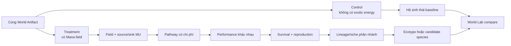

# Alternate Evolutionary Regimes

## Ý tưởng cốt lõi

Mục tiêu không phải “thêm mana để sinh vật mạnh hơn”. Mục tiêu là cho phép người dùng đặt một luật
hoặc nguồn lực mới vào thế giới từ thời điểm sớm nhất, rồi quan sát xem các dòng sống tự tìm con
đường khác qua nhiều thế hệ.



Hai nhánh có thể dùng cùng địa hình, khí hậu ban đầu, sinh khối và seed. Điểm khác duy nhất là
`WorldLawSet`. Nhờ vậy khác biệt về sau có thể được quy về điều kiện được thay, thay vì hai world
không liên quan.

## Vì sao “mana” phải là một substrate tổng quát

Tên game có thể là **Mana**, nhưng code lõi dùng `ExoticEnergySource`. Cùng abstraction có thể mô tả:

- năng lượng địa nhiệt;
- chemosynthesis quanh khe phun;
- bức xạ mà một lineage học cách khai thác;
- tinh thể/hạt hư cấu phát năng lượng;
- một field siêu nhiên trong world fantasy.

Mỗi nguồn có topology, flux, decay, toxicity và cách khai thác khác. Không cần tạo một engine phép
thuật riêng.

## Bốn lớp không được trộn

### 1. World law — điều gì có thể tồn tại

Ví dụ:

```text
exotic_energy:
  id: arcane_flux
  display_name: Mana
  mode: Renewable
  source_topology: PatchyHotspots
  source_rate: 0.02 MU/cell/ecology-tick
  diffusion: 0.08
  decay: 0.005
```

Đây là luật của run, không phải trait của organism.

### 2. Environment field — ở đâu và lúc nào nguồn có sẵn

`ExoticEnergyField` lưu density/flux theo cell/chunk. Nó có thể đồng đều, patchy, theo mùa, gắn với
địa chất hoặc xuất hiện theo pulse. Field phải có budget và được render/inspect từ chính dữ liệu sim.

### 3. Organism pathway — sinh vật khai thác bằng cách nào

Genotype có thể tiến hóa:

- cảm nhận nguồn;
- cơ quan hấp thụ;
- dự trữ;
- chuyển hóa;
- chịu độc;
- hành vi tìm hotspot.

Mỗi khả năng có maintenance/morphology/opportunity cost. Một sinh vật đầu tư vào mana trong thế giới
không có mana có thể thua organism không mang chi phí đó.

### 4. Evolutionary outcome — cái gì còn lại sau nhiều thế hệ

Field không “ra lệnh” sinh ra loài. Nó chỉ đổi landscape of selection. Loài/morph xuất hiện từ:

```text
variation → differential performance → survival/reproduction
→ trait frequency change → niche partition → lineage persistence
→ reduced gene flow / species-candidate threshold
```

## Mana tương tác với closed EU như thế nào

Current MVP định nghĩa EU là biomass-equivalent và khép kín:

```text
plants + animals + detritus = constant
```

Vì thế Mana dùng đơn vị MU riêng. MVP không cho `1 MU → tạo biomass từ hư không`. Thay vào đó MU có
thể:

- trả một phần work cost cho vận động/cảm biến/điều nhiệt;
- tăng rate organism chuyển detritus/nutrient thành biomass, nhưng material vẫn bị debit từ EU pool;
- kích hoạt defense, repair hoặc behavior có trade-off;
- trở thành resource cạnh tranh và tạo niche.

Nếu sau này muốn mana materialize vật chất thật, phải tách mass/physical-energy ledger bằng ADR mới.

## Các chế độ nguồn nên hỗ trợ

| Mode | Ý nghĩa | Câu hỏi tiến hóa |
|---|---|---|
| `Disabled` | Không có nguồn; baseline | Pathway có bị loại vì cost không? |
| `Finite` | Trữ lượng ban đầu, không tái tạo | Boom–bust, tranh chấp, extinction debt |
| `Renewable` | Có source rate và sink | Specialist ổn định có hình thành không? |
| `Pulsed` | Xuất hiện theo mùa/biến cố | Storage, dormancy hay migration có lợi hơn? |
| `Patchy` topology | Hotspot không đều | Local adaptation và ecotype có phân vùng không? |

MVP nên làm `Disabled` + `Renewable/Patchy`; các mode khác dùng cùng contract sau.

## Những kiểu sinh vật khác nhau có thể emergent

Không hard-code tên loài, nhưng có thể kỳ vọng các chiến lược:

| Áp lực | Candidate strategy | Chi phí đối trọng |
|---|---|---|
| Mana dày và ổn định | Specialist uptake cao | Cơ quan nặng, maintenance cao |
| Mana loãng/patchy | Sensor + migration/foraging range lớn | Tốn vận động và neural cost |
| Mana pulse | Storage lớn/dormancy | Chậm sinh sản hoặc thân nặng |
| Mana độc ở density cao | Tolerance/detox | Conversion efficiency thấp |
| Nhiều consumer tranh hotspot | Territorial/social defense | Injury/stress/group cost |
| Mana chỉ producers dùng được | Food web dựa trên mana-producer | Phụ thuộc trophic source mới |

Đây là hypothesis để kiểm thử, không phải outcome được script.

## “Tác động từ sớm nhất” có hai nghĩa

### Genesis fork

Đổi luật ngay trước `t=0`. Hai lịch sử chạy hàng trăm/thousands thế hệ. Cách này trả lời:

> Một thế giới luôn có mana sẽ tiến hóa khác baseline ra sao?

### Checkpoint fork

Chạy chung đến thế hệ G, snapshot, rồi thêm hoặc rút nguồn ở một nhánh. Cách này trả lời:

> Một hệ sinh thái đã ổn định phản ứng, phụ thuộc hoặc phục hồi thế nào khi luật/resource đổi?

Cần cả hai; chỉ bật mana giữa run không trả lời được lịch sử từ genesis.

## World Lab — người dùng quan sát gì

### Lớp bản đồ

- density, source flux, uptake và depletion của MU;
- biomass/resource/climate/water/soil hiện có;
- phân bố pathway phenotype;
- vùng sinh, chết, migration và reproductive success;
- niche/species cluster theo thời gian.

### Đồ thị

- source → field → uptake → storage → expenditure;
- EU và MU budget;
- trait/allele frequency;
- population, species richness, extinction;
- phenotype distribution và MAP-Elites coverage;
- food-web edges mới;
- effect size control–treatment với confidence interval.

### Inspector

Click một cell/organism/lineage/species để xem:

- giá trị hiện tại và đơn vị;
- lịch sử;
- parent/root cause;
- genotype vs developed phenotype vs runtime state;
- energy transactions;
- ancestor/descendant;
- lý do candidate species được tạo hoặc bị gộp.

### Branch timeline

World Lab hiển thị cây experiment:

```text
run-0 baseline
  ├─ run-1 mana from genesis
  ├─ run-2 mana patchy from genesis
  └─ checkpoint generation 100
       ├─ run-3 continue
       └─ run-4 remove mana
```

Người dùng có thể replay, đổi một factor, tạo branch và so sánh trên cùng trục thời gian.

## Cách chứng minh khác biệt là tiến hóa

Ba mức bằng chứng:

1. **Mechanism:** MU field và pathway tạo transaction/performance khác đúng contract.
2. **Selection:** pathway thay survival/reproductive success; frequency đổi qua thế hệ.
3. **Divergence/speciation:** lineage/niche/mating khác bền và lặp lại trên ensemble.

Ảnh con vật trông khác, một MAP-Elites cell mới hoặc correlation với hotspot chỉ đạt mức mô tả.

## Vertical slice đề xuất

Mở rộng “lưu vực – đồng cỏ – thỏ – sói” bằng một field Mana patchy:

- control: không Mana;
- treatment A: Mana hỗ trợ producer chuyển detritus → plant biomass nhanh hơn;
- treatment B: thêm consumer pathway có sensing/uptake/storage/cost;
- treatment C: sau 100 thế hệ rút Mana khỏi cùng checkpoint.

Quan sát:

- EU/MU budget;
- plant/herbivore/predator response;
- pathway frequency;
- foraging range và morphology cost;
- niche divergence;
- extinction/recovery;
- causal chain;
- multi-seed effect size.

Vertical slice này cho kết quả quan sát sớm mà chưa cần spell, combat fantasy hoặc taxonomy loài đầy
đủ.

## Giới hạn trung thực

- Live Bevy simulation chưa implement `SimModel` deterministic; M2 hiện chứng minh trên
  `ReferenceEcosystem`.
- Species lifecycle/reproduction M5–M7 chưa hoàn chỉnh.
- Causal ledger hiện chỉ có một parent và chưa phân bổ multi-cause.
- Map evidence chưa được kiểm tra trong phiên này vì `animal-map-vision` MCP không khả dụng.
- Do đó tài liệu này là thiết kế/experiment proposal, không phải tuyên bố feature đã chạy.
