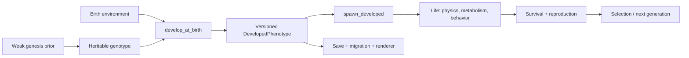
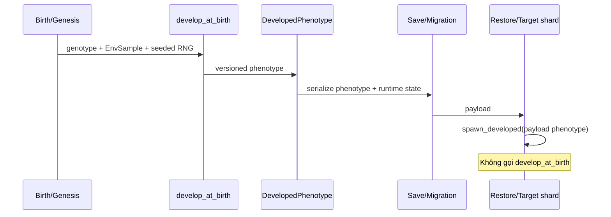

# Creature Morphogenesis

Tài liệu này giải thích cách Anima Engine tạo một sinh vật mới sao cho có quan hệ hợp
lý với môi trường nhưng vẫn giữ được tiến hóa emergent. Nó không phải contract API;
quy tắc bắt buộc nằm trong
[`CREATURE_DEVELOPMENT_CONTRACT.md`](../reference/CREATURE_DEVELOPMENT_CONTRACT.md).

## Câu trả lời ngắn

Không “tô” một sinh vật theo biome tại mỗi frame. Anima dùng ba cơ chế khác nhau:

1. **Genesis prior:** khi tạo một dòng sống hoàn toàn mới, environment bias nhẹ phân
   bố genotype ban đầu để quần thể không chết ngay.
2. **Developmental plasticity:** genotype + environment lúc sinh tạo phenotype một lần.
3. **Natural selection:** environment quyết định phenotype nào sống và sinh sản qua
   nhiều thế hệ.

Chỉ cơ chế 3 chứng minh thích nghi tiến hóa. Prior và plasticity tạo điểm xuất phát
hoặc phản ứng trong đời; chúng không tự chứng minh fitness.



## Hiện trạng engine

### Đã có

- `MorphologyGenotype`: graph node/edge với length, radius, mass, joint anchor/axis.
- `decode_genotype`: dựng root/child entities, rigid body, collider, CPG và homeostasis.
- `TerrainMap`: elevation, moisture, temperature, biome và flow.
- `ResourceField`: resource hiện tại `r` và carrying capacity `r_max`.
- Closed-EU ledger: plants, animals, detritus.
- MAP-Elites, mutation/crossover, lineage và migration.
- Pixi 2D simulation view và Three.js landscape view.

### Chưa có

- Representation phenotype tách khỏi genotype.
- Species/habitat profile độc lập với environment.
- Development version và birth-environment snapshot.
- Pigment/thermal strategy/plasticity strength có thể di truyền.
- Reproduction M5 thật sự; cơ chế hiện tại là epoch replacement.
- Sensor terrain/water/shade của M7.1.
- Save/migration cho phenotype.

### Điểm nguy hiểm hiện tại

`decode_genotype` được dùng cho cả cá thể mới và cá thể đã tồn tại. Vì vậy environment
không được đọc ngầm trong hàm này. Nếu không tách lifecycle, migration sang shard nóng
sẽ làm cá thể “sinh lại” thành hình khác.

## Bốn lớp dữ liệu

### 1. Genotype — cái có thể di truyền

- Morphology node/edge gốc.
- Pigment gene hoặc `None` cho legacy.
- Developmental reaction slopes.
- Habitat/locomotion preference.
- Thermal strategy khi M5.4 bắt đầu.

Genotype không chứa environment hiện tại và không chứa kết quả cuối của development.

### 2. Birth environment — cue phát triển

`EnvSample` là snapshot nhỏ:

```text
legacy_biome, field_temperature, moisture, elevation, flow,
resource_capacity, standing_resource
```

MVP dùng backend 11-biome projection. Khi cần ecotone/taxonomy 22-biome đầy đủ, phải mở
rộng artifact/backend contract; không giả vờ dữ liệu đã còn nguyên sau downsample.

### 3. Developed phenotype — kết quả ổn định

- Developed nodes/edges.
- Total mass thực tế.
- Collider/anchor-compatible geometry.
- Display color.
- Habitat/thermal phenotype.
- Development version và birth-environment fingerprint.

Đây là dữ liệu physics, MAP-Elites descriptor và renderer phải cùng đọc.

### 4. Runtime state — cái thay đổi mỗi tick

- Position/rotation/velocity.
- Energy/hydration/body temperature.
- CPG phase, brain transition, evaluation và feature tracker.

Save/load ghép `DevelopedPhenotype` với `RuntimeState`; không tái phát triển.

## Các quy luật sinh học chỉ là policy có phạm vi

Bergmann, Allen và Gloger hữu ích để tạo prior/response ban đầu nhưng không phải luật
phổ quát:

- Bergmann/Allen liên quan mạnh nhất tới endotherm và phản ứng có thể phi tuyến, đảo
  chiều ở miền nhiệt cực đoan.
- Gloger có nhiều cách diễn giải; humidity/temperature không cho một công thức màu
  đúng với mọi clade.
- Resource productivity thường giới hạn tổng biomass, density và trophic structure;
  nó không mặc định quyết định body mass từng cá thể.

Vì vậy mỗi response phải có:

| Thành phần | Yêu cầu |
|---|---|
| Cue | Field nào, đơn vị/miền nào |
| Scope | Thermal strategy/medium nào được áp |
| Heritable strength | Slope/bound nằm trong genotype |
| Cost/trade-off | Benefit ở môi trường A phải có giới hạn hoặc chi phí |
| Clamp | Hình học/sinh lý không ra ngoài miền hợp lệ |
| Evidence | Property test + experiment, không chỉ screenshot |

Nguồn khoa học nền:

- [Temperature-dependent plasticity và giới hạn của Bergmann/Allen](https://pmc.ncbi.nlm.nih.gov/articles/PMC10503470/)
- [Review Gloger’s rule](https://onlinelibrary.wiley.com/doi/10.1111/brv.12503)
- [Costs và limits của adaptive plasticity](https://pmc.ncbi.nlm.nih.gov/articles/PMC2842679/)
- [Local adaptation và reciprocal transplant](https://www.nature.com/articles/nrg3522)

## Policy MVP

### Morphology

Developmental slopes mặc định bằng 0 cho legacy. Genesis mới lấy mẫu slope nhỏ có
bound. Một response được áp đúng một lần:

```text
developed_value = clamp(genetic_value × response(genetic_slope, cue))
```

Không áp cùng Bergmann multiplier trong cả prior và development. Prior thay phân bố
`genetic_value`/slope; development dùng slope.

### Habitat

Medium thuộc sinh vật:

```text
Aquatic | Terrestrial | Amphibious | Arboreal | Alpine | Aerial
```

Environment được phân loại riêng thành water/land/elevation/slope class. S27 là phép
so sánh hai phía, không phải suy medium từ ô rồi kiểm lại chính ô.

### Pigment

Pigment gene tạo màu cơ sở. Developmental slope có thể tác động nhẹ theo cue. Màu
phenotype được lưu lúc sinh và không đổi khi cá thể bước qua biên biome. Crypsis chỉ
được gọi là thích nghi khi reciprocal-transplant/selection chứng minh fitness.

Legacy genotype dùng `pigment: None`; renderer tiếp tục fallback theo predator/prey,
tránh save cũ biến thành màu đen do `Default`.

### Nhiệt và nước

Phase đầu chỉ lưu strategy/trait; chưa nối trực tiếp vào survival.

- Body temperature chỉ bị environment tác động khi có heat-exchange mechanism M3/M5.
- `temp_target` là preferred range/strategy, không đơn giản là tuyến tính từ climate.
- Hydration efficiency phải có cost/trade-off và không giả định surface-water pool đã
  được bảo toàn trước M3.

## Genesis, birth và replacement

### Genesis

Genesis là điều kiện biên `t=0`:

1. Chọn spawn region hợp habitat.
2. Sample environment.
3. Lấy mẫu genotype từ prior yếu.
4. Develop một lần.
5. Spawn.
6. Chốt baseline `plants + animals + detritus`.

### Birth M5

Birth cần parent entities, maturity và energy transaction. Con non không lấy 100 EU
miễn phí. Đây là M5.3/S29 và không được “vá” vào epoch replacement.

### Evolutionary replacement legacy

Cơ chế hiện tại thay cá thể cuối epoch bằng genotype từ archive. Nó được gọi đúng tên
`EvolutionaryReplacement`, có causal event và chuyển reserve từ cá thể bị thay. Nó có
thể tiếp tục phục vụ MAP-Elites trước khi reproduction M5 hoàn chỉnh.

## Save, load và migration



Save cũ không có phenotype đi qua một migration versioned duy nhất. Migration này có
thể phát triển từ genotype + saved position để tạo phenotype legacy, nhưng phải ghi
`development_version` và không lặp ở lần load sau.

## Determinism

Nguồn seed chuẩn là `WorldIdentity.seed`. Mỗi stream có key:

```text
derive_seed(world_seed, event_kind, tick_or_epoch, lineage_key)
```

Mutation/crossover/development nhận RNG từ caller. `thread_rng()` và UUID v4 không
được dùng trong test path deterministic; lineage ID có thể sinh từ seed + counter/hash.

## Render và IPC

Rust `SegmentState` cần `length`, `radius`, `color` và `phenotype_version`. Frontend
phải đồng bộ:

- `src/types/index.ts::SegmentState`;
- `src/types/index.ts::RenderSegment`;
- `src/hooks/useSimulation.ts::buildAgentHierarchy`;
- duplicate legacy types/build function trong `src/App.tsx`;
- `src/PixiViewport.tsx`;
- renderer 3D mới;
- `PROJECT.md` Interface Contracts và mocks/tests.

Renderer không tự sample biome để đổi phenotype. Nó chỉ render dữ liệu Rust gửi.

## Chứng minh thích nghi

Ba mức bằng chứng:

1. **Mechanism:** cue đổi phenotype đúng bound.
2. **Performance:** phenotype tạo khác biệt intake/cost/movement đúng cơ chế.
3. **Adaptation:** genotype địa phương có reproductive fitness cao hơn genotype ngoại
   lai trong reciprocal transplant qua nhiều seed.

Trait–biome correlation chỉ là mô tả, không đủ cho mức 3. S43 vẫn dành cho coevolution
Red-Queen predator–prey; local adaptation dùng CM-S11.

## Ngoài phạm vi đợt đầu

- Full 22-biome preservation ở backend.
- Dynamic camouflage.
- Aerial/swimming physics hoàn chỉnh.
- Species taxonomy sinh học thực.
- Reproduction, age/life stage và mate choice hoàn chỉnh.
- Hydrology/water balance trước M3.

Các phần này được mở bằng task/ADR riêng, không chèn ngầm vào Phase đầu.
