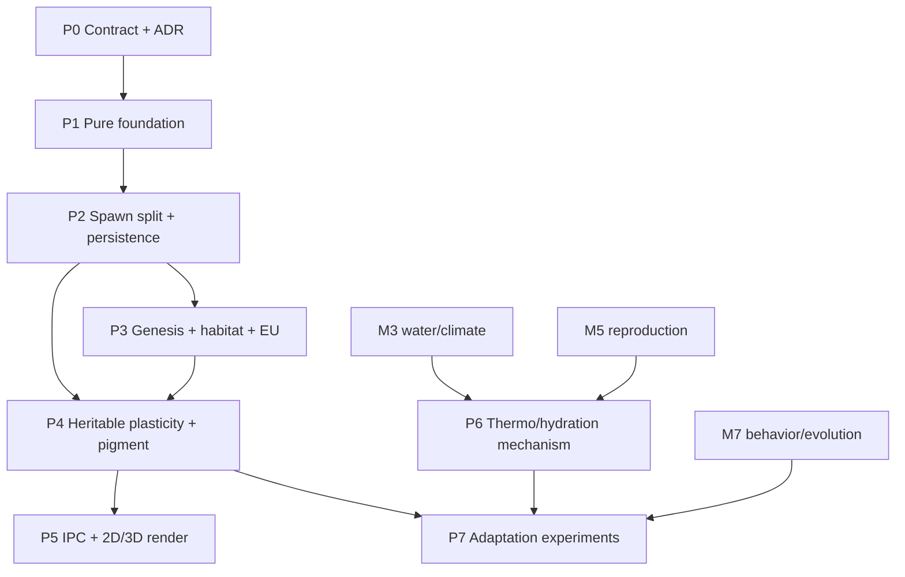

# Kế hoạch triển khai Creature Morphogenesis

Kế hoạch này thay thế bản Claude cũ trong `docs/archive`. Mọi task phải tuân theo
[`CREATURE_DEVELOPMENT_CONTRACT.md`](../reference/CREATURE_DEVELOPMENT_CONTRACT.md).

## Mục tiêu

- Tạo phenotype có quan hệ với environment lúc sinh mà không “tô màu theo biome”.
- Giữ nguyên phenotype qua save/load và migration.
- Habitat legality so trait sinh vật với environment độc lập.
- Không tạo hoặc mất EU ở genesis, replacement, birth, restore hay migration.
- Mutation, crossover và development tái lập theo seed.
- Physics, MAP-Elites, IPC và renderer dùng cùng một phenotype.
- Chứng minh local adaptation bằng experiment, không bằng correlation đơn.

Nguồn năng lượng thay thế và World Lab là feature chéo riêng, không được nhồi vào P1–P4:
[Evolution Experiment Contract](../reference/EVOLUTION_EXPERIMENT_CONTRACT.md) và
[Alternate Evolution plan](../ai/planning/2026-07-24-feature-alternate-evolution-world-lab.md).

## Không làm trong cùng PR

- Không đồng thời nâng Bevy hoặc đổi WorldArtifact.
- Không triển khai full reproduction M5 trong PR tách `decode_genotype`.
- Không nối water/thermal survival trước dependency M3/M5.
- Không thêm renderer 3D trước khi payload 2D và phenotype contract ổn định.
- Không gọi S43 cho local adaptation.

## Điểm chèn code hiện tại

Dùng symbol làm neo; số dòng chỉ để hỗ trợ đọc phiên bản 2026-07-24.

| Vai trò | Symbol | File hiện tại |
|---|---|---|
| Dựng genotype → ECS | `decode_genotype` | `src-tauri/src/evolution/genotype.rs` |
| Genesis | `SimulationEngine::start` | `src-tauri/src/core/simulation_loop.rs` |
| Epoch replacement command | `SpawnGenotypeCommand::apply` | `src-tauri/src/core/agent_systems.rs` |
| Thu thập/chuyển replacement | `check_epoch_completion_system`, `apply_staggered_evolution_system` | `core/agent_systems.rs` |
| Save schema | `SerializedAgent`, `SerializedSegmentState` | `core/simulation_state.rs` |
| Restore | `spawn_serialized_agent` | `core/simulation_state.rs` |
| Migration schema | `AgentMigrationData` | `core/components.rs` |
| Migration spawn | `SpawnMigrationCommand::apply` | `core/world_systems.rs` |
| Tick IPC | `SegmentState` | `core/simulation_state.rs` |
| Tick payload builder | `state_buffer.push(SegmentState { ... })` | `core/simulation_loop.rs` |
| Frontend contract | `SegmentState`, `RenderSegment` | `src/types/index.ts` |
| Legacy duplicate model | `SegmentState`, `RenderSegment`, `buildAgentHierarchy` | `src/App.tsx` |
| Shared hierarchy builder | `buildAgentHierarchy` | `src/hooks/useSimulation.ts` |
| 2D renderer | `PixiViewport` | `src/PixiViewport.tsx` |

## Dependency graph



## P0 — Contract, quyết định và tài liệu

**Trạng thái:** hoàn tất trong đợt quy hoạch 2026-07-24.

| ID | Công việc | Bằng chứng |
|---|---|---|
| CM-001 | Chốt contract birth/restore/migration | Contract accepted |
| CM-002 | ADR tách development khỏi spawn | ADR-0001 accepted |
| CM-003 | Thay design/plan Claude cũ | Bản cũ ở archive, redirect root |
| CM-004 | Link từ README/docs/CLAUDE | Link checker pass |

## P1 — Nền thuần, chưa đổi runtime

**Mục tiêu:** có type và pure functions có thể test mà chưa chạm bốn đường spawn.

| ID | Công việc | Phụ thuộc | Điểm chèn | Bằng chứng |
|---|---|---|---|---|
| CM-101 | Tạo `evolution/ecomorph.rs`, export trong `evolution/mod.rs` | P0 | module mới | Cargo compile |
| CM-102 | `EnvSample`, `EnvironmentSnapshot`, `EcomorphError` | CM-101 | `ecomorph.rs` | CM-S01 |
| CM-103 | `sample_environment(...) -> Result<EnvSample, _>` | CM-102 | TerrainMap/ResourceField accessors | Cell/edge/out-of-bounds tests |
| CM-104 | Thêm `DevelopmentalProgram`, `HabitatPreference`, optional pigment vào genotype với legacy defaults | CM-101 | `genotype.rs` | Old JSON/save fixture deserialize |
| CM-105 | Tạo deterministic seed derivation từ `WorldIdentity.seed` | CM-101 | resource/helper mới | Cùng key → cùng stream |
| CM-106 | Đổi mutation/crossover nội bộ để nhận `&mut impl Rng` | CM-105 | `mutation.rs`, `crossover.rs` | Không `thread_rng` trên deterministic path |

### Chữ ký P1

```rust
pub fn sample_environment(
    terrain: &TerrainMap,
    resource: Option<&ResourceField>,
    bounds: &MapBounds,
    position: Vec3,
) -> Result<EnvSample, EcomorphError>;
```

`EnvSample` chứa cả `resource_capacity` (`r_max`) và `standing_resource` (`r`); không
đặt tên cả hai là NPP.

### Gate P1

- `cargo test --manifest-path src-tauri/Cargo.toml ecomorph`
- CM-S01 và legacy serde pass.
- Không có thay đổi số entity, mass, energy hoặc tick payload runtime.

## P2 — Tách development, spawn và persistence

**Mục tiêu:** restore/migration không phát triển lại; mọi ECS entity dựng từ phenotype
đã materialize.

| ID | Công việc | Phụ thuộc | Điểm chèn | Bằng chứng |
|---|---|---|---|---|
| CM-201 | `DevelopedNode`, `DevelopedEdge`, `DevelopedPhenotype { version }` | P1 | `ecomorph.rs` | serde round-trip |
| CM-202 | `develop_at_birth` thuần, bounded, genotype không bị mutate | CM-201 | `ecomorph.rs` | CM-S02/CM-S05 |
| CM-203 | Geometry validator cho mass/radius/length/anchor/collider | CM-202 | pure helper | CM-S06 |
| CM-204 | `spawn_developed` chỉ dựng ECS, không đọc environment | CM-203 | thay phần dựng entity của `decode_genotype` | Parity với legacy phenotype |
| CM-205 | Giữ `decode_genotype` làm wrapper deprecated cho test/call-site chưa migrate | CM-204 | `genotype.rs` | Warning + không đổi behavior |
| CM-206 | Thêm phenotype/version vào `SerializedAgent` | CM-201 | `simulation_state.rs` | CM-S03 + old-save migration |
| CM-207 | Restore gọi `spawn_developed` với phenotype đã lưu | CM-206 | `spawn_serialized_agent` | Không gọi development |
| CM-208 | Thêm phenotype/version vào `AgentMigrationData` | CM-201 | `components.rs`/network payload | Backward payload policy |
| CM-209 | Migration gọi `spawn_developed`, chỉ dùng env để validate/warn | CM-208 | `SpawnMigrationCommand::apply` | CM-S04 |

### Chữ ký P2

```rust
pub fn develop_at_birth(
    genotype: &MorphologyGenotype,
    environment: EnvSample,
    rng: &mut impl rand::Rng,
) -> Result<DevelopedPhenotype, EcomorphError>;

pub fn spawn_developed(
    world: &mut World,
    genotype: &MorphologyGenotype,
    phenotype: &DevelopedPhenotype,
    state: SpawnRuntimeState,
) -> Result<Entity, SpawnError>;
```

### Migration save cũ

Save legacy thiếu phenotype được chuyển đúng một lần:

1. Xác nhận `WorldIdentity` tương thích.
2. Sample tại saved root position.
3. Dùng `DevelopmentalProgram::default()` slope 0.
4. Materialize phenotype tương đương genotype cũ.
5. Gắn version hiện tại; lần save sau chứa phenotype.

Không dùng thuật toán prior/plasticity mới để thay ngoại hình save cũ.

### Gate P2

- CM-S02…CM-S06 pass.
- Save → load giữ node/edge/mass/anchor/color/runtime state.
- Migration từ environment A sang B giữ phenotype.
- Tick hot loop không có allocation mới.

## P3 — Genesis, habitat legality và closed EU

**Mục tiêu:** genesis data-driven, S27 không vòng tròn và mọi creation path có nguồn EU.

| ID | Công việc | Phụ thuộc | Điểm chèn | Bằng chứng |
|---|---|---|---|---|
| CM-301 | `LocomotionMedium` và `HabitatPreference` thuộc genotype/profile | P1 | `genotype.rs` | Trait serialize/mutate bounded |
| CM-302 | `is_habitat_legal(profile, env)` | CM-301 | `ecomorph.rs` | CM-S07 |
| CM-303 | Candidate sampler deterministic cho water/land/alpine | CM-105, CM-302 | genesis block | Cùng seed → cùng positions |
| CM-304 | `genesis_generator` prior yếu, không áp lại reaction multiplier | CM-202, CM-303 | `ecomorph.rs` | CM-S05 |
| CM-305 | Chuyển genesis sang develop → spawn | CM-204, CM-304 | `SimulationEngine::start` | Không còn genotype cứng |
| CM-306 | Chốt baseline closed-EU sau plants + agents | CM-305 | `EcosystemBiomass` init | CM-S08 genesis |
| CM-307 | Đổi epoch path thành `EvolutionaryReplacement` có event | P2 | agent/evolution thread | Census truy vết được |
| CM-308 | Transfer reserve cá thể bị thay hoặc explicit intervention | CM-307 | `apply_staggered_evolution_system` | CM-S08 replacement |

### Quy tắc P3

- Không suy predator chỉ từ NPP rồi gọi là “đủ prey biomass”. Giữ legacy class hoặc
  dùng profile/scenario distribution cho đến M5/M6.
- `r_max` bias resource budget/prior rất nhẹ; không ép body mass đơn điệu theo biome.
- Habitat profile được tạo trước, spawn candidate được kiểm sau.
- Nếu không tìm được cell hợp lệ trong bounded attempts, trả error có scenario/seed;
  không fallback im lặng sang hàng thẳng.

### Gate P3

- S27 + CM-S07 pass trên water/land/alpine fixtures.
- CM-S08 chứng minh total EU trước/sau.
- Manifest `spawn` validate và Animal Map Vision không có finding critical/high.

## P4 — Plasticity có thể di truyền, pigment và selection metric

**Mục tiêu:** cùng genotype có thể phát triển khác nhau nhưng response strength có
giới hạn, có di truyền và có thể chịu chọn lọc.

| ID | Công việc | Phụ thuộc | Điểm chèn | Bằng chứng |
|---|---|---|---|---|
| CM-401 | Reaction norm dùng slope genotype, không constant toàn cục | P2, P3 | `develop_at_birth` | Bound/property tests |
| CM-402 | Bergmann/Allen policy chỉ bật cho thermal strategy phù hợp | CM-401 | development policy | Scope tests |
| CM-403 | Pigment optional + stored display color | CM-401 | genotype/phenotype | Legacy fallback không đổi |
| CM-404 | Mutation/crossover cho slopes/pigment/habitat | CM-106, CM-403 | evolution modules | CM-S09/S41 |
| CM-405 | MAP-Elites descriptor đọc `DevelopedPhenotype.total_mass` | CM-201 | evaluation/agent component | Descriptor khớp physics mass |
| CM-406 | Persist phenotype component trên root entity | CM-201 | components/spawn | Query không recompute |

### Gate P4

- Không double Bergmann.
- Genotype mass và phenotype mass được đặt tên/phân biệt trong telemetry.
- Default slope 0 giữ old-save behavior.
- Trait mutation/crossover deterministic và bounded.

## P5 — IPC, Pixi và renderer 3D

**Mục tiêu:** ngoại hình hiển thị đúng phenotype Rust, không tự suy lại ở frontend.

| ID | Công việc | Phụ thuộc | Điểm chèn | Bằng chứng |
|---|---|---|---|---|
| CM-501 | Mở rộng Rust `SegmentState` với length/radius/color/version | P4 | `simulation_state.rs` | serde snapshot |
| CM-502 | Điền field từ `DevelopedPhenotype` trong tick payload | CM-501 | `simulation_loop.rs` | CM-S10 |
| CM-503 | Đồng bộ shared TS types | CM-501 | `src/types/index.ts` | tsc |
| CM-504 | Xóa/đồng bộ duplicate model và builders | CM-503 | `src/App.tsx`, `useSimulation.ts` | Một source type |
| CM-505 | Pixi render color/size từ payload | CM-503 | `src/PixiViewport.tsx` | Vitest pixel/draw spy |
| CM-506 | R3F instanced renderer cho live agents | CM-504 | component mới | Visual + perf benchmark |
| CM-507 | Cập nhật IPC contract | CM-501 | `PROJECT.md` | Link/schema review |

### Gate P5

- `npm run test`
- `npm run test:frontend`
- `npm run build`
- Rust/TS payload parity.
- Renderer không import/sample biome để đổi màu sinh vật.
- Canonical before/after views qua Animal Map Vision.

## P6 — Thermoregulation và hydration mechanism

**Phụ thuộc cứng:** M3 water/climate và M5 physiology. Không kéo vào P1–P5.

| ID | Công việc | Phụ thuộc | Bằng chứng |
|---|---|---|---|
| CM-601 | `ThermalStrategy` + preferred range/tolerance | M5.1 | Domain/unit tests |
| CM-602 | Heat exchange body ↔ field có source/cost | M3, M5.4 | S30 mechanism |
| CM-603 | Hydration loss/uptake dùng water resource thật | M3, M5.5 | S31 + water budget |
| CM-604 | Plasticity cost/trade-off | CM-601–603 | Không có free universal benefit |

## P7 — Chứng minh local adaptation

**Mục tiêu:** tách imposed prior, plasticity và genetic selection.

| ID | Công việc | Phụ thuộc | Bằng chứng |
|---|---|---|---|
| CM-701 | Common-garden: genotype A/B trong cùng env | P4 | Tách genetic effect |
| CM-702 | Reciprocal transplant A↔B | CM-701 | Local-vs-foreign fitness |
| CM-703 | Factorial prior on/off × plasticity on/off | CM-702 | Tách causal contribution |
| CM-704 | Ensemble ≥5 seed + confidence interval | CM-703 | CM-S11 |
| CM-705 | Red-Queen predator/prey riêng | M6–M7.5 | S43, không trộn CM-S11 |

Fitness chính là survival + reproduction, không chỉ distance hoặc một proxy MAP-Elites.

### Tích hợp với alternate evolutionary regimes

Sau khi AE1–AE3 có manifest, exotic field, budget và reference selection slice:

- `EnvSample` chỉ thêm exotic cue bằng một versioned extension; restore/migration vẫn không develop
  lại.
- `EnergyPathwayGenotype` là trait di truyền, `DevelopedEnergyPathway` là phenotype lúc sinh và
  storage/uptake là runtime state.
- Mana/exotic field không sửa morphology hoặc genotype trực tiếp.
- CM-701…704 có thể chạy thêm factor `world_law baseline/exotic`, nhưng CM-S11 vẫn chứng minh local
  adaptation; AE-S10/11/14 chịu trách nhiệm selection/species evidence của alternate regime.
- Không gọi màu, hình hoặc một MAP-Elites cell là loài mới.

## Ma trận test → task

| Gate | Task tạo | Task sử dụng |
|---|---|---|
| CM-S01 | CM-102/103 | CM-303/305 |
| CM-S02 | CM-202 | CM-304/401 |
| CM-S03 | CM-206/207 | release save compatibility |
| CM-S04 | CM-208/209 | sharding |
| CM-S05 | CM-202/304 | CM-401 |
| CM-S06 | CM-203/204 | renderer/physics |
| CM-S07/S27 | CM-301/302 | CM-303/305 |
| CM-S08/S01/S29 | CM-306/308 | M5 birth |
| CM-S09/S41 | CM-404 | P7 |
| CM-S10 | CM-501/502/503 | P5 |
| CM-S11 | CM-701–704 | adaptation claim |
| S43 | CM-705 | Red-Queen only |

## Rủi ro và rollback

| Rủi ro | Phòng ngừa | Rollback |
|---|---|---|
| Save phình lớn | version + compact phenotype encoding sau benchmark | Vẫn giữ reader cũ |
| Geometry lệch collider | CM-S06 trước runtime switch | Legacy spawn wrapper |
| Population collapse | prior yếu + scenario fixture | Feature flag development |
| EU jump | transaction tests cho từng spawn kind | Tắt path mới, không xóa schema |
| IPC quá nặng | đo bytes/tick, color per-agent nếu đủ | 2D payload tối thiểu |
| Science overfit | strategy scope + reciprocal transplant | Đánh dấu heuristic, không gọi adaptation |

## Definition of done

- Task phase được đánh dấu bằng bằng chứng mới, không chỉ code merged.
- Contract/ADR/reference và test cùng cập nhật.
- `cargo test`, frontend tests/build theo phạm vi đều exit 0.
- Save cũ, restore và migration fixtures pass.
- Benchmark ghi build mode, seed, workload và máy.
- Không finding critical/high ở map spawn/ecology review.
- Có rollback đã chạy thử.

## Ba việc triển khai đầu tiên

1. **CM-101/102/103:** module, `EnvSample` và sampling thuần.
2. **CM-201/202/203:** materialize phenotype + geometry invariant tests.
3. **CM-206/208:** mở schema save/migration trước khi chuyển bất kỳ runtime call-site nào.

Không bắt đầu bằng cách chèn `reaction_norm` vào `decode_genotype`.
