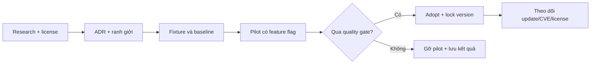

# Kế hoạch áp dụng nguồn mở

## Trạng thái thật (2026-07-26)

Kế hoạch này được lập 2026-07-24 và **chưa có mục nào được thực thi**. Bảng dưới là đối chiếu giữa
kế hoạch và code, để phiên sau không đọc một `[x]` không tồn tại thành việc đã xong. Bằng chứng
chi tiết nằm ở [§ Điều đã thay đổi](../research/OPEN_SOURCE_LANDSCAPE.md#điều-đã-thay-đổi-kể-từ-2026-07-24)
trong khảo sát.

| Mục | Kế hoạch nói | Thực tế 2026-07-26 | Xử lý |
|---|---|---|---|
| OSS-003 license | Blocker quản trị duy nhất | `LICENSE` **đã có**, proprietary | **Gỡ blocker.** Còn nợ: tách phạm vi code/asset/data |
| OSS-004 inventory | Tạo inventory ban đầu | Chưa có; và `burn`/`burn-wgpu` bị **bỏ sót** khỏi khảo sát | Đã thêm dòng vào khảo sát; inventory tự động vẫn nợ |
| OSS-010 Criterion | Adopt | **Không có trong `Cargo.toml`** | **Nâng lên P0** — xem dưới |
| OSS-011 tracing | Adopt | Không có trong `Cargo.toml` | Giữ, nhưng sau Criterion |
| OSS-012 cargo-deny | Adopt sau khi chọn license | Advisory **đã được phủ** bởi `cargo audit` + `npm audit` | Thu hẹp phạm vi còn licenses/bans/sources |
| OSS-013 lychee | Adopt | `scripts/check_docs_links.mjs` **đã là gate CI** | **Đóng — superseded** |
| OS2 oracle | 2–3 tuần | Chưa bắt đầu; OSS-021 bị chặn bởi OSS-020 | Giữ thứ tự, ghi rõ blocker |
| OS3 BVH/meshopt | Pilot | Tiền đề bị code bác bỏ | **Park** — xem OS3 |
| OS4 Rapier | Pilot có feature flag | Đường physics/CPG sống chưa tất định | Thêm tiền điều kiện cứng |
| OS5 Arrow | Khi ≥100 MB/run | Trigger **chưa đạt** | Giữ Defer |

**Thay đổi ưu tiên lớn nhất của đợt review này:** OSS-010 (Criterion) không còn là "tooling ít rủi
ro" mà là **điều kiện của một mục P0**. [`STATE_OF_THE_PROJECT.md`](STATE_OF_THE_PROJECT.md) §3.2 ghi
rằng tuyên bố "60 FPS real-time" chưa từng được đo và `BENCHMARK_BASELINE.md` tự khai số hiện tại là
proxy. Criterion là công cụ đã duyệt cho đúng việc đó, và nó hợp với ràng buộc vận hành nặng nhất —
**không chạy full backend trên máy dev** — vì nó bench từng system headless chứ không boot Tauri.

## Mục tiêu

Tận dụng nguồn mở để tăng độ tin cậy khoa học, hiệu năng và khả năng bảo trì mà vẫn
giữ bốn thuộc tính: một nguồn sự thật, tái lập theo seed, build desktop gọn và có thể
gỡ bỏ từng tích hợp. Kế hoạch này bổ trợ
[`WORLD_SIMULATION_PLAN.md`](../../WORLD_SIMULATION_PLAN.md), không thay thế nó.

## Nguyên tắc quyết định

Mỗi tích hợp đi qua chuỗi:

Một pilot không được coi là “adopted” cho đến khi có owner, lock version, NOTICE cần
thiết, test, benchmark, migration/rollback và cập nhật tài liệu nguồn sự thật.

## Trình tự tích hợp

### OS0 — Quản trị tài liệu và giấy phép

**Thời lượng:** 1–2 ngày. **Phụ thuộc:** không. **Trạng thái:** đang khởi tạo.

| ID | Công việc | Bằng chứng hoàn tất |
|---|---|---|
| OSS-001 | Dùng `README.md` và `docs/README.md` làm hai điểm vào duy nhất | Mọi tài liệu chuẩn có đường đi ≤ 2 lần nhấp |
| OSS-002 | Ban hành quy tắc Diátaxis, metadata, ADR và deprecation | Link nội bộ hợp lệ; không có hai nguồn sự thật |
| OSS-003 | Người duy trì chọn license cho chính Anima Engine | ✅ **Xong một phần (2026-07-26).** `LICENSE` proprietary đã có. **Còn nợ:** phạm vi riêng cho code/model/dataset/asset, và `NOTICE` cho thành phần permissive được phân phối |
| OSS-004 | Tạo inventory dependency ban đầu | ⬜ Chưa. Đã lộ một lỗ hổng thật: `burn`/`burn-wgpu` là runtime dep nhưng vắng khỏi khảo sát cho tới 2026-07-26 |

**Gate:** license của mọi thành phần bên thứ ba phải được xác minh **theo đúng tag/commit** trước
khi thêm. Với `LICENSE` proprietary, thành phần copyleft (GPL/AGPL) là **chặn cứng cho mọi đường
tiếp xúc với code**, không còn là "cần review thêm" — xem
[chính sách nguồn mở](../governance/OPEN_SOURCE_POLICY.md).

### OS1 — Tooling ít rủi ro

**Thời lượng:** 3–5 ngày. **Phụ thuộc:** OS0. **Trạng thái 2026-07-26: chưa thực thi mục nào.**

| ID | Công việc | Kiểm tra / tiêu chí | Trạng thái |
|---|---|---|---|
| OSS-010 | Thêm Criterion cho tick, spatial query và artifact encode/decode | Benchmark chạy headless, lưu machine metadata và baseline | ⬜ **P0** — chặn §3.2 |
| OSS-011 | Khai báo trực tiếp `tracing` và quy ước correlation ID | Không log mỗi entity/tick mặc định; overhead tắt < 2% | ⬜ Sau OSS-010 |
| OSS-012 | Thêm `cargo-deny` cho **licenses/bans/sources** | CI chặn license/source ngoài policy | ⬜ Phạm vi đã hẹp lại: advisory nay do `cargo audit` + `npm audit` phủ |
| OSS-013 | ~~Thêm lychee cho Markdown~~ | — | ✅ **Superseded** bởi [`scripts/check_docs_links.mjs`](../../scripts/check_docs_links.mjs) |

**OSS-010 là mục đáng làm trước tiên trong toàn bộ kế hoạch này**, vì nó là mục duy nhất nằm trên
đường tới hạn P0. Phạm vi tối thiểu đáng giá: bench `integrate_physics_system`,
`ResourceField::step_regrowth`, `DynamicFields::step_water` và `a2c_loss` — bốn thứ chạy mỗi tick,
đều là hàm gọi được ngoài Tauri, không cần GPU và không cần boot app.

**Gate:** build/test hiện tại không hồi quy; dependency lock được commit; mỗi công cụ
có hướng dẫn cập nhật và tắt. Criterion phải là `dev-dependency`: nếu nó xuất hiện trong
`cargo tree` của bản dựng mặc định thì gate tách feature (G2 #2) đã bị vi phạm.

### OS2 — Bộ oracle khoa học ngoại tuyến

**Thời lượng:** 2–3 tuần. **Phụ thuộc:** M0, M1 và `WorldArtifact` ổn định.

| ID | Công việc | Phụ thuộc | Bằng chứng |
|---|---|---|---|
| OSS-020 | Định nghĩa `scientific-fixture` manifest: source, version, license, units, seed, checksum | OSS-003 | JSON Schema + fixture mẫu |
| OSS-021 | Adapter Landlab cho lưới lưu vực nhỏ | OSS-020 | Flow direction/accumulation và water balance golden fixture |
| OSS-022 | Adapter pyrealm cho grass productivity | OSS-020 | Xu hướng GPP theo ánh sáng/nhiệt/ẩm nằm trong tolerance |
| OSS-023 | Adapter Virtual Ecosystem cho scenario tích hợp nhỏ | OSS-021, OSS-022 | So sánh miền hợp lệ cho nước–đất–producer |
| OSS-024 | Runner SALib đọc batch output của Anima | M2 scenario runner | Báo cáo Sobol/Morris ổn định theo seed |
| OSS-025 | Gắn provenance vào fixture đã rút gọn | OSS-021–024 | Có script tái tạo; không commit cache môi trường Python |

**Gate:** oracle chỉ chạy trong research/CI tùy chọn; runtime Tauri không phụ thuộc
Python. So sánh invariant, thứ tự xu hướng và tolerance có lý do khoa học, không ép
hai mô hình khác nhau cho ra giá trị tuyệt đối giống nhau.

> **Trạng thái 2026-07-26.** Chưa bắt đầu. **OSS-021 (Landlab) bị chặn bởi OSS-020** — định dạng
> `scientific-fixture` chưa tồn tại — cộng một chi phí vận hành chưa trả: cần môi trường Python trên
> một máy dev đang có ràng buộc tài nguyên thật. Trạng thái đúng là *"đã duyệt, chưa làm, đang bị
> chặn"*, không phải *"đã loại"*.
>
> Khoảng trống mà OSS-021 nhắm vào là **có thật và đã định vị được**: `downstream[i]` trong
> [`dynamic_fields.rs`](../../src-tauri/src/core/dynamic_fields.rs) là steepest-descent đơn hướng,
> không có flow accumulation; và `step_erosion` là công thức cục bộ **không vận chuyển trầm tích**.
> Lý do đầy đủ vì sao đây là oracle chứ không phải dependency nằm ở
> [khảo sát §3.1](../research/OPEN_SOURCE_LANDSCAPE.md).

### OS3 — Pilot truy vấn không gian và LOD — **PARK (2026-07-26)**

**Thời lượng:** 1–2 tuần. **Phụ thuộc:** baseline M1.

> **Park, không phải huỷ.** Cả hai pilot của giai đoạn này đứng trên một tiền đề mà code hiện tại
> bác bỏ: không có `THREE.Raycaster` nào trong `src/`, cao độ địa hình lấy giải tích qua
> `sampleElevation`, và LOD theo khoảng cách **đã có** ở
> [`chunkLod.ts`](../../src/components/Landscape/utils/chunkLod.ts). Bằng chứng ở
> [F1](../research/OPEN_SOURCE_LANDSCAPE.md) và [F3](../research/OPEN_SOURCE_LANDSCAPE.md).
>
> **Trigger mở lại:** OSS-030 (đo đường hiện tại) vẫn đáng làm và nay thuộc về OSS-010 — Criterion
> là công cụ đo. OSS-031/OSS-032 chỉ mở lại khi phép đo đó cho thấy raycast/ngân sách tam giác thật
> sự là nút thắt. Lịch không phải trigger.

| ID | Công việc | Kiểm tra / tiêu chí |
|---|---|---|
| OSS-030 | Benchmark raycast/picking hiện tại trên 3 mật độ terrain | CPU time, allocation, memory |
| OSS-031 | Prototype `three-mesh-bvh` sau adapter nội bộ | Feature flag; cùng hit point/normal trong tolerance |
| OSS-032 | Prototype `meshoptimizer` cho một chunk chuẩn | Kích thước, decode time, silhouette/normal/UV |
| OSS-033 | ADR adopt/reject từng pilot | Lợi ích ≥ 20% ở workload mục tiêu hoặc lý do khác được định lượng |

**Rollback:** adapter không để kiểu dữ liệu của thư viện lan ra component sản phẩm;
tắt flag quay về đường cũ và vẫn đọc artifact hiện có.

### OS4 — Pilot vật lý Rapier

**Thời lượng:** 2–4 tuần. **Phụ thuộc:** M5 animal motion và benchmark ổn định, **cộng tiền điều
kiện cứng dưới đây (thêm 2026-07-26)**.

> **Không mở pilot trước khi đường physics/CPG sống đã tất định.**
> [`DETERMINISM_CONTRACT.md`](../reference/DETERMINISM_CONTRACT.md) §5 ghi rằng physics/CPG chạy
> song song nên một run liền mạch còn **không khớp chính nó** — đó là thứ đang chặn gate
> `an_inhabited_run_replays_from_its_trace_without_a_human` của
> [ADR-0004](../decisions/ADR-0004-observer-as-declared-intervention.md).
>
> Lý do là logic, không phải thận trọng: OSS-040 đòi "chốt fixture và kết quả solver hiện tại" làm
> đường cơ sở. Một đường cơ sở không lặp lại được thì phép so sánh side-by-side ở OSS-042 không có
> nghĩa — bất kỳ sai khác nào cũng quy được cho nhiễu.
>
> Thêm nữa, solver hiện tại không phải rigid-body tổng quát: `resolve_joints_system`
> ([`physics/dynamics.rs`](../../src-tauri/src/physics/dynamics.rs)) là điều khiển khớp lái bởi
> `CpgOscillator`. Rapier không thay được phần đó mà không thiết kế lại tầng vận động — xem
> [F2](../research/OPEN_SOURCE_LANDSCAPE.md).

| ID | Công việc | Kiểm tra / tiêu chí |
|---|---|---|
| OSS-040 | Chốt fixture 100/1.000 tác nhân và collision cases | Kết quả solver hiện tại, seed, tick budget |
| OSS-041 | Viết `PhysicsBackend` nhỏ, giữ backend hiện tại | Không để handle Rapier thành component lưu trữ công khai |
| OSS-042 | Chạy side-by-side Rapier bằng feature flag | Collision correctness, determinism, CPU, memory, save/load |
| OSS-043 | ADR adopt/partial/reject | Không critical regression; lợi ích đủ bù chi phí build/nâng cấp |

Rapier không mặc nhiên sở hữu hunger, energy, damage hay nguyên nhân tử vong; các luật
đó vẫn ở simulation domain.

### OS5 — Dữ liệu thí nghiệm

**Thời lượng:** 1–2 tuần khi cần. **Phụ thuộc:** M2/M8.

| ID | Công việc | Trigger |
|---|---|---|
| OSS-050 | Đo JSON/CSV batch export | ≥ 100 MB mỗi run hoặc phân tích I/O thành nút thắt đo được |
| OSS-051 | Pilot Arrow/Parquet ở output adapter | Chỉ khi OSS-050 kích hoạt |
| OSS-052 | So sánh schema evolution/tooling/size/time | ADR adopt/reject |

Arrow/Parquet không thay `WorldArtifact` hoặc save-game. Nếu chưa vượt trigger, giữ
JSON/CSV để debug và trao đổi dễ hơn.

### OS6 — Mẫu kiến trúc cho quy mô lớn

**Thời lượng:** 3–5 tuần, gắn M9. **Phụ thuộc:** profiler xác nhận nút thắt.

- Học cohort/energy-budget từ Madingley.
- Học modular experiment từ MABE2.
- Học observation/action/task/replay từ Neural MMO.
- Học scheduler/module benchmark từ BioDynaMo.

Đầu ra là ADR, prototype nội bộ và benchmark; không import engine thứ hai.

### OS7 — Phả hệ và bằng chứng tiến hoá (mới, 2026-07-26)

**Thời lượng:** 1–2 tuần. **Phụ thuộc:** không có blocker ngoài — toàn bộ là code nội bộ.

Giai đoạn này không thêm **một** dependency nào; nó lấy *thuật toán* và *định dạng* thay vì thư
viện. Lý do nằm ở [khảo sát §5](../research/OPEN_SOURCE_LANDSCAPE.md).

| ID | Công việc | Phụ thuộc | Bằng chứng hoàn tất |
|---|---|---|---|
| OSS-070 | Xuất Newick từ đồ thị lineage sẵn có | không | Một parser bên thứ ba (`ape`/DendroPy) đọc được output; test từ chối cây có chu trình, node mồ côi hoặc nhiều gốc |
| OSS-071 | `simplify()` kiểu tskit: prune nhánh không còn hậu duệ sống | OSS-070 | Bộ nhớ lineage trở thành O(cá thể sống), không phải O(tổng từng sống); quan hệ tổ tiên của phần giữ lại **không đổi** |
| OSS-072 | Truy vấn MRCA | OSS-071 | Test trên cây đã biết đáp án; tất định |
| OSS-073 | Giao thức đo "line of descent" kiểu Avida | OSS-072 | Bám được dòng dõi của genotype thống trị cuối run |

**Vì sao đáng làm sớm:** [`evolution/lineage.rs`](../../src-tauri/src/evolution/lineage.rs) lưu mỗi
lần sinh sản kèm **bản sao đầy đủ** `MorphologyGenotype` và **không bao giờ prune**. Đó là đường
tăng bộ nhớ không có trần với một run dài. OSS-070 là món rẻ nhất trong toàn kế hoạch (~40 dòng,
0 dependency) và lợi ích lớn nhất của nó không phải là interop mà là **kiểm tra độc lập tính đúng
của phả hệ**.

**Thứ tự là bắt buộc, không phải gợi ý:** không có MRCA thì không có gì để xuất ra một cây có
nghĩa, nên OSS-073 không thể đi trước OSS-072.

**Ranh giới license:** Newick là *định dạng*, `ape`/`ggtree` không được nhập code — nên license của
chúng không liên quan. Avida là copyleft: chỉ tham khảo qua bài báo, không đọc source rồi viết lại.

## Ma trận ánh xạ với roadmap mô phỏng

| Roadmap | Tích hợp hỗ trợ | Không được thay thế |
|---|---|---|
| M0 Rules/units/determinism | Criterion, tracing, cargo-deny | `SIMULATION_RULES.md` |
| M1 Authoritative world | Criterion, three-mesh-bvh pilot | `WorldArtifact` và Rust authority |
| M2 Scenario/causality | SALib, tracing | Domain causal ledger |
| M3 Climate/water/soil | Landlab, Virtual Ecosystem | Rust runtime model |
| M4 Plants | pyrealm, Virtual Ecosystem | Producer components/systems |
| M5–M7 Animals/food web | Rapier pilot, Madingley reference | Energy/behavior/death rules |
| M8 Disturbance/experiments | SALib, Arrow trigger | Scenario schema |
| M9 Scale/LOD | meshoptimizer, ABM references | Một ECS authority |
| Phả hệ / bằng chứng tiến hoá (OS7) | Newick (định dạng), thuật toán `simplify` kiểu tskit, giao thức đo kiểu Avida | `LineageTracker` là nguồn sự thật; không nhập code copyleft |

## Tiêu chí bắt buộc cho mỗi PR tích hợp

- Link ADR và issue/task ID.
- Upstream URL, version/tag/commit và SPDX license.
- Loại dùng: runtime, dev-only, offline tool, code copied, data hoặc asset.
- Benchmark trước/sau với workload và máy chạy.
- Test correctness, determinism, serialization và cross-language nếu liên quan.
- Ngân sách CPU/memory/binary size.
- Cờ bật/tắt hoặc kế hoạch rollback.
- Cập nhật `NOTICE`/credits và inventory nếu license yêu cầu.
- Owner và lịch kiểm tra update.
- Không có finding critical/high của các gate bản đồ liên quan.

## Ba hành động tiếp theo

> **Cập nhật 2026-07-26.** Danh sách cũ được giữ bên dưới làm bản ghi; nó đã lỗi thời ở cả ba mục —
> hành động 1 đã xong một phần, hành động 2 nêu lychee (nay superseded), và không mục nào phản ánh
> việc OSS-010 đã lên P0.

1. **Thêm Criterion (OSS-010).** Là mục duy nhất của kế hoạch này nằm trên đường tới hạn P0
   ([`STATE_OF_THE_PROJECT.md`](STATE_OF_THE_PROJECT.md) §3.2). `dev-dependency`, bench bốn hàm
   chạy mỗi tick, không boot Tauri, không cần GPU.
2. **OSS-070 — xuất Newick.** Món rẻ nhất trong kế hoạch: ~40 dòng, 0 dependency, và mua được một
   kiểm tra độc lập cho tính đúng của phả hệ.
3. **Đóng phần còn nợ của OSS-003:** tách phạm vi license cho code / model / dataset / asset, và
   tạo `NOTICE` cho các thành phần permissive đang được phân phối.

Danh sách cũ (2026-07-24) — giữ làm bản ghi

1. **Quyết định license của Anima Engine** và phạm vi riêng cho code, model, dataset,
   screenshot/asset. Đây là blocker quản trị duy nhất trước khi nhận code bên ngoài.
2. Tạo ADR cho **OS1**, chốt baseline rồi thêm Criterion, tracing, lychee và cargo-deny
   thành các PR nhỏ độc lập.
3. Sau khi `WorldArtifact` ổn định, tạo một fixture lưu vực 32×32 để chạy Landlab và
   một fixture grass productivity để chạy pyrealm; chỉ lưu output rút gọn + provenance.

Danh sách và bằng chứng nghiên cứu nằm trong
[`OPEN_SOURCE_LANDSCAPE.md`](../research/OPEN_SOURCE_LANDSCAPE.md).
