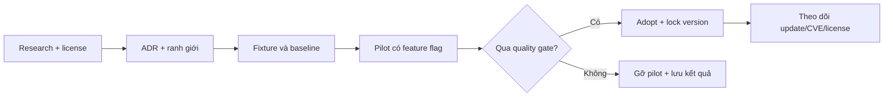

# Kế hoạch áp dụng nguồn mở

## Mục tiêu

Tận dụng nguồn mở để tăng độ tin cậy khoa học, hiệu năng và khả năng bảo trì mà vẫn
giữ bốn thuộc tính: một nguồn sự thật, tái lập theo seed, build desktop gọn và có thể
gỡ bỏ từng tích hợp. Kế hoạch này bổ trợ
[`WORLD_SIMULATION_PLAN.md`](../../WORLD_SIMULATION_PLAN.md), không thay thế nó.

## Nguyên tắc quyết định

Mỗi tích hợp đi qua chuỗi:

Một pilot không được coi là “adopted” cho đến khi có owner, lock version, NOTICE cần
thiết, test, benchmark, migration/rollback và cập nhật tài liệu nguồn sự thật.

## Trình tự tích hợp

### OS0 — Quản trị tài liệu và giấy phép

**Thời lượng:** 1–2 ngày. **Phụ thuộc:** không. **Trạng thái:** đang khởi tạo.

| ID | Công việc | Bằng chứng hoàn tất |
|---|---|---|
| OSS-001 | Dùng `README.md` và `docs/README.md` làm hai điểm vào duy nhất | Mọi tài liệu chuẩn có đường đi ≤ 2 lần nhấp |
| OSS-002 | Ban hành quy tắc Diátaxis, metadata, ADR và deprecation | Link nội bộ hợp lệ; không có hai nguồn sự thật |
| OSS-003 | Người duy trì chọn license cho chính Anima Engine | Có `LICENSE`, SPDX policy và phạm vi code/asset/data rõ ràng |
| OSS-004 | Tạo inventory dependency ban đầu | Ghi package, version/tag, license, loại tích hợp và owner |

**Gate:** chưa thêm code/asset bên thứ ba nếu OSS-003 chưa được quyết định và license
của thành phần đó chưa được xác minh.

### OS1 — Tooling ít rủi ro

**Thời lượng:** 3–5 ngày. **Phụ thuộc:** OS0.

| ID | Công việc | Kiểm tra / tiêu chí |
|---|---|---|
| OSS-010 | Thêm Criterion cho tick, spatial query và artifact encode/decode | Benchmark chạy headless, lưu machine metadata và baseline |
| OSS-011 | Khai báo trực tiếp `tracing` và quy ước correlation ID | Không log mỗi entity/tick mặc định; overhead tắt < 2% |
| OSS-012 | Thêm `cargo-deny` sau quyết định license | CI chặn license/source/advisory ngoài policy |
| OSS-013 | Thêm lychee cho Markdown | Link nội bộ bắt buộc; link web cho phép retry/cache |

**Gate:** build/test hiện tại không hồi quy; dependency lock được commit; mỗi công cụ
có hướng dẫn cập nhật và tắt.

### OS2 — Bộ oracle khoa học ngoại tuyến

**Thời lượng:** 2–3 tuần. **Phụ thuộc:** M0, M1 và `WorldArtifact` ổn định.

| ID | Công việc | Phụ thuộc | Bằng chứng |
|---|---|---|---|
| OSS-020 | Định nghĩa `scientific-fixture` manifest: source, version, license, units, seed, checksum | OSS-003 | JSON Schema + fixture mẫu |
| OSS-021 | Adapter Landlab cho lưới lưu vực nhỏ | OSS-020 | Flow direction/accumulation và water balance golden fixture |
| OSS-022 | Adapter pyrealm cho grass productivity | OSS-020 | Xu hướng GPP theo ánh sáng/nhiệt/ẩm nằm trong tolerance |
| OSS-023 | Adapter Virtual Ecosystem cho scenario tích hợp nhỏ | OSS-021, OSS-022 | So sánh miền hợp lệ cho nước–đất–producer |
| OSS-024 | Runner SALib đọc batch output của Anima | M2 scenario runner | Báo cáo Sobol/Morris ổn định theo seed |
| OSS-025 | Gắn provenance vào fixture đã rút gọn | OSS-021–024 | Có script tái tạo; không commit cache môi trường Python |

**Gate:** oracle chỉ chạy trong research/CI tùy chọn; runtime Tauri không phụ thuộc
Python. So sánh invariant, thứ tự xu hướng và tolerance có lý do khoa học, không ép
hai mô hình khác nhau cho ra giá trị tuyệt đối giống nhau.

### OS3 — Pilot truy vấn không gian và LOD

**Thời lượng:** 1–2 tuần. **Phụ thuộc:** baseline M1.

| ID | Công việc | Kiểm tra / tiêu chí |
|---|---|---|
| OSS-030 | Benchmark raycast/picking hiện tại trên 3 mật độ terrain | CPU time, allocation, memory |
| OSS-031 | Prototype `three-mesh-bvh` sau adapter nội bộ | Feature flag; cùng hit point/normal trong tolerance |
| OSS-032 | Prototype `meshoptimizer` cho một chunk chuẩn | Kích thước, decode time, silhouette/normal/UV |
| OSS-033 | ADR adopt/reject từng pilot | Lợi ích ≥ 20% ở workload mục tiêu hoặc lý do khác được định lượng |

**Rollback:** adapter không để kiểu dữ liệu của thư viện lan ra component sản phẩm;
tắt flag quay về đường cũ và vẫn đọc artifact hiện có.

### OS4 — Pilot vật lý Rapier

**Thời lượng:** 2–4 tuần. **Phụ thuộc:** M5 animal motion và benchmark ổn định.

| ID | Công việc | Kiểm tra / tiêu chí |
|---|---|---|
| OSS-040 | Chốt fixture 100/1.000 tác nhân và collision cases | Kết quả solver hiện tại, seed, tick budget |
| OSS-041 | Viết `PhysicsBackend` nhỏ, giữ backend hiện tại | Không để handle Rapier thành component lưu trữ công khai |
| OSS-042 | Chạy side-by-side Rapier bằng feature flag | Collision correctness, determinism, CPU, memory, save/load |
| OSS-043 | ADR adopt/partial/reject | Không critical regression; lợi ích đủ bù chi phí build/nâng cấp |

Rapier không mặc nhiên sở hữu hunger, energy, damage hay nguyên nhân tử vong; các luật
đó vẫn ở simulation domain.

### OS5 — Dữ liệu thí nghiệm

**Thời lượng:** 1–2 tuần khi cần. **Phụ thuộc:** M2/M8.

| ID | Công việc | Trigger |
|---|---|---|
| OSS-050 | Đo JSON/CSV batch export | ≥ 100 MB mỗi run hoặc phân tích I/O thành nút thắt đo được |
| OSS-051 | Pilot Arrow/Parquet ở output adapter | Chỉ khi OSS-050 kích hoạt |
| OSS-052 | So sánh schema evolution/tooling/size/time | ADR adopt/reject |

Arrow/Parquet không thay `WorldArtifact` hoặc save-game. Nếu chưa vượt trigger, giữ
JSON/CSV để debug và trao đổi dễ hơn.

### OS6 — Mẫu kiến trúc cho quy mô lớn

**Thời lượng:** 3–5 tuần, gắn M9. **Phụ thuộc:** profiler xác nhận nút thắt.

- Học cohort/energy-budget từ Madingley.
- Học modular experiment từ MABE2.
- Học observation/action/task/replay từ Neural MMO.
- Học scheduler/module benchmark từ BioDynaMo.

Đầu ra là ADR, prototype nội bộ và benchmark; không import engine thứ hai.

## Ma trận ánh xạ với roadmap mô phỏng

| Roadmap | Tích hợp hỗ trợ | Không được thay thế |
|---|---|---|
| M0 Rules/units/determinism | Criterion, tracing, cargo-deny | `SIMULATION_RULES.md` |
| M1 Authoritative world | Criterion, three-mesh-bvh pilot | `WorldArtifact` và Rust authority |
| M2 Scenario/causality | SALib, tracing | Domain causal ledger |
| M3 Climate/water/soil | Landlab, Virtual Ecosystem | Rust runtime model |
| M4 Plants | pyrealm, Virtual Ecosystem | Producer components/systems |
| M5–M7 Animals/food web | Rapier pilot, Madingley reference | Energy/behavior/death rules |
| M8 Disturbance/experiments | SALib, Arrow trigger | Scenario schema |
| M9 Scale/LOD | meshoptimizer, ABM references | Một ECS authority |

## Tiêu chí bắt buộc cho mỗi PR tích hợp

- Link ADR và issue/task ID.
- Upstream URL, version/tag/commit và SPDX license.
- Loại dùng: runtime, dev-only, offline tool, code copied, data hoặc asset.
- Benchmark trước/sau với workload và máy chạy.
- Test correctness, determinism, serialization và cross-language nếu liên quan.
- Ngân sách CPU/memory/binary size.
- Cờ bật/tắt hoặc kế hoạch rollback.
- Cập nhật `NOTICE`/credits và inventory nếu license yêu cầu.
- Owner và lịch kiểm tra update.
- Không có finding critical/high của các gate bản đồ liên quan.

## Ba hành động tiếp theo

1. **Quyết định license của Anima Engine** và phạm vi riêng cho code, model, dataset,
   screenshot/asset. Đây là blocker quản trị duy nhất trước khi nhận code bên ngoài.
2. Tạo ADR cho **OS1**, chốt baseline rồi thêm Criterion, tracing, lychee và cargo-deny
   thành các PR nhỏ độc lập.
3. Sau khi `WorldArtifact` ổn định, tạo một fixture lưu vực 32×32 để chạy Landlab và
   một fixture grass productivity để chạy pyrealm; chỉ lưu output rút gọn + provenance.

Danh sách và bằng chứng nghiên cứu nằm trong
[`OPEN_SOURCE_LANDSCAPE.md`](../research/OPEN_SOURCE_LANDSCAPE.md).
